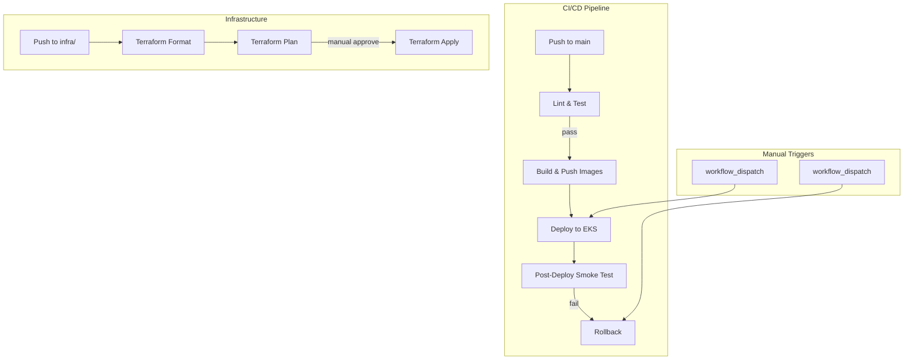

# .github/

GitHub Actions CI/CD pipelines for automated testing, building, deploying, and managing the LLM Optimization Platform.

## Architecture



## Workflows

| File                     | Trigger                        | Purpose                               |
| ------------------------ | ------------------------------ | ------------------------------------- |
| `ci-cd.yaml`             | Push/PR to `services/`, `k8s/` | Lint → Build → Push images to ECR     |
| `deploy.yaml`            | Manual dispatch                | Full build + deploy to EKS            |
| `post-deploy-smoke.yaml` | Manual or called by deploy     | Smoke test baseline model + services  |
| `rollback.yaml`          | Manual dispatch                | Rollback specific service or all      |
| `terraform.yaml`         | Push/PR to `infra/`            | Format check → Plan → Apply Terraform |

## CI/CD Pipeline (ci-cd.yaml)

```yaml
jobs:
  lint-and-test: # ruff check + pytest
  build-push: # Matrix build: gateway, quant-api, finetune-api, eval-api, data-engine
  build-grafana: # Build Grafana plugin + custom image
```

Each service is built with its own Dockerfile and pushed to ECR with the `dev-latest` tag.

## Security

- AWS credentials via secrets (`AWS_ACCESS_KEY_ID`, `AWS_SECRET_ACCESS_KEY`)
- GitHub OIDC for infrastructure workflows (`id-token: write` permission)
- ECR repository existence verified before push
- Terraform changes require manual approval for `apply`
