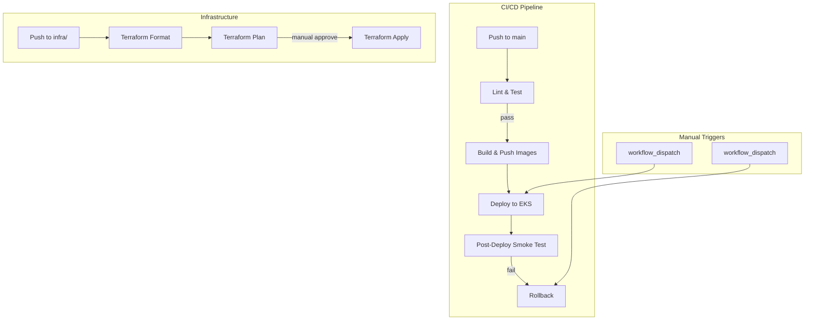

# .github/

GitHub Actions CI/CD pipelines for automated testing, building, deploying, and managing the LLM Optimization Platform.

## Architecture



## Workflows

| File                     | Trigger                        | Purpose                               |
| ------------------------ | ------------------------------ | ------------------------------------- |
| `ci-cd.yaml`             | Push/PR to `services/`, `k8s/` | Lint → Build → Push images to ECR     |
| `deploy.yaml`            | Manual dispatch                | Full build + deploy to EKS            |
| `post-deploy-smoke.yaml` | Manual or called by deploy     | Smoke test baseline model + services  |
| `rollback.yaml`          | Manual dispatch                | Rollback specific service or all      |
| `terraform.yaml`         | Push/PR to `infra/`            | Format check → Plan → Apply Terraform |

## CI/CD Pipeline — Detailed Walkthrough (ci-cd.yaml)

### When does it run?

| Trigger                    | Condition                                                                              | What happens                                                              |
| -------------------------- | -------------------------------------------------------------------------------------- | ------------------------------------------------------------------------- |
| **Push to `main`**         | Only if files changed under `services/**`, `k8s/**`, or `.github/workflows/ci-cd.yaml` | Full pipeline: lint → build → push to ECR                                 |
| **Pull request to `main`** | Only if files changed under `services/**` or `k8s/**`                                  | Lint & test only (build jobs have `if: github.event_name == 'push'` gate) |
| **Manual dispatch**        | Always                                                                                 | Full pipeline with optional `service` input (default: `all`)              |

**Key implication:** If you push changes to `infra/**` only (e.g., IRSA ARN fixes), this workflow **does not trigger** — no service code changed, so no images need rebuilding.

### Environment variables (shared across all jobs)

```
AWS_REGION:   us-west-2
ECR_REGISTRY: <account-id>.dkr.ecr.us-west-2.amazonaws.com
EKS_CLUSTER:  llmplatform-dev
IMAGE_TAG:    dev-latest
```

All images are tagged `dev-latest` — a mutable tag that always points to the latest build. There is no SHA-based or version-based tagging.

### Job 1: `lint-and-test`

Runs on every trigger (push, PR, manual). No AWS credentials needed — purely local checks.

| Step                     | What it does                                                                  |
| ------------------------ | ----------------------------------------------------------------------------- |
| **Checkout**             | `actions/checkout@v4` — clones the repo at the triggering commit              |
| **Setup Python**         | Installs Python 3.11                                                          |
| **Install dependencies** | `pip install -r services/requirements-dev.txt` + ruff, pytest, pytest-asyncio |
| **Lint with Ruff**       | `ruff check services/` — static analysis of all Python service code           |
| **Run tests**            | `pytest services/tests/ -v --tb=short` — runs the test suite                  |

If either lint or tests fail, the entire pipeline stops here. The `build-push` and `build-grafana` jobs both declare `needs: lint-and-test`.

### Job 2: `build-push` (matrix: 5 services)

Only runs on **push to main** (not on PRs). Uses a matrix strategy to build 5 services in parallel:

| Service      | ECR Repository                 | Dockerfile                         | Build Context   |
| ------------ | ------------------------------ | ---------------------------------- | --------------- |
| gateway      | `llmplatform-dev/gateway`      | `services/gateway/Dockerfile`      | `services/`     |
| quant-api    | `llmplatform-dev/quant-api`    | `services/quant-api/Dockerfile`    | `services/`     |
| finetune-api | `llmplatform-dev/finetune-api` | `services/finetune-api/Dockerfile` | `services/`     |
| eval-api     | `llmplatform-dev/eval-api`     | `services/eval-api/Dockerfile`     | `services/`     |
| data-engine  | `llmplatform-dev/data-engine`  | `services/data-engine/Dockerfile`  | `.` (repo root) |

Each matrix instance runs these steps:

| Step                             | What it does                                                                                                                                  |
| -------------------------------- | --------------------------------------------------------------------------------------------------------------------------------------------- |
| **Checkout**                     | Clones the repo (each matrix job runs independently)                                                                                          |
| **Configure AWS credentials**    | Sets `AWS_ACCESS_KEY_ID` and `AWS_SECRET_ACCESS_KEY` from repo secrets                                                                        |
| **Login to Amazon ECR**          | `aws ecr get-login-password` → `docker login` to the registry                                                                                 |
| **Verify ECR repository exists** | `aws ecr describe-repositories --repository-names <repo>` — fails with an error if the repo doesn't exist, telling you to run Terraform first |
| **Build and push**               | `docker build -t <registry>/<repo>:dev-latest` → `docker push`                                                                                |

**Why "verify ECR repo exists"?** The ECR repositories are created by the Terraform `ecr` module. If Terraform hasn't been applied yet, there's nowhere to push images. This step catches that ordering mistake early with a clear error message instead of a cryptic Docker push failure.

### Job 3: `build-grafana`

Also gated on `push` only and `needs: lint-and-test`. Separate from the matrix because it requires Node.js:

| Step                             | What it does                                                                               |
| -------------------------------- | ------------------------------------------------------------------------------------------ |
| **Checkout**                     | Clones the repo                                                                            |
| **Setup Node.js**                | Installs Node 18                                                                           |
| **Build Grafana plugin**         | `npm ci` + `npx webpack --mode production` in `grafana-plugins/llm-platform-ops/`          |
| **Configure AWS credentials**    | Same as build-push                                                                         |
| **Login to Amazon ECR**          | Same as build-push                                                                         |
| **Verify ECR repository exists** | Checks `llmplatform-dev/grafana-plugin` exists                                             |
| **Build and push Grafana image** | Builds from `grafana-plugins/Dockerfile` using the compiled plugin, pushes as `dev-latest` |

### Job 4: `summary`

Runs after both `build-push` and `build-grafana` complete. Writes a GitHub Actions job summary listing all 6 ECR repositories and their tags, plus next steps: "Go to Actions → Deploy LLM Platform → Run workflow."

### CI/CD does NOT deploy

This is the critical point — the CI/CD pipeline builds and pushes images to ECR but **never touches EKS**. It explicitly tells you to run the Deploy workflow next. This separation means you can rebuild images without affecting a running cluster.

---

## Terraform Infrastructure — Detailed Walkthrough (terraform.yaml)

### When does it run?

| Trigger                    | Condition                              | What happens                                                                      |
| -------------------------- | -------------------------------------- | --------------------------------------------------------------------------------- |
| **Push to `main`**         | Only if files changed under `infra/**` | fmt → plan → apply (auto-approve)                                                 |
| **Pull request to `main`** | Only if files changed under `infra/**` | fmt → plan only (plan output posted as PR comment)                                |
| **Manual dispatch**        | Always                                 | Choose environment (`dev`/`staging`/`prod`) and action (`plan`/`apply`/`destroy`) |

### Environment variables

```
AWS_REGION: us-west-2
PROJECT:    llmplatform
TF_VERSION: 1.6.0
```

### Permissions

```yaml
permissions:
  id-token: write # For GitHub OIDC (future)
  contents: read # Read repo
  pull-requests: write # Post plan comments on PRs
```

### Job 1: `fmt` (Format Check)

| Step                 | What it does                                                                                |
| -------------------- | ------------------------------------------------------------------------------------------- |
| **Checkout**         | Clones the repo                                                                             |
| **Setup Terraform**  | Installs Terraform v1.6.0                                                                   |
| **Terraform Format** | `terraform fmt -check -recursive infra/` — fails if any `.tf` file isn't properly formatted |

This is a fast, stateless check. No AWS credentials needed. If it fails, nothing else runs.

### Job 2: `plan` (matrix: environments)

`needs: fmt`. Currently the matrix has only `[dev]` but is designed for `[dev, staging, prod]`.

| Step                              | What it does                                                                                                                                                                                                                                                                                                                                              |
| --------------------------------- | --------------------------------------------------------------------------------------------------------------------------------------------------------------------------------------------------------------------------------------------------------------------------------------------------------------------------------------------------------- |
| **Checkout**                      | Clones the repo                                                                                                                                                                                                                                                                                                                                           |
| **Configure AWS credentials**     | Sets AWS credentials from secrets                                                                                                                                                                                                                                                                                                                         |
| **Setup Terraform**               | Installs Terraform v1.6.0                                                                                                                                                                                                                                                                                                                                 |
| **Terraform Init**                | `terraform init` in `infra/envs/<env>/` — downloads providers, configures the S3 remote backend, downloads modules. This runs **every time** (not cached between jobs because each job gets a fresh runner)                                                                                                                                               |
| **Terraform Plan**                | `terraform plan -no-color -out=tfplan` — compares the desired state (your `.tf` files) against the actual state (in S3 remote backend) and produces a change plan. The `TF_VAR_hf_token` secret is passed for the HuggingFace token used by SageMaker model definitions. Output is saved to both `tfplan` (binary) and `plan_output.txt` (human-readable) |
| **Check for destructive changes** | **Safety gate** — greps `plan_output.txt` for "will be destroyed". If any resources would be destroyed, the job fails with an error. This prevents accidental deletions from auto-applying on push. If destruction is intentional, you must use the `destroy` action via manual dispatch                                                                  |
| **Plan summary**                  | Writes a table to the GitHub Actions summary: counts of resources to create, update, replace, and destroy (always 0 due to the safety gate)                                                                                                                                                                                                               |
| **Upload Plan**                   | Saves the `tfplan` binary as a GitHub Actions artifact so the apply job can download and use the exact same plan                                                                                                                                                                                                                                          |
| **Comment Plan on PR**            | If triggered by a PR, posts the full plan output as a comment on the pull request so reviewers can see exactly what will change                                                                                                                                                                                                                           |

### Job 3: `apply`

`needs: plan`. Only runs when:

- Push to `main` **and** `ref == refs/heads/main` — auto-applies after a merge
- Manual dispatch **and** `action == 'apply'`

Uses the `environment: <env>` setting, which can require approval for prod.

| Step                                    | What it does                                                                                                                                          |
| --------------------------------------- | ----------------------------------------------------------------------------------------------------------------------------------------------------- |
| **Checkout**                            | Clones the repo                                                                                                                                       |
| **Configure AWS credentials**           | Sets AWS credentials                                                                                                                                  |
| **Setup Terraform**                     | Installs Terraform v1.6.0                                                                                                                             |
| **Download Plan**                       | Attempts to download the `tfplan` artifact from the plan job. Uses `continue-on-error: true` so it doesn't fail if the artifact is missing            |
| **Terraform Init**                      | `terraform init` again — required because this is a fresh runner with no state                                                                        |
| **Generate Plan (if artifact missing)** | If the download failed, generates a fresh plan. This handles the case where manual dispatch skips the plan job's artifact                             |
| **Terraform Apply**                     | `terraform apply -auto-approve tfplan` — applies the plan. No human confirmation needed (the safety gate in plan already blocked destructive changes) |
| **Output Results**                      | `terraform output -json \| jq .` — prints all Terraform outputs (EKS cluster name, ECR repos, IRSA role ARNs, etc.)                                   |

### Job 4: `destroy` (manual only)

Only runs on manual dispatch with `action == 'destroy'`. Uses a separate environment (`<env>-destroy`) requiring extra approval.

| Step                          | What it does                                                                                |
| ----------------------------- | ------------------------------------------------------------------------------------------- |
| **Checkout**                  | Clones the repo                                                                             |
| **Configure AWS credentials** | Sets AWS credentials                                                                        |
| **Setup Terraform**           | Installs Terraform v1.6.0                                                                   |
| **Terraform Init**            | Initializes in `infra/envs/<env>/`                                                          |
| **Pre-destroy plan**          | `terraform plan -destroy` — shows exactly what will be removed, writes count to job summary |
| **Terraform Destroy**         | `terraform destroy -auto-approve` — tears down all resources                                |

---

## How the Workflows Relate

```
┌─────────────────────────────────────────────────────────────────────┐
│                    What Each Workflow Owns                           │
├─────────────────────┬──────────────────┬────────────────────────────┤
│   terraform.yaml    │    ci-cd.yaml    │      deploy.yaml           │
├─────────────────────┼──────────────────┼────────────────────────────┤
│ ✅ ECR repositories │ ✅ Docker images │ ✅ Docker images (rebuilds)│
│ ✅ EKS cluster      │ ✅ ECR push      │ ✅ ECR push                │
│ ✅ VPC / networking │ ❌ No deploy     │ ✅ K8s manifest deploy     │
│ ✅ IAM roles (IRSA) │ ❌ No Terraform  │ ✅ Rollout wait            │
│ ✅ SageMaker endpts │                  │ ❌ No Terraform            │
│ ✅ K8s namespaces   │                  │                            │
└─────────────────────┴──────────────────┴────────────────────────────┘
```

### Dependency chain

Terraform **must** run first because it creates the resources that the other workflows depend on:

```
terraform.yaml (creates infrastructure)
    │
    ├── ECR repositories ──► ci-cd.yaml / deploy.yaml need somewhere to push images
    │
    ├── EKS cluster ──► deploy.yaml needs a cluster to deploy K8s manifests to
    │
    ├── IAM IRSA roles ──► Pods need correct IAM policies to call SageMaker
    │
    ├── K8s namespaces ──► Deployments target specific namespaces (quant, finetune, etc.)
    │
    └── SageMaker endpoints ──► Team APIs call these for inference
```

### When to run which workflow

| Scenario                                    | Run terraform.yaml?                 | Run ci-cd.yaml?                    | Run deploy.yaml?                                     |
| ------------------------------------------- | ----------------------------------- | ---------------------------------- | ---------------------------------------------------- |
| Changed Python service code (`services/**`) | No                                  | Auto-triggers on push              | Then manually trigger deploy                         |
| Changed K8s manifests (`k8s/**`)            | No                                  | Auto-triggers on push              | Then manually trigger deploy                         |
| Changed Terraform files (`infra/**`)        | Auto-triggers on push               | No (path filter excludes `infra/`) | Maybe — if IAM/namespace changes affect running pods |
| Changed both `services/` and `infra/`       | Both auto-trigger                   | Auto-triggers                      | Then manually trigger deploy                         |
| First-time setup (no infra exists)          | Yes — manually trigger with `apply` | Then manually trigger              | Then manually trigger deploy                         |
| Fixing IRSA ARN patterns                    | Auto-triggers (infra change)        | Does not trigger                   | Yes — restart pods to pick up new IAM policies       |

### The `dev-latest` tag strategy

Both CI/CD and Deploy tag images as `dev-latest` — a **mutable tag** that always points to the most recent build. This means:

- K8s deployments reference `image: <ecr>/llmplatform-dev/quant-api:dev-latest`
- Every build overwrites the same tag
- The Deploy workflow forces a pod restart (which re-pulls the image) to pick up changes
- There's no rollback-by-tag capability — rollback works by reverting code and rebuilding

## Security

- AWS credentials via secrets (`AWS_ACCESS_KEY_ID`, `AWS_SECRET_ACCESS_KEY`)
- GitHub OIDC for infrastructure workflows (`id-token: write` permission)
- ECR repository existence verified before push
- Terraform destructive changes blocked by safety gate (must use explicit `destroy` action)
- Terraform plan posted as PR comment for review before merge
- `HF_TOKEN` secret passed only to Terraform plan/apply for SageMaker model access
- Destroy requires a separate GitHub environment approval (`<env>-destroy`)
