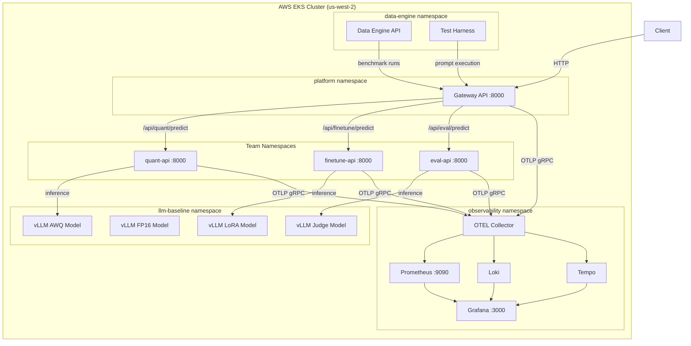

# LLM Optimization Platform

A production-grade, multi-team platform for optimizing LLM inference on AWS EKS. Three internal AI lab teams—**Quant**, **FineTune**, and **Eval**—share a centralized gateway, vLLM model fleet, and full observability stack to benchmark, score, and serve Mistral-7B model variants.

## Teams & Responsibilities

| Team         | Focus                | Model Variant    | Purpose                     |
| ------------ | -------------------- | ---------------- | --------------------------- |
| **Quant**    | Quantization (4-bit) | Mistral-7B-AWQ   | GPTQ/AWQ compressed models  |
| **FineTune** | LoRA adapters        | Mistral-7B-LoRA  | Domain-specific fine-tuning |
| **Eval**     | Quality scoring      | Mistral-7B-Judge | LLM-as-a-Judge evaluation   |

## System Architecture



## Repository Structure

| Directory                            | Description                                               |
| ------------------------------------ | --------------------------------------------------------- |
| [services/](services/)               | Python FastAPI microservices (gateway, team APIs, shared) |
| [infra/](infra/)                     | Terraform IaC modules and environment configs             |
| [k8s/](k8s/)                         | Kubernetes manifests (Kustomize base + overlays)          |
| [.github/](.github/)                 | CI/CD pipelines (GitHub Actions)                          |
| [grafana-plugins/](grafana-plugins/) | Custom Grafana operations dashboard plugin                |
| [scripts/](scripts/)                 | Operational scripts (benchmarks, golden checks, demos)    |
| [data/](data/)                       | Versioned promptsets for testing and benchmarking         |
| [docs/](docs/)                       | Design documents and deployment guides                    |
| [domains/](domains/)                 | Domain configuration for fine-tuning data splits          |
| [scenarios/](scenarios/)             | Test scenario templates for prompt generation             |
| [prometheus/](prometheus/)           | Prometheus recording rules                                |

## Quick Start

```bash
# 1. Provision infrastructure
cd infra/envs/dev && terraform init && terraform apply

# 2. Deploy Kubernetes resources
k8s/scripts/apply.sh dev

# 3. Deploy baseline model fleet
kubectl apply -k k8s/base/llm-baseline/

# 4. Build and push service images (CI/CD handles this automatically)
# Manual: see .github/workflows/deploy.yaml

# 5. Validate with golden checks
bash scripts/golden-checks.sh
```

## Key Technologies

- **Runtime**: Python 3.11, FastAPI, uvicorn
- **Inference**: vLLM v0.6.6, Mistral-7B-Instruct-v0.2
- **Infrastructure**: Terraform, AWS EKS (v1.29), ECR, SageMaker
- **Orchestration**: Kubernetes, Kustomize
- **Observability**: OpenTelemetry, Prometheus, Loki, Tempo, Grafana
- **CI/CD**: GitHub Actions (lint → build → push → deploy → smoke test)
- **Dashboard**: Custom Grafana panel plugin (React/TypeScript)
