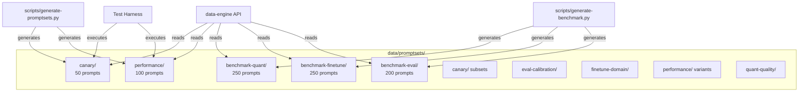

# data/

Versioned test data for benchmarking and validation. Contains promptsets organized by test scenario, each with a JSONL prompt file and a JSON manifest.

## Architecture



## Promptset Structure

Each promptset directory contains:

- `promptset.jsonl` — One JSON object per prompt line
- `manifest.json` — Metadata: ID, checksum, version, token budgets

### Manifest Format

```json
{
  "promptset_id": "canary-deployment-health-20260301",
  "scenario_id": "canary-v1",
  "prompt_count": 50,
  "checksum": "sha256:282c4bf1...",
  "version": "1.0.0",
  "compatible_harness_version": ">=2.0.0",
  "target_buckets": {
    "output_tokens": { "buckets": [50, 200, 800] }
  }
}
```

### Prompt Format (JSONL)

```json
{
  "prompt_id": "canary-001",
  "prompt": "What is 2 + 2?",
  "expected_contains": ["4"],
  "scenario_id": "math_simple",
  "bucket": "short"
}
```

## Promptset Categories

| Promptset            | Count | Purpose                               |
| -------------------- | ----- | ------------------------------------- |
| `canary`             | 50    | Deployment health checks              |
| `performance`        | 100   | Throughput/latency stress testing     |
| `benchmark-quant`    | 250   | AWQ vs FP16 quality comparison        |
| `benchmark-finetune` | 250   | LoRA domain adaptation testing        |
| `benchmark-eval`     | 200   | Judge model scoring calibration       |
| `eval-calibration`   | —     | Eval scoring accuracy tests           |
| `finetune-domain`    | —     | Domain-specific fine-tune prompts     |
| `quant-quality`      | —     | Quantization quality regression tests |
