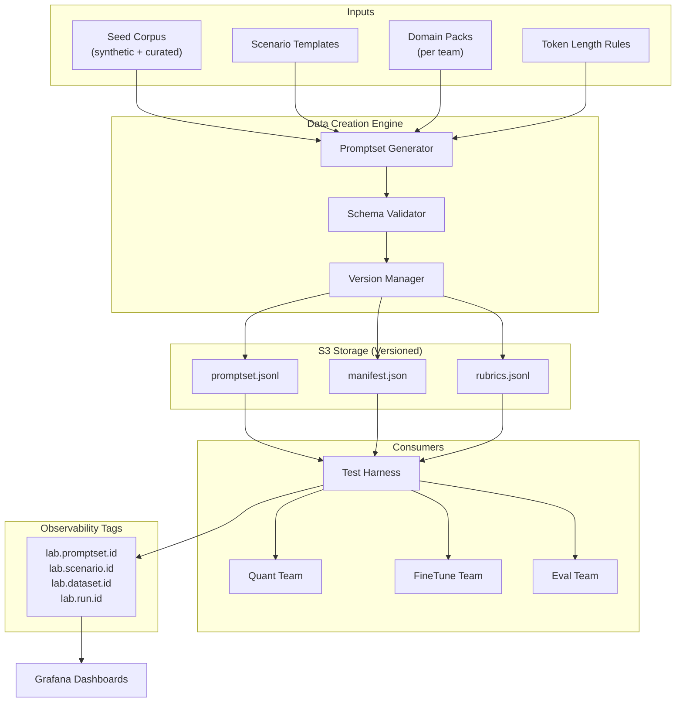
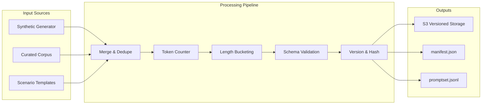
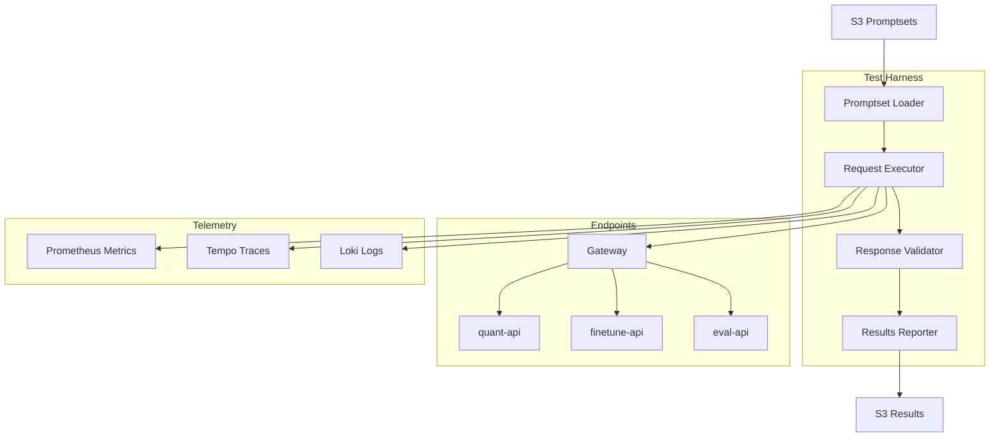
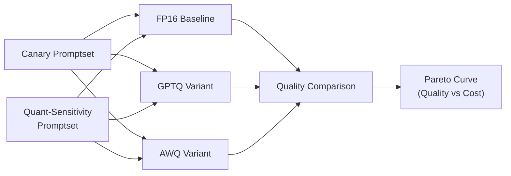
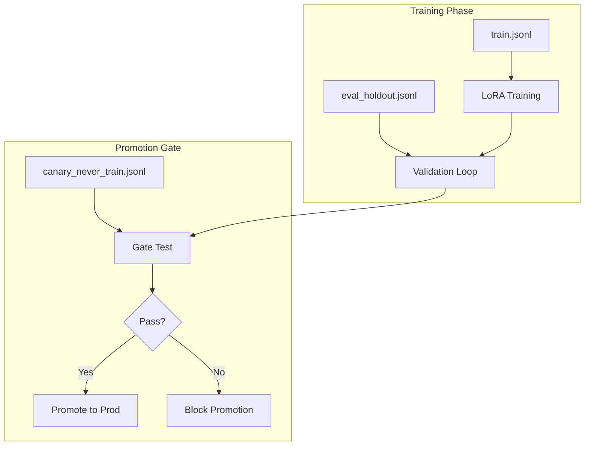
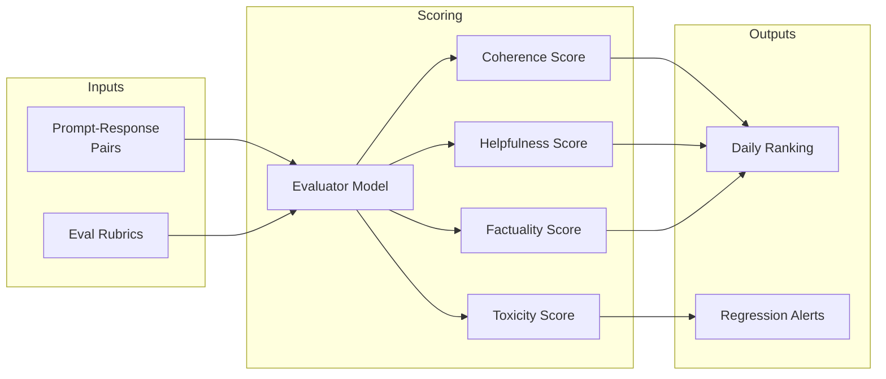

# Design Document 9: Data Engine

## Overview

This document defines the data strategy for the LLM Optimization Platform. The Data Engine is a platform-owned service that produces versioned promptsets and scenario metadata to enable:

- **Quantization comparisons** - Quality delta curves across model variants
- **LoRA fine-tuning experiments** - A/B testing with holdout validation
- **Eval scoring** - Consistent rubrics for quality metrics
- **Observability demos** - Predictable telemetry patterns for Grafana dashboards

The Data Engine ensures all three teams run experiments against the same versioned datasets, enabling apples-to-apples comparisons and reproducible results.

---

## Quick Start (Implementation Order)

```bash
# 1. Prerequisites (after design-10 baseline model deployed)
# Baseline model needed for generating reference outputs

# 2. Create S3 bucket for promptsets
aws s3 mb s3://llmplatform-data

# 3. Generate canary promptset
python data_engine/generate.py canary \
  --output s3://llmplatform-data/promptsets/canary-v1.jsonl

# 4. Upload to services via ConfigMap
kubectl create configmap promptsets \
  --from-file=canary=data/canary-v1.jsonl \
  -n platform

# 5. Run canary suite
curl -X POST "http://gateway/test/canary" | jq '.summary'
```

**Depends On**: [design-10-models.md](design-10-models.md) (baseline for references)
**Feeds Into**: [design-07-checklist.md](design-07-checklist.md) (acceptance tests)

---

## Architecture



---

## Section 1: Required Datasets

### 1.1 Canary Promptset (Deployment Health)

**Purpose**: Prove endpoints are live, routing is correct, outputs are sane.

| Property           | Value                 |
| ------------------ | --------------------- |
| Size               | 50–200 prompts        |
| Run Frequency      | Every deploy + hourly |
| Target Latency     | < 2s p95              |
| Expected Pass Rate | > 99.5%               |

**Grafana Metrics**:

- `lab_canary_pass_rate{team, variant}`
- `lab_canary_error_rate{team, variant}`
- `lab_canary_latency_p95{team, variant}`

**Schema**:

```json
{
  "prompt_id": "canary-001",
  "prompt": "What is 2 + 2?",
  "expected_format": "text",
  "expected_contains": ["4"],
  "max_tokens": 50,
  "timeout_ms": 2000,
  "tags": ["math", "simple", "routing-check"]
}
```

**Example Prompts**:

```jsonl
{"prompt_id": "canary-001", "prompt": "What is 2 + 2?", "expected_contains": ["4"], "scenario": "math_simple"}
{"prompt_id": "canary-002", "prompt": "Translate 'hello' to Spanish.", "expected_contains": ["hola", "Hola"], "scenario": "translation"}
{"prompt_id": "canary-003", "prompt": "List three primary colors.", "expected_contains": ["red", "blue", "yellow"], "scenario": "knowledge"}
{"prompt_id": "canary-004", "prompt": "Return JSON: {\"status\": \"ok\"}", "expected_format": "json", "scenario": "structured_output"}
{"prompt_id": "canary-005", "prompt": "Complete: The capital of France is", "expected_contains": ["Paris"], "scenario": "completion"}
```

### 1.2 Performance Promptset (Throughput & Scaling)

**Purpose**: Show queue depth, TTFT, p95 changes, autoscaling response.

| Property              | Value                 |
| --------------------- | --------------------- |
| Size                  | 500–2,000 prompts     |
| Output Length Buckets | 50 / 200 / 800 tokens |
| Concurrency Levels    | 1, 5, 10, 20, 50      |

**Token Length Distribution**:

| Bucket | Target Output Tokens | Prompt Count | Purpose                   |
| ------ | -------------------- | ------------ | ------------------------- |
| short  | 50                   | 40%          | Baseline latency          |
| medium | 200                  | 40%          | Typical workload          |
| long   | 800                  | 20%          | Stress test / queue depth |

**Schema**:

```json
{
  "prompt_id": "perf-001",
  "prompt": "Write a one-sentence summary of photosynthesis.",
  "target_output_tokens": 50,
  "bucket": "short",
  "scenario": "summarization",
  "concurrency_group": "batch_1"
}
```

**Grafana Metrics**:

- `lab_llm_queue_depth{team}`
- `lab_llm_ttft_ms{team, bucket}`
- `lab_llm_e2e_duration_ms{team, bucket}`
- `lab_llm_tokens_per_sec{team, bucket}`

### 1.3 Quant-Sensitivity Promptset (Quantization Regressions)

**Purpose**: Detect quality degradation from 4-bit quantization (GPTQ/AWQ).

| Property    | Value                                               |
| ----------- | --------------------------------------------------- |
| Size        | 200–500 prompts                                     |
| Focus Areas | Math/logic, structured output, multi-step reasoning |
| Baseline    | FP16 reference outputs                              |

**Sensitive Categories**:

| Category          | Description                        | Why Sensitive                       |
| ----------------- | ---------------------------------- | ----------------------------------- |
| `math_logic`      | Arithmetic, algebra, logic puzzles | Precision loss affects calculations |
| `structured_json` | JSON output constraints            | Format compliance degrades          |
| `multi_step`      | Chain-of-thought (short context)   | Reasoning chain breaks              |
| `code_gen`        | Simple code generation             | Syntax errors from quantization     |
| `numerical`       | Number extraction/formatting       | Digit accuracy                      |

**Schema**:

```json
{
  "prompt_id": "quant-001",
  "prompt": "Calculate: 347 * 28 = ?",
  "expected_answer": "9716",
  "category": "math_logic",
  "sensitivity_weight": 1.0,
  "baseline_fp16_output": "The result of 347 * 28 is 9716.",
  "eval_criteria": ["exact_match", "numerical_accuracy"]
}
```

**Example Prompts**:

```jsonl
{"prompt_id": "quant-001", "prompt": "Calculate: 347 * 28 = ?", "expected": "9716", "category": "math_logic"}
{"prompt_id": "quant-002", "prompt": "Return valid JSON: {\"items\": [1,2,3], \"total\": 6}", "category": "structured_json"}
{"prompt_id": "quant-003", "prompt": "If A > B, B > C, and C > D, what is the relationship between A and D?", "expected_contains": ["A > D"], "category": "multi_step"}
{"prompt_id": "quant-004", "prompt": "Write a Python function that returns the factorial of n.", "category": "code_gen"}
{"prompt_id": "quant-005", "prompt": "Extract the year from: 'Founded in 1847'", "expected": "1847", "category": "numerical"}
```

### 1.4 Domain Promptset (LoRA Fine-Tuning)

**Purpose**: Train LoRA adapters and validate against holdout sets.

| Split                | Size | Usage                                |
| -------------------- | ---- | ------------------------------------ |
| `train`              | 70%  | Fine-tuning training data            |
| `eval_holdout`       | 20%  | Validation during training           |
| `canary_never_train` | 10%  | Post-deployment regression detection |

**Schema**:

```json
{
  "prompt_id": "domain-001",
  "prompt": "Summarize this legal contract clause: ...",
  "domain": "legal",
  "split": "train",
  "reference_output": "This clause establishes...",
  "metadata": {
    "source": "synthetic",
    "difficulty": "medium",
    "subdomain": "contract_law"
  }
}
```

**Domain Packs**:

| Domain      | Description                           | Use Case             |
| ----------- | ------------------------------------- | -------------------- |
| `legal`     | Contract analysis, clause extraction  | Legal AI assistant   |
| `medical`   | Clinical notes, symptom analysis      | Healthcare NLP       |
| `financial` | Report summarization, risk assessment | FinTech applications |
| `technical` | Documentation, code explanation       | Developer tools      |

**A/B Testing Tags**:

```python
# Tags for fine-tune A/B experiments
{
    "lab.experiment.id": "lora-legal-v5-vs-v4",
    "lab.variant.a": "lora-legal-v4",
    "lab.variant.b": "lora-legal-v5",
    "lab.split": "canary_never_train",
    "lab.domain": "legal"
}
```

### 1.5 Eval Rubric Set (Judge/Scoring)

**Purpose**: Consistent quality metrics across all prompt-response pairs.

**Structure**: Triples of (prompt, response_candidate, optional_reference)

**Metrics**:

| Metric        | Range   | Description                       |
| ------------- | ------- | --------------------------------- |
| `coherence`   | 0.0–1.0 | Logical flow and readability      |
| `helpfulness` | 0.0–1.0 | Addresses user intent             |
| `factuality`  | 0.0–1.0 | Accuracy (requires grounding)     |
| `toxicity`    | 0.0–1.0 | Harmful content (lower is better) |

**Schema**:

```json
{
  "eval_id": "eval-001",
  "prompt": "What causes rainbows?",
  "response_candidate": "Rainbows are caused by light refraction...",
  "reference_context": "Light refraction and reflection in water droplets...",
  "ground_truth": "provided",
  "expected_scores": {
    "coherence": 0.85,
    "helpfulness": 0.9,
    "factuality": 0.95,
    "toxicity": 0.01
  }
}
```

**Retrieval-Grounded Eval** (for meaningful factuality):

```json
{
  "eval_id": "eval-grounded-001",
  "prompt": "According to the document, what was the Q3 revenue?",
  "context_document": "Q3 2025 Financial Report: Revenue was $4.2B...",
  "response_candidate": "The Q3 revenue was $4.2 billion.",
  "factuality_checkable": true,
  "ground_truth_answer": "$4.2B"
}
```

---

## Section 2: Data Creation Engine

### 2.1 Architecture



### 2.2 Input Specifications

**Seed Corpus**:

| Source      | Description                        | Volume |
| ----------- | ---------------------------------- | ------ |
| Synthetic   | LLM-generated with diversity rules | 60%    |
| Curated     | Human-reviewed, domain-specific    | 30%    |
| Adversarial | Edge cases, known failure modes    | 10%    |

**Scenario Templates**:

```yaml
# scenarios/performance.yaml
scenario_id: perf_throughput
description: "Throughput stress test"
prompt_templates:
  - template: "Write a {length} summary of {topic}."
    variables:
      length: ["one-sentence", "paragraph", "detailed"]
      topic: ["${domain_topics}"]
    target_output_tokens:
      one-sentence: 50
      paragraph: 200
      detailed: 800
token_rules:
  input_range: [50, 500]
  output_buckets: [50, 200, 800]
```

**Domain Packs**:

```yaml
# domains/legal.yaml
domain_id: legal
team: finetune
splits:
  train: 0.7
  eval_holdout: 0.2
  canary_never_train: 0.1
sources:
  - path: s3://data-engine/domains/legal/contracts.jsonl
  - path: s3://data-engine/domains/legal/clauses.jsonl
metadata:
  jurisdiction: ["US", "UK", "EU"]
  document_type: ["contract", "brief", "statute"]
```

### 2.3 Output Specifications

**Promptset Format** (`promptset.jsonl`):

```jsonl
{"prompt_id": "canary-001", "prompt": "What is 2 + 2?", "scenario_id": "canary", "dataset_id": "canary-v1", "expected_contains": ["4"], "max_tokens": 50}
{"prompt_id": "perf-001", "prompt": "Summarize photosynthesis.", "scenario_id": "perf_throughput", "dataset_id": "perf-v1", "target_output_tokens": 50, "bucket": "short"}
```

**Manifest Format** (`manifest.json`):

```json
{
  "promptset_id": "canary-v1-20260224",
  "scenario_id": "canary",
  "dataset_id": "canary-v1",
  "created_at": "2026-02-24T10:00:00Z",
  "seed": 42,
  "prompt_count": 100,
  "expected_output_schema": {
    "format": "text",
    "max_tokens": 50
  },
  "target_buckets": {
    "input_tokens": { "min": 10, "max": 100 },
    "output_tokens": { "buckets": [50] }
  },
  "checksum": "sha256:abc123...",
  "version": "1.0.0",
  "compatible_harness_version": ">=2.0.0"
}
```

### 2.4 Implementation

```python
# services/data-engine/generator.py
import json
import hashlib
from datetime import datetime
from pathlib import Path
from typing import List, Dict, Optional
from dataclasses import dataclass, asdict
import tiktoken


@dataclass
class Prompt:
    prompt_id: str
    prompt: str
    scenario_id: str
    dataset_id: str
    expected_contains: Optional[List[str]] = None
    expected_format: Optional[str] = None
    target_output_tokens: Optional[int] = None
    bucket: Optional[str] = None
    category: Optional[str] = None
    split: Optional[str] = None
    metadata: Optional[Dict] = None


@dataclass
class Manifest:
    promptset_id: str
    scenario_id: str
    dataset_id: str
    created_at: str
    seed: int
    prompt_count: int
    expected_output_schema: Dict
    target_buckets: Dict
    checksum: str
    version: str
    compatible_harness_version: str


class PromptsetGenerator:
    """Generate versioned promptsets from templates and sources."""

    def __init__(self, seed: int = 42):
        self.seed = seed
        self.encoder = tiktoken.get_encoding("cl100k_base")

    def count_tokens(self, text: str) -> int:
        """Count tokens using tiktoken."""
        return len(self.encoder.encode(text))

    def assign_bucket(self, target_tokens: int) -> str:
        """Assign output length bucket."""
        if target_tokens <= 75:
            return "short"
        elif target_tokens <= 300:
            return "medium"
        else:
            return "long"

    def generate_promptset(
        self,
        scenario_id: str,
        dataset_id: str,
        prompts: List[Dict],
        output_dir: Path
    ) -> Manifest:
        """Generate promptset files and manifest."""

        # Process prompts
        processed = []
        for p in prompts:
            prompt = Prompt(
                prompt_id=p["prompt_id"],
                prompt=p["prompt"],
                scenario_id=scenario_id,
                dataset_id=dataset_id,
                expected_contains=p.get("expected_contains"),
                expected_format=p.get("expected_format"),
                target_output_tokens=p.get("target_output_tokens"),
                bucket=self.assign_bucket(p.get("target_output_tokens", 50)),
                category=p.get("category"),
                split=p.get("split"),
                metadata=p.get("metadata")
            )
            processed.append(prompt)

        # Write promptset.jsonl
        promptset_path = output_dir / "promptset.jsonl"
        with open(promptset_path, "w") as f:
            for p in processed:
                f.write(json.dumps(asdict(p)) + "\n")

        # Calculate checksum
        with open(promptset_path, "rb") as f:
            checksum = f"sha256:{hashlib.sha256(f.read()).hexdigest()}"

        # Generate manifest
        manifest = Manifest(
            promptset_id=f"{dataset_id}-{datetime.now().strftime('%Y%m%d')}",
            scenario_id=scenario_id,
            dataset_id=dataset_id,
            created_at=datetime.utcnow().isoformat() + "Z",
            seed=self.seed,
            prompt_count=len(processed),
            expected_output_schema={"format": "text"},
            target_buckets={
                "input_tokens": {"min": 10, "max": 500},
                "output_tokens": {"buckets": [50, 200, 800]}
            },
            checksum=checksum,
            version="1.0.0",
            compatible_harness_version=">=2.0.0"
        )

        # Write manifest.json
        manifest_path = output_dir / "manifest.json"
        with open(manifest_path, "w") as f:
            json.dump(asdict(manifest), f, indent=2)

        return manifest
```

### 2.5 S3 Storage Structure

```
s3://llmplatform-data-engine/
├── promptsets/
│   ├── canary/
│   │   ├── v1/
│   │   │   ├── promptset.jsonl
│   │   │   └── manifest.json
│   │   └── v2/
│   │       ├── promptset.jsonl
│   │       └── manifest.json
│   ├── performance/
│   │   └── v1/
│   │       ├── promptset.jsonl
│   │       └── manifest.json
│   ├── quant-sensitivity/
│   │   └── v1/
│   │       ├── promptset.jsonl
│   │       └── manifest.json
│   └── domain/
│       ├── legal/
│       │   └── v1/
│       │       ├── train.jsonl
│       │       ├── eval_holdout.jsonl
│       │       ├── canary_never_train.jsonl
│       │       └── manifest.json
│       └── medical/
│           └── v1/
├── rubrics/
│   └── v1/
│       ├── rubrics.jsonl
│       └── manifest.json
└── runs/
    └── 2026-02-24/
        └── run-001/
            ├── results.jsonl
            └── summary.json
```

---

## Section 3: Test Harness

The Test Harness executes promptsets against endpoints and produces tagged telemetry.

### 3.1 Architecture



### 3.2 Implementation

```python
# services/test-harness/harness.py
import asyncio
import httpx
import json
from datetime import datetime
from typing import List, Dict, Optional
from dataclasses import dataclass
from opentelemetry import trace, metrics
from opentelemetry.propagate import inject

tracer = trace.get_tracer("test-harness")
meter = metrics.get_meter("test-harness")

# Metrics
harness_requests_total = meter.create_counter(
    "lab_harness_requests_total",
    description="Total harness requests"
)
harness_pass_total = meter.create_counter(
    "lab_harness_pass_total",
    description="Total passed validations"
)
harness_fail_total = meter.create_counter(
    "lab_harness_fail_total",
    description="Total failed validations"
)
harness_latency = meter.create_histogram(
    "lab_harness_latency_ms",
    description="Request latency"
)


@dataclass
class HarnessResult:
    prompt_id: str
    scenario_id: str
    dataset_id: str
    run_id: str
    team: str
    variant: str
    passed: bool
    latency_ms: float
    error: Optional[str] = None
    response_preview: Optional[str] = None


class TestHarness:
    """Execute promptsets against endpoints with observability."""

    def __init__(
        self,
        gateway_url: str,
        run_id: str,
        concurrency: int = 10
    ):
        self.gateway_url = gateway_url
        self.run_id = run_id
        self.concurrency = concurrency
        self.semaphore = asyncio.Semaphore(concurrency)

    async def execute_prompt(
        self,
        prompt: Dict,
        team: str,
        variant: Optional[str] = None
    ) -> HarnessResult:
        """Execute single prompt with telemetry."""

        async with self.semaphore:
            with tracer.start_as_current_span("harness.execute") as span:
                # Set span attributes
                span.set_attribute("lab.promptset.id", prompt.get("dataset_id", "unknown"))
                span.set_attribute("lab.scenario.id", prompt.get("scenario_id", "unknown"))
                span.set_attribute("lab.dataset.id", prompt.get("dataset_id", "unknown"))
                span.set_attribute("lab.run.id", self.run_id)
                span.set_attribute("lab.prompt.id", prompt["prompt_id"])
                span.set_attribute("lab.target.team", team)

                if variant:
                    span.set_attribute("lab.model.variant.id", variant)

                # Prepare headers with trace propagation
                headers = {"Content-Type": "application/json"}
                inject(headers)

                # Add routing headers
                headers["X-Target-Team"] = team
                if variant:
                    headers["X-Model-Variant"] = variant

                start_time = asyncio.get_event_loop().time()

                try:
                    async with httpx.AsyncClient(timeout=30.0) as client:
                        response = await client.post(
                            f"{self.gateway_url}/predict",
                            json={"prompt": prompt["prompt"], "max_tokens": prompt.get("max_tokens", 100)},
                            headers=headers
                        )
                        response.raise_for_status()
                        result = response.json()

                    latency_ms = (asyncio.get_event_loop().time() - start_time) * 1000

                    # Validate response
                    passed = self._validate_response(prompt, result)

                    # Record metrics
                    labels = {
                        "scenario_id": prompt.get("scenario_id", "unknown"),
                        "team": team,
                        "bucket": prompt.get("bucket", "unknown")
                    }
                    harness_requests_total.add(1, labels)
                    harness_latency.record(latency_ms, labels)

                    if passed:
                        harness_pass_total.add(1, labels)
                    else:
                        harness_fail_total.add(1, labels)

                    return HarnessResult(
                        prompt_id=prompt["prompt_id"],
                        scenario_id=prompt.get("scenario_id", "unknown"),
                        dataset_id=prompt.get("dataset_id", "unknown"),
                        run_id=self.run_id,
                        team=team,
                        variant=variant or "default",
                        passed=passed,
                        latency_ms=latency_ms,
                        response_preview=str(result.get("response", ""))[:200]
                    )

                except Exception as e:
                    latency_ms = (asyncio.get_event_loop().time() - start_time) * 1000
                    span.set_attribute("error.type", type(e).__name__)
                    span.set_attribute("error.message", str(e)[:200])

                    harness_fail_total.add(1, {"scenario_id": prompt.get("scenario_id", "unknown"), "team": team})

                    return HarnessResult(
                        prompt_id=prompt["prompt_id"],
                        scenario_id=prompt.get("scenario_id", "unknown"),
                        dataset_id=prompt.get("dataset_id", "unknown"),
                        run_id=self.run_id,
                        team=team,
                        variant=variant or "default",
                        passed=False,
                        latency_ms=latency_ms,
                        error=str(e)
                    )

    def _validate_response(self, prompt: Dict, result: Dict) -> bool:
        """Validate response against expected criteria."""
        response_text = str(result.get("response", "")).lower()

        # Check expected_contains
        if "expected_contains" in prompt:
            for expected in prompt["expected_contains"]:
                if expected.lower() not in response_text:
                    return False

        # Check expected_format
        if prompt.get("expected_format") == "json":
            try:
                json.loads(result.get("response", ""))
            except json.JSONDecodeError:
                return False

        return True

    async def run_promptset(
        self,
        prompts: List[Dict],
        team: str,
        variant: Optional[str] = None
    ) -> List[HarnessResult]:
        """Run full promptset against endpoint."""

        tasks = [
            self.execute_prompt(p, team, variant)
            for p in prompts
        ]

        return await asyncio.gather(*tasks)


# CLI entrypoint
async def main():
    import argparse

    parser = argparse.ArgumentParser()
    parser.add_argument("--promptset", required=True, help="Path to promptset.jsonl")
    parser.add_argument("--gateway", default="http://gateway.platform.svc", help="Gateway URL")
    parser.add_argument("--team", required=True, help="Target team")
    parser.add_argument("--variant", help="Model variant")
    parser.add_argument("--concurrency", type=int, default=10, help="Concurrent requests")
    parser.add_argument("--run-id", default=datetime.now().strftime("run-%Y%m%d-%H%M%S"))
    args = parser.parse_args()

    # Load promptset
    prompts = []
    with open(args.promptset) as f:
        for line in f:
            prompts.append(json.loads(line))

    # Run harness
    harness = TestHarness(
        gateway_url=args.gateway,
        run_id=args.run_id,
        concurrency=args.concurrency
    )

    results = await harness.run_promptset(prompts, args.team, args.variant)

    # Summary
    passed = sum(1 for r in results if r.passed)
    failed = sum(1 for r in results if not r.passed)
    avg_latency = sum(r.latency_ms for r in results) / len(results) if results else 0

    print(f"Run ID: {args.run_id}")
    print(f"Total: {len(results)}, Passed: {passed}, Failed: {failed}")
    print(f"Pass Rate: {passed/len(results)*100:.1f}%")
    print(f"Avg Latency: {avg_latency:.1f}ms")


if __name__ == "__main__":
    asyncio.run(main())
```

---

## Section 4: Observability Integration

### 4.1 Request Tagging

Every request from the harness includes these tags for Grafana slicing:

| Tag                | Description                    | Example                                          |
| ------------------ | ------------------------------ | ------------------------------------------------ |
| `lab.promptset.id` | Versioned promptset identifier | `canary-v1-20260224`                             |
| `lab.scenario.id`  | Scenario type                  | `canary`, `perf_throughput`, `quant_sensitivity` |
| `lab.dataset.id`   | Dataset identifier             | `canary-v1`                                      |
| `lab.run.id`       | Unique run identifier          | `run-20260224-100000`                            |
| `lab.prompt.id`    | Individual prompt ID           | `canary-001`                                     |
| `lab.bucket`       | Output length bucket           | `short`, `medium`, `long`                        |

### 4.2 Grafana Dashboard Queries

**Latency by Scenario**:

```promql
histogram_quantile(0.95,
  sum(rate(lab_harness_latency_ms_bucket[5m])) by (le, scenario_id)
)
```

**Error Rate by Scenario**:

```promql
sum(rate(lab_harness_fail_total[5m])) by (scenario_id)
/ sum(rate(lab_harness_requests_total[5m])) by (scenario_id)
```

**SageMaker vs Platform Overhead**:

```promql
# Platform overhead = total latency - model latency
avg(lab_harness_latency_ms{scenario_id="perf_throughput"}) by (team)
- avg(lab_llm_e2e_duration_ms{}) by (team)
```

**Canary Pass Rate**:

```promql
sum(rate(lab_harness_pass_total{scenario_id="canary"}[5m])) by (team, variant)
/ sum(rate(lab_harness_requests_total{scenario_id="canary"}[5m])) by (team, variant)
```

**Queue Depth During Performance Test**:

```promql
max_over_time(lab_llm_inflight_requests{scenario_id="perf_throughput"}[5m])
```

### 4.3 Loki Correlation

```logql
{job="test-harness"}
| json
| lab_run_id="run-20260224-100000"
| line_format "{{.lab_prompt_id}} {{.passed}} {{.latency_ms}}ms"
```

### 4.4 Tempo Trace Search

```
{ resource.service.name="test-harness" && span.lab.scenario.id="quant_sensitivity" && span.lab.run.id="run-20260224-100000" }
```

---

## Section 5: Team Workflows

### 5.1 Quantization Team

**Workflow**: Compare baseline FP16 vs GPTQ/AWQ variants.



**Execution Script**:

```bash
#!/bin/bash
# scripts/quant-comparison.sh

RUN_ID="quant-$(date +%Y%m%d-%H%M%S)"
PROMPTSET="s3://llmplatform-data-engine/promptsets/quant-sensitivity/v1/promptset.jsonl"

# Download promptset
aws s3 cp $PROMPTSET /tmp/promptset.jsonl

# Run against each variant
for VARIANT in fp16 gptq-4bit awq-4bit; do
  echo "Running $VARIANT..."
  python harness.py \
    --promptset /tmp/promptset.jsonl \
    --team quant \
    --variant $VARIANT \
    --run-id "${RUN_ID}-${VARIANT}" \
    --concurrency 20
done

echo "Results: Run ID prefix = $RUN_ID"
```

**Output**: Pareto curve data in Grafana showing quality degradation vs latency/cost improvement.

### 5.2 Fine-Tuning Team

**Workflow**: Train LoRA adapters and validate against holdout sets.



**A/B Testing Script**:

```bash
#!/bin/bash
# scripts/finetune-ab-test.sh

RUN_ID="ab-$(date +%Y%m%d-%H%M%S)"
DOMAIN="legal"
PROMPTSET="s3://llmplatform-data-engine/promptsets/domain/${DOMAIN}/v1/canary_never_train.jsonl"

aws s3 cp $PROMPTSET /tmp/promptset.jsonl

# Run A/B comparison
python harness.py \
  --promptset /tmp/promptset.jsonl \
  --team finetune \
  --variant lora-legal-v4 \
  --run-id "${RUN_ID}-A"

python harness.py \
  --promptset /tmp/promptset.jsonl \
  --team finetune \
  --variant lora-legal-v5 \
  --run-id "${RUN_ID}-B"

# Compare results
python compare_ab.py --run-a "${RUN_ID}-A" --run-b "${RUN_ID}-B"
```

**Output**: A/B win rate + regression flags.

### 5.3 Eval Team

**Workflow**: Run judge/scorers over all prompt-response pairs.



**Scoring Implementation**:

```python
# services/eval-api/scorer.py
from dataclasses import dataclass
from typing import Dict, Optional
import json


@dataclass
class EvalScore:
    eval_id: str
    coherence: float
    helpfulness: float
    factuality: float
    toxicity: float
    pass_threshold: bool
    metadata: Optional[Dict] = None


class EvalScorer:
    """Score prompt-response pairs against rubrics."""

    def __init__(self, threshold_profile: str = "daily-gate-v1"):
        self.thresholds = self._load_thresholds(threshold_profile)

    def _load_thresholds(self, profile: str) -> Dict:
        """Load threshold configuration."""
        profiles = {
            "daily-gate-v1": {
                "coherence": 0.7,
                "helpfulness": 0.7,
                "factuality": 0.6,
                "toxicity": 0.1  # Max allowed
            },
            "strict-v1": {
                "coherence": 0.85,
                "helpfulness": 0.85,
                "factuality": 0.8,
                "toxicity": 0.05
            }
        }
        return profiles.get(profile, profiles["daily-gate-v1"])

    async def score(
        self,
        prompt: str,
        response: str,
        reference: Optional[str] = None
    ) -> EvalScore:
        """Score a prompt-response pair."""

        # Call evaluator model (simplified)
        scores = await self._call_evaluator(prompt, response, reference)

        # Check against thresholds
        pass_threshold = (
            scores["coherence"] >= self.thresholds["coherence"] and
            scores["helpfulness"] >= self.thresholds["helpfulness"] and
            scores["factuality"] >= self.thresholds["factuality"] and
            scores["toxicity"] <= self.thresholds["toxicity"]
        )

        return EvalScore(
            eval_id=f"eval-{hash(prompt + response) % 100000:05d}",
            coherence=scores["coherence"],
            helpfulness=scores["helpfulness"],
            factuality=scores["factuality"],
            toxicity=scores["toxicity"],
            pass_threshold=pass_threshold
        )

    async def _call_evaluator(
        self,
        prompt: str,
        response: str,
        reference: Optional[str]
    ) -> Dict[str, float]:
        """Call evaluator model for scoring."""
        # Implementation calls eval-api SageMaker endpoint
        # Returns: {"coherence": 0.85, "helpfulness": 0.90, ...}
        pass
```

**Output**: Daily ranking + regression alerts in Grafana.

---

## Section 6: Controlled Failure Scenarios

These scenarios demonstrate the platform's observability by creating predictable failures.

### 6.1 Readiness-Gated Traffic

**Scenario**: Deploy a service with startup delay, observe Gateway routing only to Ready pods.

**Setup**:

```yaml
# k8s/quant/deployment-slow-startup.yaml
apiVersion: apps/v1
kind: Deployment
metadata:
  name: quant-api-slow
  namespace: quant
spec:
  replicas: 2
  template:
    spec:
      containers:
        - name: quant-api
          env:
            - name: STARTUP_DELAY_SECONDS
              value: "60" # Simulate model warmup
          readinessProbe:
            httpGet:
              path: /ready
              port: 8000
            initialDelaySeconds: 10
            periodSeconds: 5
            failureThreshold: 12 # 60s total
```

**Expected Grafana Observations**:

| Panel             | Expected Behavior                            |
| ----------------- | -------------------------------------------- |
| Traffic by Pod    | Traffic drops to 0 for slow-starting pod     |
| 5xx Error Rate    | No increase (traffic gated properly)         |
| Ready Pod Count   | Shows 1 → 2 transition after 60s             |
| Routing Decisions | Shows `backend_unready` reason during warmup |

**Prometheus Query**:

```promql
# Traffic per pod during deployment
sum(rate(lab_service_requests_total[1m])) by (kubernetes_pod_name)
```

### 6.2 Quota Rejection

**Scenario**: Attempt rollout that exceeds namespace ResourceQuota.

**Setup**:

```yaml
# k8s/quant/resourcequota-tight.yaml
apiVersion: v1
kind: ResourceQuota
metadata:
  name: tight-quota
  namespace: quant
spec:
  hard:
    requests.cpu: "2"
    requests.memory: 4Gi
    limits.cpu: "4"
    limits.memory: 8Gi
```

```yaml
# k8s/quant/deployment-exceeds-quota.yaml
apiVersion: apps/v1
kind: Deployment
metadata:
  name: quant-api-big
  namespace: quant
spec:
  replicas: 3
  template:
    spec:
      containers:
        - name: quant-api
          resources:
            requests:
              cpu: "2" # 3 replicas × 2 = 6 CPU (exceeds 2)
              memory: 4Gi
```

**Expected Grafana Observations**:

| Panel            | Expected Behavior          |
| ---------------- | -------------------------- |
| Pod Status       | Pods stuck in Pending      |
| Rollout Progress | Shows 0/3 available        |
| Quota Usage      | At 100% for CPU            |
| Traffic          | No shift to new deployment |

**Prometheus Query**:

```promql
# Pods pending due to quota
kube_pod_status_phase{namespace="quant", phase="Pending"}
```

### 6.3 SageMaker Timeout / Error Propagation

**Scenario**: FastAPI client timeout triggers before SageMaker completes long inference.

**Setup**:

```python
# services/quant-api/config.py
class Config:
    # FastAPI timeout lower than SageMaker needs for long outputs
    SAGEMAKER_TIMEOUT_MS = 5000  # 5 seconds

    # But long outputs take ~10 seconds
    # This will cause 504s from FastAPI while SageMaker is still processing
```

**Test Execution**:

```bash
# Run performance promptset with long outputs
python harness.py \
  --promptset /tmp/perf-long.jsonl \
  --team quant \
  --run-id "timeout-demo-$(date +%s)"
```

**Expected Grafana Observations**:

| Panel                        | Expected Behavior                                  |
| ---------------------------- | -------------------------------------------------- |
| FastAPI Status Codes         | 504 spike for long bucket                          |
| SageMaker ModelLatency       | Normal (~10s for long)                             |
| App Timeout vs Model Latency | Clear gap showing platform timeout triggered early |
| Error Type Distribution      | `timeout` errors spike                             |

**Prometheus Queries**:

```promql
# FastAPI 504s
sum(rate(lab_service_requests_total{status_code="504"}[1m])) by (team)

# SageMaker latency still normal
histogram_quantile(0.95, sum(rate(lab_llm_e2e_duration_ms_bucket{bucket="long"}[5m])) by (le))

# Platform vs Model overhead
avg(lab_harness_latency_ms{bucket="long"}) - avg(lab_llm_e2e_duration_ms{bucket="long"})
```

### 6.4 Failure Demo Script

```bash
#!/bin/bash
# scripts/failure-demos.sh

set -e

echo "=== Controlled Failure Demonstration ==="

# 1. Readiness-Gated Traffic
echo "[1/3] Deploying slow-startup service..."
kubectl apply -f k8s/quant/deployment-slow-startup.yaml
echo "Watch Grafana: Traffic should drop to Ready pods only"
echo "Expected: No 5xx errors, traffic gates correctly"
sleep 70  # Wait for startup
kubectl delete -f k8s/quant/deployment-slow-startup.yaml

# 2. Quota Rejection
echo "[2/3] Testing quota rejection..."
kubectl apply -f k8s/quant/resourcequota-tight.yaml
kubectl apply -f k8s/quant/deployment-exceeds-quota.yaml || true
echo "Watch Grafana: Pods should be Pending, no traffic shift"
sleep 30
kubectl delete -f k8s/quant/deployment-exceeds-quota.yaml || true
kubectl delete -f k8s/quant/resourcequota-tight.yaml

# 3. SageMaker Timeout
echo "[3/3] Testing timeout propagation..."
python harness.py \
  --promptset s3://llmplatform-data-engine/promptsets/performance/v1/long-only.jsonl \
  --team quant \
  --run-id "timeout-demo-$(date +%s)" \
  --concurrency 5
echo "Watch Grafana: 504s from FastAPI, SageMaker latency normal"

echo "=== Failure Demonstration Complete ==="
echo "Review Grafana dashboards for observability validation"
```

---

## Section 7: Data Engine API

### 7.1 REST API Endpoints

| Endpoint                  | Method | Description                                     |
| ------------------------- | ------ | ----------------------------------------------- |
| `/promptsets`             | GET    | List all promptsets                             |
| `/promptsets/{id}`        | GET    | Get promptset details                           |
| `/promptsets`             | POST   | Create new promptset                            |
| `/runs`                   | GET    | List harness runs                               |
| `/runs/{id}`              | GET    | Get run results                                 |
| `/runs`                   | POST   | Start new harness run                           |
| `/harness/benchmark`      | POST   | Start full benchmark (all 3 teams, 700 prompts) |
| `/harness/benchmark/{id}` | GET    | Get benchmark status/results                    |

> **See also:** [design-12-benchmark.md](design-12-benchmark.md) for the full benchmark test battery specification.

### 7.2 FastAPI Implementation

```python
# services/data-engine/api.py
from fastapi import FastAPI, HTTPException, BackgroundTasks
from pydantic import BaseModel
from typing import List, Optional
import boto3

app = FastAPI(title="Data Engine API")
s3 = boto3.client("s3")
BUCKET = "llmplatform-data-engine"


class PromptsetMetadata(BaseModel):
    promptset_id: str
    scenario_id: str
    dataset_id: str
    prompt_count: int
    created_at: str
    version: str


class RunRequest(BaseModel):
    promptset_id: str
    team: str
    variant: Optional[str] = None
    concurrency: int = 10


class RunStatus(BaseModel):
    run_id: str
    status: str  # pending, running, completed, failed
    progress: Optional[int] = None
    results_url: Optional[str] = None


@app.get("/promptsets", response_model=List[PromptsetMetadata])
async def list_promptsets():
    """List all available promptsets."""
    promptsets = []
    paginator = s3.get_paginator("list_objects_v2")

    for page in paginator.paginate(Bucket=BUCKET, Prefix="promptsets/", Delimiter="/"):
        for prefix in page.get("CommonPrefixes", []):
            scenario = prefix["Prefix"].split("/")[1]
            # Get latest version
            manifest = _get_latest_manifest(f"promptsets/{scenario}/")
            if manifest:
                promptsets.append(PromptsetMetadata(**manifest))

    return promptsets


@app.get("/promptsets/{promptset_id}", response_model=PromptsetMetadata)
async def get_promptset(promptset_id: str):
    """Get promptset details."""
    try:
        response = s3.get_object(
            Bucket=BUCKET,
            Key=f"promptsets/{promptset_id}/manifest.json"
        )
        manifest = json.loads(response["Body"].read())
        return PromptsetMetadata(**manifest)
    except s3.exceptions.NoSuchKey:
        raise HTTPException(status_code=404, detail="Promptset not found")


@app.post("/runs", response_model=RunStatus)
async def create_run(request: RunRequest, background_tasks: BackgroundTasks):
    """Start a new harness run."""
    run_id = f"run-{datetime.now().strftime('%Y%m%d-%H%M%S')}"

    # Queue background task
    background_tasks.add_task(
        execute_harness_run,
        run_id=run_id,
        promptset_id=request.promptset_id,
        team=request.team,
        variant=request.variant,
        concurrency=request.concurrency
    )

    return RunStatus(
        run_id=run_id,
        status="pending"
    )


@app.get("/runs/{run_id}", response_model=RunStatus)
async def get_run(run_id: str):
    """Get run status and results."""
    try:
        response = s3.get_object(
            Bucket=BUCKET,
            Key=f"runs/{run_id}/summary.json"
        )
        summary = json.loads(response["Body"].read())
        return RunStatus(
            run_id=run_id,
            status="completed",
            results_url=f"s3://{BUCKET}/runs/{run_id}/results.jsonl"
        )
    except s3.exceptions.NoSuchKey:
        # Check if run is in progress
        # ...
        return RunStatus(run_id=run_id, status="running")
```

---

## Implementation Checklist

### Data Engine Setup

- [ ] S3 bucket created with versioning enabled
- [ ] Promptset generator implemented
- [ ] Manifest schema validated
- [ ] Token counting with tiktoken

### Required Datasets

- [ ] Canary promptset (50–200 prompts)
- [ ] Performance promptset (500–2000 prompts, 3 buckets)
- [ ] Quant-sensitivity promptset (200–500 prompts)
- [ ] Domain promptsets (train/holdout/canary splits)
- [ ] Eval rubric set with grounded examples

### Test Harness

- [ ] Concurrent request execution
- [ ] Response validation logic
- [ ] Telemetry tagging (promptset.id, scenario.id, run.id)
- [ ] Results persistence to S3
- [ ] CLI and API interfaces

### Observability Integration

- [ ] Grafana dashboards for harness metrics
- [ ] Latency by scenario panels
- [ ] Error rate by scenario panels
- [ ] Loki queries for run correlation
- [ ] Tempo trace search by run.id

### Team Workflows

- [ ] Quant comparison script
- [ ] Fine-tune A/B testing script
- [ ] Eval scoring pipeline
- [ ] Daily ranking job

### Controlled Failures

- [ ] Readiness-gated traffic demo
- [ ] Quota rejection demo
- [ ] SageMaker timeout demo
- [ ] Failure demo script
- [ ] Grafana panels showing expected behavior

### Benchmark Test Battery

- [x] Benchmark promptset generator (`scripts/generate-benchmark.py`)
- [x] benchmark-quant: 250 prompts (5 categories)
- [x] benchmark-finetune: 250 prompts (5 categories)
- [x] benchmark-eval: 200 prompts (4 categories)
- [x] POST /harness/benchmark endpoint
- [x] "Run Benchmark" button in Grafana Test Harness panel
- [x] Design doc: [design-12-benchmark.md](design-12-benchmark.md)
