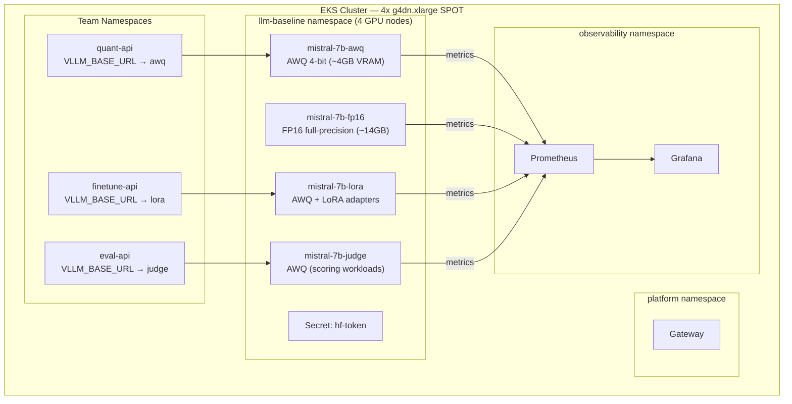
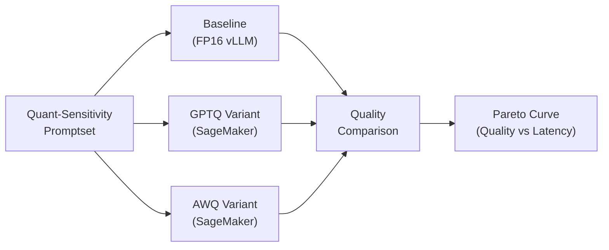
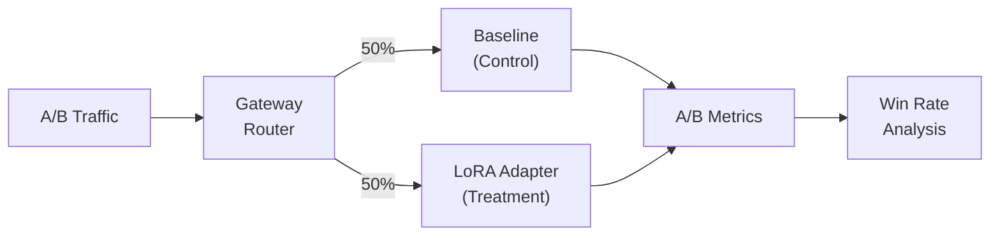

# Design Document 10: Model Infrastructure

## Overview

This document defines the model infrastructure for the LLM Optimization Platform. The platform runs **4 dedicated vLLM model instances** — one per GPU node — each serving a team-specific purpose:

| Model Variant              | Service Name       | Team                 | Model ID                                | Key vLLM Flags                                  |
| -------------------------- | ------------------ | -------------------- | --------------------------------------- | ----------------------------------------------- |
| **AWQ** (4-bit quantized)  | `mistral-7b-awq`   | Quant                | `TheBloke/Mistral-7B-Instruct-v0.2-AWQ` | `--quantization awq`, max_len=4096              |
| **FP16** (full precision)  | `mistral-7b-fp16`  | Platform (reference) | `mistralai/Mistral-7B-Instruct-v0.2`    | `--dtype half`, max_len=1024                    |
| **LoRA** (adapter-enabled) | `mistral-7b-lora`  | Finetune             | AWQ base + LoRA                         | `--quantization awq --enable-lora`, max_loras=4 |
| **Judge** (scoring)        | `mistral-7b-judge` | Eval                 | `TheBloke/Mistral-7B-Instruct-v0.2-AWQ` | `--quantization awq`, max_len=4096              |

**Infrastructure**: 4x g4dn.xlarge **SPOT** instances (T4 16GB GPU each), managed via EKS node group with `capacity_type = "SPOT"` (~70% cost savings vs on-demand).

**Key Technology Choice**: [vLLM](https://docs.vllm.ai/) provides an OpenAI-compatible server with high throughput, native Prometheus metrics, and optional OpenTelemetry tracing.

---

## Quick Start (Implementation Order)

```bash
# 1. Prerequisites (after design-02 llm-baseline namespace created)
# Ensure GPU node group available: 4x g4dn.xlarge SPOT nodes

# 2. Create HuggingFace token secret
kubectl create secret generic hf-token \
  --from-literal=HUGGING_FACE_HUB_TOKEN=$HF_TOKEN \
  -n llm-baseline

# 3. Deploy all 4 model variants via kustomize
kubectl apply -k k8s/base/llm-baseline/

# 4. Wait for all models to become ready (~5-10 min cold start)
kubectl wait --for=condition=ready pod -l model-variant \
  -n llm-baseline --timeout=600s

# 5. Verify all 4 models are serving
for svc in mistral-7b-awq mistral-7b-fp16 mistral-7b-lora mistral-7b-judge; do
  kubectl exec -n llm-baseline deploy/$svc -- \
    curl -s http://localhost:8000/v1/models | jq -r '.data[0].id'
done
```

**Depends On**: [design-02-kubernetes.md](design-02-kubernetes.md) (namespace), GPU node group
**Feeds Into**: [design-04-sagemaker.md](design-04-sagemaker.md) (baseline routing), [design-09-data-engine.md](design-09-data-engine.md) (reference outputs)

---

## Architecture Integration



---

## Namespace Addition

All 4 model variants run in the `llm-baseline` namespace with **pod anti-affinity** (`model-variant` label) ensuring each model lands on a separate GPU node. The namespace extends the architecture from [design-02-kubernetes.md](design-02-kubernetes.md):

| Namespace       | Purpose                          | Key Workloads                               |
| --------------- | -------------------------------- | ------------------------------------------- |
| `platform`      | Core infrastructure services     | Gateway, OTEL Collector sidecar             |
| `quant`         | Quantization team workloads      | quant-api deployment                        |
| `finetune`      | Fine-tuning team workloads       | finetune-api deployment                     |
| `eval`          | Evaluation team workloads        | eval-api deployment                         |
| `observability` | Monitoring stack                 | Grafana, Prometheus, Loki, Tempo            |
| `llm-baseline`  | **Model inference (4 variants)** | **AWQ, FP16, LoRA, Judge vLLM deployments** |

---

## Section 1: vLLM Deployment Architecture

### 1.1 Key Capabilities

| Feature               | Description                                               |
| --------------------- | --------------------------------------------------------- |
| OpenAI-compatible API | `/v1/chat/completions`, `/v1/models`, `/v1/completions`   |
| Prometheus metrics    | `/metrics` endpoint with queue depth, latency, throughput |
| OpenTelemetry tracing | Optional OTLP export for distributed tracing              |
| PVC-backed cache      | No re-download on restarts/rollouts                       |
| GPU-bound scaling     | Scale replicas (1 GPU each), not CPU autoscaling          |

### 1.2 Model Selection

The platform runs **4 model variants** on Mistral-7B-Instruct-v0.2, each optimized for a team's mission:

| Variant   | Model ID                                | Quantization | VRAM Usage | max_model_len | Team                 |
| --------- | --------------------------------------- | ------------ | ---------- | ------------- | -------------------- |
| **AWQ**   | `TheBloke/Mistral-7B-Instruct-v0.2-AWQ` | AWQ 4-bit    | ~4GB       | 4096          | Quant                |
| **FP16**  | `mistralai/Mistral-7B-Instruct-v0.2`    | None (half)  | ~14GB      | 1024          | Platform (reference) |
| **LoRA**  | AWQ base + `--enable-lora`              | AWQ 4-bit    | ~5GB       | 4096          | Finetune             |
| **Judge** | `TheBloke/Mistral-7B-Instruct-v0.2-AWQ` | AWQ 4-bit    | ~4GB       | 4096          | Eval                 |

**Hardware**: 4x g4dn.xlarge SPOT instances (NVIDIA T4 16GB each)

> **Note**: FP16 uses `max_model_len=1024` and `max_num_seqs=4` because T4's 16GB VRAM leaves only ~2GB for KV cache after loading the full-precision weights (~14GB). AWQ models fit comfortably at 4096 tokens.

> **Note**: This model is gated on HuggingFace. "Friction-free" refers to small/cheap hosting, not tokenless access. A read token with terms acceptance is required.

---

## Section 2: Kubernetes Manifests

### 2.1 Namespace

```yaml
# k8s/base/namespace-llm-baseline.yaml
apiVersion: v1
kind: Namespace
metadata:
  name: llm-baseline
  labels:
    app.kubernetes.io/part-of: llm-optimization-platform
    app.kubernetes.io/component: baseline-inference
```

### 2.2 HuggingFace Token Secret

```yaml
# k8s/base/llm-baseline/hf-token-secret.yaml
apiVersion: v1
kind: Secret
metadata:
  name: hf-token
  namespace: llm-baseline
type: Opaque
stringData:
  HUGGING_FACE_HUB_TOKEN: "${HF_TOKEN}" # Inject via sealed-secrets or external-secrets
```

> **Security**: Use [Sealed Secrets](https://github.com/bitnami-labs/sealed-secrets) or [External Secrets Operator](https://external-secrets.io/) to manage the HF token in production. Never commit plaintext tokens.

### 2.3 PVC for Model Cache

```yaml
# k8s/base/llm-baseline/hf-cache-pvc.yaml
apiVersion: v1
kind: PersistentVolumeClaim
metadata:
  name: hf-cache
  namespace: llm-baseline
spec:
  accessModes:
    - ReadWriteOnce
  resources:
    requests:
      storage: 200Gi
  storageClassName: gp3
```

**Benefits**:

- No re-download on pod restarts
- Fast rollouts (~30s vs ~10min cold start)
- Reduces HuggingFace API load

### 2.4 vLLM Deployment

```yaml
# k8s/base/llm-baseline/vllm-deployment.yaml
apiVersion: apps/v1
kind: Deployment
metadata:
  name: mistral-7b-instruct-vllm
  namespace: llm-baseline
  labels:
    app: mistral-7b-instruct-vllm
    app.kubernetes.io/part-of: llm-optimization-platform
    app.kubernetes.io/component: baseline-inference
spec:
  replicas: 1
  selector:
    matchLabels:
      app: mistral-7b-instruct-vllm
  template:
    metadata:
      labels:
        app: mistral-7b-instruct-vllm
        lab.team: platform
      annotations:
        # Prometheus scraping (aligns with design-03-observability.md)
        prometheus.io/scrape: "true"
        prometheus.io/port: "8000"
        prometheus.io/path: "/metrics"
    spec:
      nodeSelector:
        nvidia.com/gpu.present: "true"
      tolerations:
        - key: "nvidia.com/gpu"
          operator: "Exists"
          effect: "NoSchedule"
      containers:
        - name: vllm
          image: vllm/vllm-openai:v0.4.0 # Pin to specific version
          imagePullPolicy: IfNotPresent
          ports:
            - name: http
              containerPort: 8000
          env:
            - name: HUGGING_FACE_HUB_TOKEN
              valueFrom:
                secretKeyRef:
                  name: hf-token
                  key: HUGGING_FACE_HUB_TOKEN

            # Pod metadata for telemetry (aligns with design-08-otel-schema.md)
            - name: POD_NAME
              valueFrom:
                fieldRef:
                  fieldPath: metadata.name
            - name: POD_UID
              valueFrom:
                fieldRef:
                  fieldPath: metadata.uid

            # Optional: OpenTelemetry tracing (uncomment to enable)
            # - name: OTEL_EXPORTER_OTLP_ENDPOINT
            #   value: "http://otel-collector.observability.svc:4318"
            # - name: OTEL_SERVICE_NAME
            #   value: "mistral-7b-baseline"
            # - name: OTEL_RESOURCE_ATTRIBUTES
            #   value: "service.version=v0.4.0,deployment.environment=dev,lab.team=platform"

          args:
            - "--model"
            - "mistralai/Mistral-7B-Instruct-v0.2"
            - "--host"
            - "0.0.0.0"
            - "--port"
            - "8000"
            # Throughput tuning (start conservative)
            - "--max-model-len"
            - "8192"
            - "--max-num-seqs"
            - "64"
            # Uncomment for stability if compilation issues occur:
            # - "--enforce-eager"

          resources:
            limits:
              nvidia.com/gpu: "1"
              cpu: "8"
              memory: "32Gi"
            requests:
              nvidia.com/gpu: "1"
              cpu: "4"
              memory: "16Gi"

          volumeMounts:
            - name: hf-cache
              mountPath: /root/.cache/huggingface
            - name: shm
              mountPath: /dev/shm

          # Probe pattern aligned with design-02-kubernetes.md
          startupProbe:
            httpGet:
              path: /v1/models
              port: 8000
            periodSeconds: 5
            failureThreshold: 90 # 7.5 minutes for cold start
            timeoutSeconds: 5

          readinessProbe:
            httpGet:
              path: /v1/models
              port: 8000
            initialDelaySeconds: 0 # startupProbe gates readiness; no extra delay
            periodSeconds: 5
            timeoutSeconds: 2
            failureThreshold: 12

          livenessProbe:
            httpGet:
              path: /metrics
              port: 8000
            initialDelaySeconds: 0 # startupProbe gates liveness; no extra delay
            periodSeconds: 15
            timeoutSeconds: 2
            failureThreshold: 6

      volumes:
        - name: hf-cache
          persistentVolumeClaim:
            claimName: hf-cache
        - name: shm
          emptyDir:
            medium: Memory
            sizeLimit: 2Gi # Required for vLLM tensor parallelism
```

### 2.5 Service

```yaml
# k8s/base/llm-baseline/vllm-service.yaml
apiVersion: v1
kind: Service
metadata:
  name: mistral-7b-baseline
  namespace: llm-baseline
  labels:
    app: mistral-7b-instruct-vllm
spec:
  selector:
    app: mistral-7b-instruct-vllm
  ports:
    - name: http
      port: 8000
      targetPort: 8000
  type: ClusterIP
```

### 2.6 ServiceMonitor (Prometheus Operator)

```yaml
# k8s/base/llm-baseline/servicemonitor.yaml
apiVersion: monitoring.coreos.com/v1
kind: ServiceMonitor
metadata:
  name: mistral-7b-baseline
  namespace: llm-baseline
  labels:
    release: prometheus # Match your Prometheus Operator selector
spec:
  selector:
    matchLabels:
      app: mistral-7b-instruct-vllm
  endpoints:
    - port: http
      path: /metrics
      interval: 15s
  namespaceSelector:
    matchNames:
      - llm-baseline
```

---

## Section 3: vLLM API Reference

### 3.1 Endpoints

| Endpoint               | Method | Purpose                                 |
| ---------------------- | ------ | --------------------------------------- |
| `/v1/models`           | GET    | List available models (readiness check) |
| `/v1/chat/completions` | POST   | Chat completions (OpenAI-compatible)    |
| `/v1/completions`      | POST   | Text completions (OpenAI-compatible)    |
| `/metrics`             | GET    | Prometheus metrics                      |
| `/health`              | GET    | Health check                            |

### 3.2 Chat Completions Request

```bash
curl -X POST http://mistral-7b-baseline.llm-baseline.svc:8000/v1/chat/completions \
  -H "Content-Type: application/json" \
  -d '{
    "model": "mistralai/Mistral-7B-Instruct-v0.2",
    "messages": [
      {"role": "user", "content": "Explain Kubernetes readiness probes in 3 bullet points."}
    ],
    "max_tokens": 200,
    "temperature": 0.7
  }'
```

### 3.3 Response Format

```json
{
  "id": "cmpl-abc123",
  "object": "chat.completion",
  "created": 1709251200,
  "model": "mistralai/Mistral-7B-Instruct-v0.2",
  "choices": [
    {
      "index": 0,
      "message": {
        "role": "assistant",
        "content": "• Readiness probes determine if a pod can receive traffic...\n• ..."
      },
      "finish_reason": "stop"
    }
  ],
  "usage": {
    "prompt_tokens": 18,
    "completion_tokens": 156,
    "total_tokens": 174
  }
}
```

---

## Section 4: Observability Integration

### 4.1 vLLM Prometheus Metrics

vLLM exposes metrics on `/metrics` that align with `lab_*` naming from [design-08-otel-schema.md](design-08-otel-schema.md):

| Metric                               | Type      | Description                        |
| ------------------------------------ | --------- | ---------------------------------- |
| `vllm_num_requests_running`          | Gauge     | Currently processing requests      |
| `vllm_num_requests_waiting`          | Gauge     | Requests in queue                  |
| `vllm_num_requests_swapped`          | Gauge     | Swapped requests (memory pressure) |
| `vllm_gpu_cache_usage_perc`          | Gauge     | GPU KV cache utilization           |
| `vllm_cpu_cache_usage_perc`          | Gauge     | CPU cache utilization              |
| `vllm_request_prompt_tokens`         | Histogram | Input token distribution           |
| `vllm_request_generation_tokens`     | Histogram | Output token distribution          |
| `vllm_request_success`               | Counter   | Successful requests                |
| `vllm_request_failure`               | Counter   | Failed requests                    |
| `vllm_time_to_first_token_seconds`   | Histogram | TTFT latency                       |
| `vllm_time_per_output_token_seconds` | Histogram | TPOT latency                       |
| `vllm_e2e_request_latency_seconds`   | Histogram | End-to-end latency                 |

### 4.2 Grafana Dashboard Queries

**Queue Depth**:

```promql
vllm_num_requests_waiting{namespace="llm-baseline"}
```

**Request Rate**:

```promql
sum(rate(vllm_request_success_total{namespace="llm-baseline"}[5m]))
```

**P95 E2E Latency**:

```promql
histogram_quantile(0.95,
  sum(rate(vllm_e2e_request_latency_seconds_bucket{namespace="llm-baseline"}[5m])) by (le)
)
```

**GPU Cache Pressure**:

```promql
vllm_gpu_cache_usage_perc{namespace="llm-baseline"}
```

**TTFT (Time to First Token)**:

```promql
histogram_quantile(0.95,
  sum(rate(vllm_time_to_first_token_seconds_bucket{namespace="llm-baseline"}[5m])) by (le)
)
```

**Token Throughput**:

```promql
sum(rate(vllm_request_generation_tokens_sum{namespace="llm-baseline"}[5m]))
```

### 4.3 OpenTelemetry Integration (Optional)

To enable distributed tracing, uncomment the OTEL environment variables in the deployment:

```yaml
env:
  - name: OTEL_EXPORTER_OTLP_ENDPOINT
    value: "http://otel-collector.observability.svc:4318"
  - name: OTEL_SERVICE_NAME
    value: "mistral-7b-baseline"
  - name: OTEL_RESOURCE_ATTRIBUTES
    value: "service.version=v0.4.0,deployment.environment=dev,lab.team=platform,k8s.namespace.name=llm-baseline"
```

This enables trace correlation through the full request path:

```
Gateway → Team Service → Baseline Model (vLLM)
    └── traceparent propagation ──────────┘
```

---

## Section 5: Team Usage Patterns

### 5.1 Quant Team (Baseline Reference)

The quant team uses the baseline as the "truth" reference for quantization comparisons.



**Usage Pattern**:

```python
# Run same promptset against baseline and quantized variants
async def compare_variants(promptset: List[dict]):
    baseline_results = await run_against_endpoint(
        promptset,
        endpoint="http://mistral-7b-baseline.llm-baseline.svc:8000/v1/chat/completions",
        variant="fp16-baseline"
    )

    gptq_results = await run_against_endpoint(
        promptset,
        endpoint="http://quant-api.quant.svc:8000/predict",
        variant="gptq-4bit"
    )

    return calculate_quality_delta(baseline_results, gptq_results)
```

### 5.2 FineTune Team (A/B Control)

The baseline serves as the control group for LoRA adapter experiments.



**Gateway Route Configuration**:

```yaml
# Add to Gateway route_table (design-04-sagemaker.md)
baseline:
  url: http://mistral-7b-baseline.llm-baseline.svc:8000/v1/chat/completions
  timeout_ms: 30000
  ab_variants:
    control: { weight: 50, endpoint: "baseline" }
    treatment: { weight: 50, endpoint: "finetune-api" }
```

### 5.3 Eval Team (Judge Endpoint)

The baseline serves as a cheap judge for scoring prompt-response pairs.

```python
# services/eval-api/judge.py
from typing import Dict
import httpx

BASELINE_URL = "http://mistral-7b-baseline.llm-baseline.svc:8000/v1/chat/completions"

async def score_with_baseline_judge(
    prompt: str,
    response: str,
    rubric: str = "coherence"
) -> Dict[str, float]:
    """Use baseline model as judge for quality scoring."""

    judge_prompt = f"""Rate the following response on {rubric} from 0.0 to 1.0.

Question: {prompt}
Response: {response}

Output only a JSON object: {{"score": <float>, "reasoning": "<brief>"}}"""

    async with httpx.AsyncClient(timeout=30.0) as client:
        result = await client.post(
            BASELINE_URL,
            json={
                "model": "mistralai/Mistral-7B-Instruct-v0.2",
                "messages": [{"role": "user", "content": judge_prompt}],
                "max_tokens": 100,
                "temperature": 0.1
            }
        )
        result.raise_for_status()

        # Parse JSON from response
        content = result.json()["choices"][0]["message"]["content"]
        return json.loads(content)
```

### 5.4 CI/CD (Smoke Tests)

Integration with [design-05-cicd.md](design-05-cicd.md) GitHub Actions workflows:

```yaml
# .github/workflows/post-deploy-smoke.yaml
- name: Smoke test baseline model
  run: |
    # Wait for rollout
    kubectl -n llm-baseline rollout status deploy/mistral-7b-instruct-vllm --timeout=10m

    # Port-forward and test
    kubectl -n llm-baseline port-forward svc/mistral-7b-baseline 8000:8000 &
    sleep 5

    # Check model list
    curl -sf http://localhost:8000/v1/models | jq -e '.data[0].id'

    # Test inference
    RESPONSE=$(curl -sf http://localhost:8000/v1/chat/completions \
      -H "Content-Type: application/json" \
      -d '{
        "model": "mistralai/Mistral-7B-Instruct-v0.2",
        "messages": [{"role": "user", "content": "Say hello"}],
        "max_tokens": 10
      }')

    # Assert response has choices
    echo "$RESPONSE" | jq -e '.choices[0].message.content'
```

---

## Section 6: Autoscaling

### 6.1 KEDA ScaledObject (Recommended)

Scale on vLLM queue pressure using KEDA with Prometheus trigger:

```yaml
# k8s/base/llm-baseline/keda-scaledobject.yaml
apiVersion: keda.sh/v1alpha1
kind: ScaledObject
metadata:
  name: mistral-7b-baseline-scaler
  namespace: llm-baseline
spec:
  scaleTargetRef:
    name: mistral-7b-instruct-vllm
  minReplicaCount: 1
  maxReplicaCount: 10
  cooldownPeriod: 300 # 5 minutes
  pollingInterval: 15
  triggers:
    - type: prometheus
      metadata:
        serverAddress: http://prometheus.observability.svc:9090
        metricName: vllm_num_requests_waiting
        query: avg(vllm_num_requests_waiting{namespace="llm-baseline"})
        threshold: "5" # Scale up when avg queue > 5
```

### 6.2 HPA on CPU (Fallback)

CPU-based HPA is not ideal for GPU inference but works for testing autoscaling plumbing:

```yaml
# k8s/base/llm-baseline/hpa.yaml
apiVersion: autoscaling/v2
kind: HorizontalPodAutoscaler
metadata:
  name: mistral-7b-baseline-hpa
  namespace: llm-baseline
spec:
  scaleTargetRef:
    apiVersion: apps/v1
    kind: Deployment
    name: mistral-7b-instruct-vllm
  minReplicas: 1
  maxReplicas: 5
  metrics:
    - type: Resource
      resource:
        name: cpu
        target:
          type: Utilization
          averageUtilization: 70
```

### 6.3 Autoscaling Validation Tests

Integration with [design-09-data-engine.md](design-09-data-engine.md) test harness:

```bash
#!/bin/bash
# scripts/validate-autoscaling.sh

echo "=== Autoscaling Validation ==="

# 1. Baseline state
echo "[1/4] Recording baseline..."
BASELINE_REPLICAS=$(kubectl -n llm-baseline get deploy/mistral-7b-instruct-vllm -o jsonpath='{.spec.replicas}')
echo "Baseline replicas: $BASELINE_REPLICAS"

# 2. Generate load
echo "[2/4] Generating load (performance promptset, 50 concurrent)..."
python harness.py \
  --promptset s3://llmplatform-data-engine/promptsets/performance/v1/promptset.jsonl \
  --gateway http://mistral-7b-baseline.llm-baseline.svc:8000 \
  --concurrency 50 \
  --run-id "autoscale-test-$(date +%s)" &

LOAD_PID=$!
sleep 120  # Wait 2 minutes for scaling

# 3. Check scale-up
echo "[3/4] Checking scale-up..."
SCALED_REPLICAS=$(kubectl -n llm-baseline get deploy/mistral-7b-instruct-vllm -o jsonpath='{.status.replicas}')
echo "Scaled replicas: $SCALED_REPLICAS"

if [ "$SCALED_REPLICAS" -gt "$BASELINE_REPLICAS" ]; then
  echo "✓ Scale-up successful"
else
  echo "✗ Scale-up did not occur"
fi

# 4. Stop load and check scale-down
echo "[4/4] Stopping load, waiting for scale-down..."
kill $LOAD_PID 2>/dev/null
sleep 360  # Wait 6 minutes (cooldown + scale-down)

FINAL_REPLICAS=$(kubectl -n llm-baseline get deploy/mistral-7b-instruct-vllm -o jsonpath='{.status.replicas}')
echo "Final replicas: $FINAL_REPLICAS"

if [ "$FINAL_REPLICAS" -le "$BASELINE_REPLICAS" ]; then
  echo "✓ Scale-down successful"
else
  echo "✗ Scale-down did not complete"
fi

echo "=== Autoscaling Validation Complete ==="
```

---

## Section 7: Tuning Guide

### 7.1 vLLM Configuration Knobs

| Parameter                  | Default | Description                         | Tuning Guidance                                   |
| -------------------------- | ------- | ----------------------------------- | ------------------------------------------------- |
| `--max-model-len`          | 8192    | Maximum context length              | Raise only if needed; increases KV cache pressure |
| `--max-num-seqs`           | 64      | Max concurrent sequences            | Tune with p95 latency + GPU memory headroom       |
| `--gpu-memory-utilization` | 0.9     | Fraction of GPU memory for KV cache | Lower if OOM; raise for throughput                |
| `--enforce-eager`          | false   | Disable CUDA graphs                 | Enable if compilation issues occur                |
| `--swap-space`             | 4       | CPU swap space (GB)                 | Increase for memory-constrained GPUs              |

### 7.2 Scaling Strategy

| Load Pattern               | Strategy                        |
| -------------------------- | ------------------------------- |
| Low traffic (< 10 rps)     | 1 replica                       |
| Medium traffic (10-50 rps) | 2-3 replicas                    |
| High traffic (50+ rps)     | KEDA-based autoscaling          |
| Burst traffic              | Pre-scale before expected burst |

### 7.3 Cost Optimization

| Optimization                              | Impact                         |
| ----------------------------------------- | ------------------------------ |
| Use spot/preemptible GPU nodes            | 60-70% cost reduction          |
| Share PVC across replicas (ReadWriteMany) | Eliminates redundant downloads |
| Scale to zero during off-hours            | Eliminate idle costs           |
| Use smaller model for dev/staging         | Reduce GPU requirements        |

---

## Section 8: Golden Path Validation

### 8.1 Post-Deploy Checks

```bash
#!/bin/bash
# scripts/golden-checks.sh

set -e

echo "=== vLLM Baseline Golden Checks ==="

# 1. Rollout status
echo "[1/4] Checking rollout status..."
kubectl -n llm-baseline rollout status deploy/mistral-7b-instruct-vllm --timeout=10m

# 2. Model list endpoint
echo "[2/4] Checking /v1/models..."
kubectl -n llm-baseline port-forward svc/mistral-7b-baseline 8000:8000 &
PF_PID=$!
sleep 3

MODELS=$(curl -sf http://localhost:8000/v1/models)
echo "$MODELS" | jq -e '.data[0].id' > /dev/null
echo "✓ Model available: $(echo $MODELS | jq -r '.data[0].id')"

# 3. Chat completions
echo "[3/4] Testing /v1/chat/completions..."
RESPONSE=$(curl -sf http://localhost:8000/v1/chat/completions \
  -H "Content-Type: application/json" \
  -d '{
    "model": "mistralai/Mistral-7B-Instruct-v0.2",
    "messages": [{"role": "user", "content": "Say hello in one word."}],
    "max_tokens": 10
  }')

CONTENT=$(echo "$RESPONSE" | jq -r '.choices[0].message.content')
echo "✓ Response: $CONTENT"

# 4. Metrics endpoint
echo "[4/4] Checking /metrics..."
METRICS=$(curl -sf http://localhost:8000/metrics | head -20)
echo "$METRICS" | grep -q "vllm_" && echo "✓ Prometheus metrics available"

kill $PF_PID 2>/dev/null

echo "=== All Golden Checks Passed ==="
```

### 8.2 Canary Integration

Integration with canary promptset from [design-09-data-engine.md](design-09-data-engine.md):

```bash
# Run canary promptset against baseline
python harness.py \
  --promptset s3://llmplatform-data-engine/promptsets/canary/v1/promptset.jsonl \
  --gateway http://mistral-7b-baseline.llm-baseline.svc:8000 \
  --team baseline \
  --run-id "canary-baseline-$(date +%Y%m%d-%H%M%S)"
```

---

## Section 9: Directory Structure

```
k8s/
├── base/
│   ├── kustomization.yaml
│   ├── namespace-llm-baseline.yaml
│   └── llm-baseline/
│       ├── kustomization.yaml
│       ├── hf-token-secret.yaml
│       ├── hf-cache-pvc.yaml
│       ├── vllm-deployment.yaml
│       ├── vllm-service.yaml
│       ├── servicemonitor.yaml
│       └── keda-scaledobject.yaml
└── overlays/
    ├── dev/
    │   └── llm-baseline/
    │       └── kustomization.yaml  # replicas: 1, CPU fallback
    └── prod/
        └── llm-baseline/
            └── kustomization.yaml  # KEDA enabled, multi-replica
```

### Kustomization Files

```yaml
# k8s/base/llm-baseline/kustomization.yaml
apiVersion: kustomize.config.k8s.io/v1beta1
kind: Kustomization
namespace: llm-baseline
resources:
  - hf-token-secret.yaml
  - hf-cache-pvc.yaml
  - vllm-deployment.yaml
  - vllm-service.yaml
  - servicemonitor.yaml
```

```yaml
# k8s/overlays/prod/llm-baseline/kustomization.yaml
apiVersion: kustomize.config.k8s.io/v1beta1
kind: Kustomization
resources:
  - ../../../base/llm-baseline
  - keda-scaledobject.yaml
patches:
  - patch: |-
      - op: replace
        path: /spec/replicas
        value: 2
    target:
      kind: Deployment
      name: mistral-7b-instruct-vllm
```

---

## Implementation Checklist

### Infrastructure

- [ ] `llm-baseline` namespace created
- [ ] HuggingFace token stored in Secret (via sealed-secrets)
- [ ] PVC for model cache (200Gi) provisioned
- [ ] GPU node pool available with correct labels

### Deployment

- [ ] vLLM deployment applied and healthy
- [ ] Probes configured (startup: 7.5min, readiness: /v1/models, liveness: /metrics)
- [ ] Service exposed on port 8000
- [ ] ServiceMonitor for Prometheus scraping

### Observability

- [ ] Prometheus scraping `/metrics`
- [ ] Grafana dashboards for vLLM metrics
- [ ] OTEL tracing enabled (optional)
- [ ] Alerting rules for queue depth / error rate

### Team Integration

- [ ] Quant team can reach baseline for comparisons
- [ ] FineTune team configured for A/B routing
- [ ] Eval team using baseline as judge endpoint
- [ ] Test harness updated with baseline endpoint

### Autoscaling

- [ ] KEDA ScaledObject configured
- [ ] Autoscaling validation tests passing
- [ ] Cooldown period tuned for workload

### CI/CD

- [ ] Golden checks script in repo
- [ ] Post-deploy smoke tests in GitHub Actions
- [ ] Canary promptset run automated
