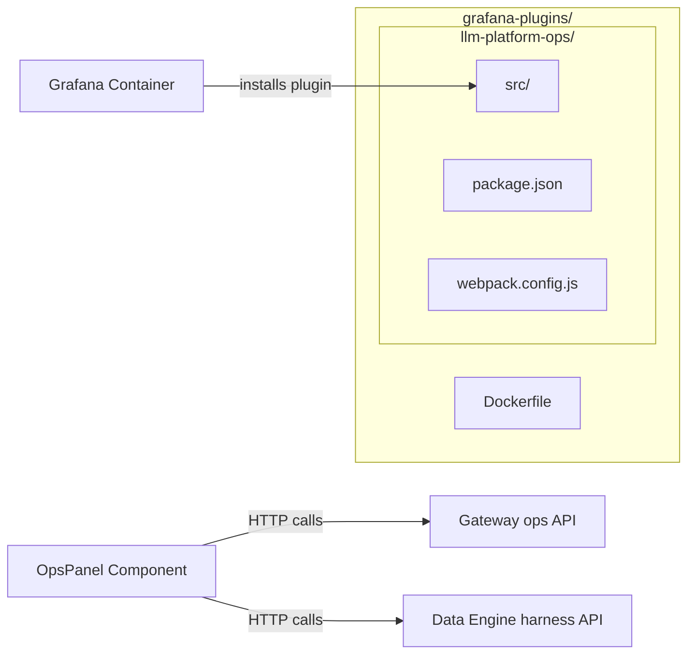

# grafana-plugins/

Custom Grafana panel plugin and Docker configuration for the LLM Platform operations dashboard.

## Architecture



## Files

| File         | Purpose                                               |
| ------------ | ----------------------------------------------------- |
| `Dockerfile` | Grafana 10.3.1 image with custom plugin pre-installed |

## Dockerfile

```dockerfile
FROM grafana/grafana:10.3.1
COPY llm-platform-ops/dist/ /var/lib/grafana/plugins/llmplatform-ops-panel/
ENV GF_PLUGINS_ALLOW_LOADING_UNSIGNED_PLUGINS=llmplatform-ops-panel
```

## Plugin: llm-platform-ops/

See [llm-platform-ops/README.md](llm-platform-ops/README.md) for full details.

The plugin provides a unified operations dashboard with health overview, platform stats, service registry, test console, and harness console — all communicating via the Gateway's `/ops/*` API and data-engine's `/harness/*` endpoints.
