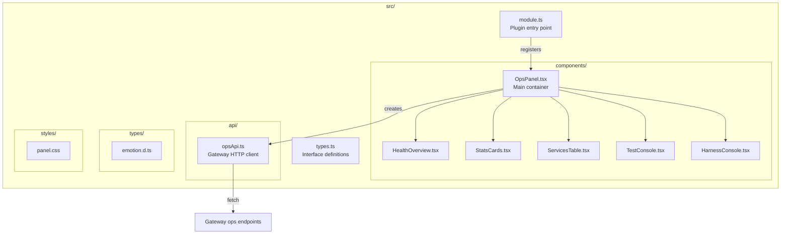

# grafana-plugins/llm-platform-ops/src/

TypeScript/React source code for the Grafana operations panel plugin.

## Architecture



## Files

| File                            | Purpose                                           |
| ------------------------------- | ------------------------------------------------- |
| `module.ts`                     | Plugin registration — `PanelPlugin(OpsPanel)`     |
| `types.ts`                      | TypeScript interfaces for panel options           |
| `api/opsApi.ts`                 | HTTP client for Gateway ops and harness endpoints |
| `components/OpsPanel.tsx`       | Main panel — orchestrates all sub-components      |
| `components/HealthOverview.tsx` | Real-time health status per team                  |
| `components/StatsCards.tsx`     | 24h metrics: requests, error rate, latency        |
| `components/ServicesTable.tsx`  | Registered services with versions                 |
| `components/TestConsole.tsx`    | Execute test predictions with correlation IDs     |
| `components/HarnessConsole.tsx` | Run test harness and benchmark suites             |
| `styles/panel.css`              | Panel CSS styles                                  |
| `types/emotion.d.ts`            | TypeScript declaration for @emotion/css           |

## Key Component: OpsPanel.tsx

Main container that fetches data on mount and at a configurable interval:

```tsx
export const OpsPanel: React.FC<Props> = ({ options }) => {
  const api = useMemo(
    () => new OpsApi(options.gatewayUrl),
    [options.gatewayUrl],
  );

  useEffect(() => {
    const fetchData = async () => {
      const [services, health, stats] = await Promise.all([
        api.getServices(),
        api.getHealth(),
        api.getStats(),
      ]);
      // ... update state
    };
    const interval = setInterval(fetchData, options.refreshInterval * 1000);
    return () => clearInterval(interval);
  }, [options.gatewayUrl, options.refreshInterval]);

  return (
    <div>
      <HealthOverview health={health} />
      <StatsCards stats={stats} />
      <ServicesTable services={services} />
      <TestConsole api={api} />
      <HarnessConsole api={api} />
    </div>
  );
};
```

## Plugin Options

| Option            | Default          | Description                     |
| ----------------- | ---------------- | ------------------------------- |
| `gatewayUrl`      | `/gateway-proxy` | Base URL for ops API            |
| `refreshInterval` | `30`             | Auto-refresh interval (seconds) |
