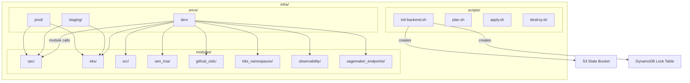

# infra/

Terraform Infrastructure-as-Code for provisioning all AWS resources. Uses a modular architecture with per-environment configurations and remote S3/DynamoDB state management.

## Architecture



## Directory Contents

| Path            | Purpose                                                   |
| --------------- | --------------------------------------------------------- |
| `envs/dev/`     | Dev environment config — VPC, EKS, ECR, IRSA, all modules |
| `envs/staging/` | Staging environment (placeholder)                         |
| `envs/prod/`    | Production environment (placeholder)                      |
| `modules/`      | Reusable Terraform modules                                |
| `scripts/`      | Shell helpers for init, plan, apply, destroy              |

## Module Summary

| Module                | Resources Created                                         |
| --------------------- | --------------------------------------------------------- |
| `vpc`                 | VPC, subnets (public/private), NAT Gateway, route tables  |
| `eks`                 | EKS cluster, managed node groups (general + GPU SPOT)     |
| `ecr`                 | ECR repositories per service with lifecycle policies      |
| `iam_irsa`            | IRSA roles per team for SageMaker + CloudWatch access     |
| `github_oidc`         | GitHub Actions OIDC provider + CI/CD IAM role             |
| `k8s_namespaces`      | Kubernetes namespaces with ResourceQuotas and LimitRanges |
| `observability`       | CloudWatch log groups, ALB Ingress Controller IRSA role   |
| `sagemaker_endpoints` | SageMaker models, endpoint configs, endpoints per team    |

## State Management

Remote state backend (S3 + DynamoDB):

```hcl
backend "s3" {
  bucket         = "troys-bigbucket-west2"
  key            = "terraform.tfstate"
  region         = "us-west-2"
  encrypt        = true
  dynamodb_table = "tf-locks-llmplatform-dev"
}
```

## Dev Environment Node Groups

```hcl
node_groups = {
  general = {
    instance_types = ["t3.medium"]
    desired_size   = 4, min_size = 2, max_size = 5
  }
  gpu = {
    instance_types = ["g4dn.xlarge", "g4dn.2xlarge", "g5.xlarge"]
    capacity_type  = "SPOT"
    desired_size   = 0, min_size = 0, max_size = 4
    taints = [{ key = "nvidia.com/gpu", effect = "NO_SCHEDULE" }]
  }
}
```

## Infrastructure Modules Overview

How each Terraform module maps to the LLM Optimization Platform architecture.

| Module                                                | What It Provisions                                                                                                                                                                                  | Role in the LLM Optimization Platform                                                                                                                                                                                                                                                                                                                                              |
| ----------------------------------------------------- | --------------------------------------------------------------------------------------------------------------------------------------------------------------------------------------------------- | ---------------------------------------------------------------------------------------------------------------------------------------------------------------------------------------------------------------------------------------------------------------------------------------------------------------------------------------------------------------------------------- |
| **vpc** (20 resources)                                | VPC, 3 public + 3 private subnets across us-west-2a/b/c, Internet Gateway, single NAT Gateway, route tables, and associations                                                                       | The network foundation — isolates all platform traffic in a dedicated VPC, places EKS worker nodes in private subnets for security, and exposes only the ALB in public subnets so users can reach the Gateway API. The NAT Gateway lets private workloads call SageMaker, ECR, and CloudWatch without public IPs.                                                                  |
| **eks** (15 resources)                                | EKS cluster (K8s 1.29), general-purpose node group (t3.medium), GPU SPOT node group (g4dn/g5), OIDC provider, EBS CSI driver, cluster/node IAM roles and policy attachments, cluster security group | The compute engine — orchestrates all six platform microservices (gateway, quant-api, finetune-api, eval-api, grafana-plugin, data-engine) as Kubernetes pods. The general node group handles API traffic and observability; the GPU SPOT group scales from zero for quantization and fine-tuning inference. IRSA via the OIDC provider gives each service scoped AWS credentials. |
| **ecr** (12 resources)                                | 6 ECR repositories (gateway, quant-api, finetune-api, eval-api, grafana-plugin, data-engine) with KMS encryption and scan-on-push, plus 6 lifecycle policies                                        | The container registry — stores versioned Docker images for every platform service. CI/CD pushes images here; EKS nodes pull them at deploy time. Lifecycle policies cap storage at 15 tagged images and expire untagged builds after 7 days.                                                                                                                                      |
| **iam_irsa** (11 resources across 4 instances)        | 4 IRSA IAM roles (quant-api, finetune-api, eval-api, gateway) with SageMaker invoke and/or CloudWatch inline policies                                                                               | The identity layer — each team's Kubernetes service account is bound to a scoped IAM role via IRSA. Quant, finetune, and eval services get `sagemaker:InvokeEndpoint` on their respective endpoints; gateway gets CloudWatch-only. No static AWS keys exist anywhere in the platform.                                                                                              |
| **k8s_namespaces** (25 resources across 5 namespaces) | 5 namespaces (platform, quant, finetune, eval, observability), each with a ResourceQuota, LimitRange, ConfigMap, and IRSA-annotated ServiceAccount                                                  | The multi-tenancy layer — isolates each team's workloads with resource quotas (CPU/memory/pod caps) and injects environment config (SageMaker endpoint names, region, log levels) via ConfigMaps. ServiceAccounts bind IRSA roles so pods automatically receive their AWS credentials.                                                                                             |
| **github_oidc** (5 resources)                         | GitHub Actions OIDC provider, CI/CD IAM role with ECR push, EKS deploy, and Terraform state access policies                                                                                         | The CI/CD identity — lets GitHub Actions assume an AWS role without long-lived secrets. Workflows build images → push to ECR → deploy manifests to EKS → run Terraform plan/apply, all authenticated via short-lived OIDC tokens scoped to the repo's main/develop branches.                                                                                                       |
| **observability** (5 resources)                       | CloudWatch log group for EKS, ALB Ingress Controller IRSA role + policy, External Secrets Operator IRSA role + policy                                                                               | The monitoring and ingress plumbing — centralizes cluster logs in CloudWatch, enables the ALB controller to provision load balancers that route traffic to the Gateway, and allows the External Secrets Operator to pull secrets from AWS Secrets Manager into Kubernetes.                                                                                                         |
| **sagemaker_endpoints** (per-team, variable count)    | SageMaker models, endpoint configurations (with A/B variant support), and live endpoints per team                                                                                                   | The ML inference layer — hosts optimized LLM models behind SageMaker endpoints that the platform's APIs invoke. Each team (quant, finetune, eval) gets its own model + endpoint config + endpoint, enabling independent model deployments and A/B traffic splitting between model variants.                                                                                        |

## Infrastructure Diagram

```mermaid
graph TB
    %% ── External ──
    USER["👤 Platform Users"]
    GH["🔀 GitHub Actions CI/CD"]

    %% ── GitHub OIDC Module (5 resources) ──
    subgraph OIDC_MOD["github_oidc module &lpar;5 resources&rpar;"]
        OIDC_PROV["aws_iam_openid_connect_provider.github"]
        OIDC_ROLE["aws_iam_role.github_actions"]
        OIDC_ECR_POL["aws_iam_role_policy.ecr_push"]
        OIDC_EKS_POL["aws_iam_role_policy.eks_deploy"]
        OIDC_TF_POL["aws_iam_role_policy.terraform_state"]
    end

    %% ── VPC Module (20 resources) ──
    subgraph VPC_MOD["vpc module &lpar;20 resources&rpar;"]
        VPC["aws_vpc.main"]
        IGW["aws_internet_gateway.main"]
        subgraph PUB_NETS["Public Subnets"]
            PUB0["aws_subnet.public 0 · 2a"]
            PUB1["aws_subnet.public 1 · 2b"]
            PUB2["aws_subnet.public 2 · 2c"]
        end
        subgraph PRIV_NETS["Private Subnets"]
            PRIV0["aws_subnet.private 0 · 2a"]
            PRIV1["aws_subnet.private 1 · 2b"]
            PRIV2["aws_subnet.private 2 · 2c"]
        end
        EIP["aws_eip.nat 0"]
        NAT["aws_nat_gateway.main 0"]
        RT_PUB["aws_route_table.public"]
        RT_PRIV0["aws_route_table.private 0"]
        RT_PRIV1["aws_route_table.private 1"]
        RT_PRIV2["aws_route_table.private 2"]
        RTA_PUB0["rt_assoc.public 0"]
        RTA_PUB1["rt_assoc.public 1"]
        RTA_PUB2["rt_assoc.public 2"]
        RTA_PRIV0["rt_assoc.private 0"]
        RTA_PRIV1["rt_assoc.private 1"]
        RTA_PRIV2["rt_assoc.private 2"]
    end

    %% ── EKS Module (15 resources) ──
    subgraph EKS_MOD["eks module &lpar;15 resources&rpar;"]
        EKS_ROLE["aws_iam_role.cluster"]
        EKS_POL1["policy: AmazonEKSClusterPolicy"]
        EKS_POL2["policy: AmazonEKSVPCResourceController"]
        EKS_CLUSTER["aws_eks_cluster.main &lpar;K8s 1.29&rpar;"]
        EKS_SG["aws_security_group.cluster"]
        NODE_ROLE["aws_iam_role.nodes"]
        NODE_POL1["policy: EKSWorkerNodePolicy"]
        NODE_POL2["policy: EKS_CNI_Policy"]
        NODE_POL3["policy: ECRReadOnly"]
        NG_GEN["node_group general · t3.medium 2‑5"]
        NG_GPU["node_group gpu · g4dn/g5 SPOT 0‑4"]
        EKS_OIDC["aws_iam_openid_connect_provider.eks"]
        EBS_ADDON["aws_eks_addon.ebs_csi"]
        EBS_ROLE["aws_iam_role.ebs_csi"]
        EBS_POL["policy: AmazonEBSCSIDriverPolicy"]
    end

    %% ── ECR Module (12 resources) ──
    subgraph ECR_MOD["ecr module &lpar;12 resources&rpar;"]
        ECR_GW["ecr: gateway"]
        ECR_QA["ecr: quant-api"]
        ECR_FA["ecr: finetune-api"]
        ECR_EA["ecr: eval-api"]
        ECR_GP["ecr: grafana-plugin"]
        ECR_DE["ecr: data-engine"]
        LCP_GW["lifecycle: gateway"]
        LCP_QA["lifecycle: quant-api"]
        LCP_FA["lifecycle: finetune-api"]
        LCP_EA["lifecycle: eval-api"]
        LCP_GP["lifecycle: grafana-plugin"]
        LCP_DE["lifecycle: data-engine"]
    end

    %% ── IAM IRSA Module (11 resources) ──
    subgraph IRSA_MOD["iam_irsa module &lpar;11 resources × 4 instances&rpar;"]
        subgraph IRSA_Q["quant-api IRSA"]
            IQ_ROLE["aws_iam_role.irsa"]
            IQ_SM["policy: sagemaker_invoke"]
            IQ_CW["policy: cloudwatch"]
        end
        subgraph IRSA_F["finetune-api IRSA"]
            IF_ROLE["aws_iam_role.irsa"]
            IF_SM["policy: sagemaker_invoke"]
            IF_CW["policy: cloudwatch"]
        end
        subgraph IRSA_E["eval-api IRSA"]
            IE_ROLE["aws_iam_role.irsa"]
            IE_SM["policy: sagemaker_invoke"]
            IE_CW["policy: cloudwatch"]
        end
        subgraph IRSA_G["gateway IRSA"]
            IG_ROLE["aws_iam_role.irsa"]
            IG_CW["policy: cloudwatch"]
        end
    end

    %% ── K8s Namespaces Module (25 resources) ──
    subgraph K8S_MOD["k8s_namespaces module &lpar;25 resources × 5 namespaces&rpar;"]
        subgraph NS_PLAT["namespace: platform"]
            N_PLAT["kubernetes_namespace"]
            Q_PLAT["resource_quota"]
            L_PLAT["limit_range"]
            C_PLAT["config_map"]
            S_PLAT["service_account: platform-sa"]
        end
        subgraph NS_QUANT["namespace: quant"]
            N_QUANT["kubernetes_namespace"]
            Q_QUANT["resource_quota"]
            L_QUANT["limit_range"]
            C_QUANT["config_map"]
            S_QUANT["service_account: quant-sa"]
        end
        subgraph NS_FT["namespace: finetune"]
            N_FT["kubernetes_namespace"]
            Q_FT["resource_quota"]
            L_FT["limit_range"]
            C_FT["config_map"]
            S_FT["service_account: finetune-sa"]
        end
        subgraph NS_EVAL["namespace: eval"]
            N_EVAL["kubernetes_namespace"]
            Q_EVAL["resource_quota"]
            L_EVAL["limit_range"]
            C_EVAL["config_map"]
            S_EVAL["service_account: eval-sa"]
        end
        subgraph NS_OBS["namespace: observability"]
            N_OBS["kubernetes_namespace"]
            Q_OBS["resource_quota"]
            L_OBS["limit_range"]
            C_OBS["config_map"]
            S_OBS["service_account: observability-sa"]
        end
    end

    %% ── Observability Module (5 resources) ──
    subgraph OBS_MOD["observability module &lpar;5 resources&rpar;"]
        CW_LOG["aws_cloudwatch_log_group.eks"]
        ALB_ROLE["aws_iam_role.alb_controller"]
        ALB_POL["aws_iam_role_policy.alb_controller"]
        ES_ROLE["aws_iam_role.external_secrets"]
        ES_POL["aws_iam_role_policy.external_secrets"]
    end

    %% ── SageMaker Module (per-team) ──
    subgraph SM_MOD["sagemaker_endpoints module &lpar;per team&rpar;"]
        SM_MODEL_Q["aws_sagemaker_model · quant"]
        SM_CFG_Q["aws_sagemaker_endpoint_configuration · quant"]
        SM_EP_Q["aws_sagemaker_endpoint · quant"]
        SM_MODEL_F["aws_sagemaker_model · finetune"]
        SM_CFG_F["aws_sagemaker_endpoint_configuration · finetune"]
        SM_EP_F["aws_sagemaker_endpoint · finetune"]
        SM_MODEL_E["aws_sagemaker_model · eval"]
        SM_CFG_E["aws_sagemaker_endpoint_configuration · eval"]
        SM_EP_E["aws_sagemaker_endpoint · eval"]
    end

    %% ── Connections ──
    USER -->|"HTTPS"| IGW
    IGW --> PUB_NETS
    PUB_NETS -->|"ALB"| EKS_CLUSTER
    EKS_CLUSTER --> PRIV_NETS
    PRIV_NETS -->|"outbound via"| NAT
    NAT -->|"→ AWS APIs"| ECR_MOD
    NAT -->|"→ SageMaker"| SM_MOD
    NAT -->|"→ CloudWatch"| CW_LOG

    GH -->|"OIDC assume role"| OIDC_ROLE
    OIDC_ROLE -->|"push images"| ECR_MOD
    OIDC_ROLE -->|"deploy manifests"| EKS_CLUSTER

    EKS_CLUSTER --> K8S_MOD
    EKS_OIDC -->|"IRSA"| IRSA_MOD
    S_PLAT -.->|"binds"| IG_ROLE
    S_QUANT -.->|"binds"| IQ_ROLE
    S_FT -.->|"binds"| IF_ROLE
    S_EVAL -.->|"binds"| IE_ROLE

    IQ_SM -->|"invoke"| SM_EP_Q
    IF_SM -->|"invoke"| SM_EP_F
    IE_SM -->|"invoke"| SM_EP_E

    ALB_ROLE -->|"provisions ALBs in"| PUB_NETS
    EBS_ADDON -->|"dynamic PVs"| PRIV_NETS

    NG_GEN -->|"runs in"| PRIV_NETS
    NG_GPU -->|"runs in"| PRIV_NETS
    NODE_POL3 -->|"pulls from"| ECR_MOD
```



## Complete Resource Inventory (83 Resources)

All resources provisioned by the dev environment and how each connects to the LLM Optimization Platform.

### VPC Module (20 resources)

| #   | Resource                                 | Description                                           | Platform Connection                                                                                                     |
| --- | ---------------------------------------- | ----------------------------------------------------- | ----------------------------------------------------------------------------------------------------------------------- |
| 1   | `aws_vpc.main`                           | Virtual Private Cloud (10.0.0.0/16)                   | Isolated network boundary for all platform compute (EKS, SageMaker) and ensures traffic stays private between services  |
| 2   | `aws_internet_gateway.main`              | Internet Gateway attached to the VPC                  | Allows the Gateway API and ALB Ingress to receive external HTTP traffic from platform users                             |
| 3   | `aws_subnet.public[0]`                   | Public subnet in us-west-2a (10.0.1.0/24)             | Hosts public-facing ALB that routes requests to the Gateway service; tagged for EKS ELB discovery                       |
| 4   | `aws_subnet.public[1]`                   | Public subnet in us-west-2b (10.0.2.0/24)             | Second AZ for ALB high-availability; ensures platform API remains reachable during AZ failures                          |
| 5   | `aws_subnet.public[2]`                   | Public subnet in us-west-2c (10.0.3.0/24)             | Third AZ for ALB high-availability; completes multi-AZ redundancy for ingress traffic                                   |
| 6   | `aws_subnet.private[0]`                  | Private subnet in us-west-2a (10.0.10.0/24)           | Runs EKS worker nodes for quant-api, finetune-api, eval-api, and gateway pods without public IPs                        |
| 7   | `aws_subnet.private[1]`                  | Private subnet in us-west-2b (10.0.20.0/24)           | Second AZ for EKS node scheduling; Kubernetes spreads team workloads across AZs for fault tolerance                     |
| 8   | `aws_subnet.private[2]`                  | Private subnet in us-west-2c (10.0.30.0/24)           | Third AZ for EKS node scheduling; GPU SPOT nodes can launch in any AZ to maximize capacity availability                 |
| 9   | `aws_eip.nat[0]`                         | Elastic IP for NAT Gateway                            | Stable outbound IP for all private workloads; enables ECR image pulls, SageMaker API calls, and CloudWatch log shipping |
| 10  | `aws_nat_gateway.main[0]`                | NAT Gateway (single, cost-optimized for dev)          | Provides internet access to private EKS nodes so platform services can reach AWS APIs and external dependencies         |
| 11  | `aws_route_table.public`                 | Public route table (0.0.0.0/0 → IGW)                  | Routes inbound platform traffic from the internet through the IGW to the ALB in public subnets                          |
| 12  | `aws_route_table.private[0]`             | Private route table for AZ-a (0.0.0.0/0 → NAT)        | Outbound routing for private nodes in AZ-a; enables SageMaker endpoint calls and image pulls                            |
| 13  | `aws_route_table.private[1]`             | Private route table for AZ-b (0.0.0.0/0 → NAT)        | Outbound routing for private nodes in AZ-b                                                                              |
| 14  | `aws_route_table.private[2]`             | Private route table for AZ-c (0.0.0.0/0 → NAT)        | Outbound routing for private nodes in AZ-c                                                                              |
| 15  | `aws_route_table_association.public[0]`  | Associates public subnet AZ-a with public route table | Ensures public subnet in AZ-a can receive external traffic destined for platform APIs                                   |
| 16  | `aws_route_table_association.public[1]`  | Associates public subnet AZ-b with public route table | Ensures public subnet in AZ-b can receive external traffic                                                              |
| 17  | `aws_route_table_association.public[2]`  | Associates public subnet AZ-c with public route table | Ensures public subnet in AZ-c can receive external traffic                                                              |
| 18  | `aws_route_table_association.private[0]` | Associates private subnet AZ-a with its route table   | Connects private EKS nodes in AZ-a to the NAT for outbound platform traffic                                             |
| 19  | `aws_route_table_association.private[1]` | Associates private subnet AZ-b with its route table   | Connects private EKS nodes in AZ-b to the NAT                                                                           |
| 20  | `aws_route_table_association.private[2]` | Associates private subnet AZ-c with its route table   | Connects private EKS nodes in AZ-c to the NAT                                                                           |

### EKS Module (15 resources)

| #   | Resource                                                 | Description                                                | Platform Connection                                                                                                                       |
| --- | -------------------------------------------------------- | ---------------------------------------------------------- | ----------------------------------------------------------------------------------------------------------------------------------------- |
| 21  | `aws_iam_role.cluster`                                   | IAM role for the EKS control plane                         | Grants AWS permissions for EKS to manage the Kubernetes cluster that orchestrates all platform microservices                              |
| 22  | `aws_iam_role_policy_attachment.cluster_policy`          | Attaches `AmazonEKSClusterPolicy` to cluster role          | Core EKS permissions — required for the cluster to manage networking, nodes, and pod scheduling                                           |
| 23  | `aws_iam_role_policy_attachment.vpc_resource_controller` | Attaches `AmazonEKSVPCResourceController` to cluster role  | Enables pod-level security groups and ENI management for fine-grained network isolation between team namespaces                           |
| 24  | `aws_eks_cluster.main`                                   | EKS cluster (Kubernetes 1.29)                              | The central compute platform — runs gateway, quant-api, finetune-api, eval-api, grafana-plugin, and data-engine as containerized services |
| 25  | `aws_security_group.cluster`                             | Security group for the EKS cluster control plane           | Controls network access to the Kubernetes API server; allows cluster-to-node communication for pod management                             |
| 26  | `aws_iam_role.nodes`                                     | IAM role for EKS managed node groups                       | Worker node identity — allows EC2 instances to join the cluster, pull container images, and run platform workloads                        |
| 27  | `aws_iam_role_policy_attachment.worker_node`             | Attaches `AmazonEKSWorkerNodePolicy` to node role          | Permits worker nodes to communicate with the EKS API and receive pod scheduling instructions                                              |
| 28  | `aws_iam_role_policy_attachment.cni`                     | Attaches `AmazonEKS_CNI_Policy` to node role               | Enables VPC-native networking (each pod gets a VPC IP) so platform services can communicate directly                                      |
| 29  | `aws_iam_role_policy_attachment.ecr_readonly`            | Attaches `AmazonEC2ContainerRegistryReadOnly` to node role | Allows worker nodes to pull container images for gateway, quant-api, finetune-api, eval-api, grafana-plugin, and data-engine from ECR     |
| 30  | `aws_eks_node_group.main["general"]`                     | General-purpose node group (t3.medium, 2–5 nodes)          | Runs the platform control plane workloads: gateway, eval-api, data-engine, and the observability stack (Prometheus, Grafana)              |
| 31  | `aws_eks_node_group.main["gpu"]`                         | GPU SPOT node group (g4dn/g5, 0–4 nodes)                   | On-demand GPU compute for quantization and fine-tuning jobs; scales from 0 to minimize costs when no inference/training is active         |
| 32  | `aws_iam_openid_connect_provider.eks`                    | OIDC identity provider for the EKS cluster                 | Enables IRSA (IAM Roles for Service Accounts) so each platform microservice gets scoped AWS credentials without static keys               |
| 33  | `aws_eks_addon.ebs_csi`                                  | EBS CSI driver addon                                       | Provides dynamic PersistentVolume provisioning for stateful platform components (Prometheus data, Grafana dashboards, model caches)       |
| 34  | `aws_iam_role.ebs_csi`                                   | IAM role for the EBS CSI driver (IRSA)                     | Scoped identity for the CSI driver to create/attach/delete EBS volumes on behalf of platform pods                                         |
| 35  | `aws_iam_role_policy_attachment.ebs_csi`                 | Attaches `AmazonEBSCSIDriverPolicy` to EBS CSI role        | Grants EBS volume management permissions to the CSI driver for platform storage                                                           |

### ECR Module (12 resources)

| #   | Resource                                             | Description                                  | Platform Connection                                                                                                             |
| --- | ---------------------------------------------------- | -------------------------------------------- | ------------------------------------------------------------------------------------------------------------------------------- |
| 36  | `aws_ecr_repository.services["gateway"]`             | ECR repo for the Gateway service image       | Stores Docker images for the API gateway — the single entry point that routes requests to team APIs (quant, finetune, eval)     |
| 37  | `aws_ecr_repository.services["quant-api"]`           | ECR repo for the Quantization API image      | Stores Docker images for the quantization service that applies GPTQ/AWQ compression to LLMs via SageMaker                       |
| 38  | `aws_ecr_repository.services["finetune-api"]`        | ECR repo for the Fine-tuning API image       | Stores Docker images for the fine-tuning service that runs LoRA adapter training on LLMs via SageMaker                          |
| 39  | `aws_ecr_repository.services["eval-api"]`            | ECR repo for the Evaluation API image        | Stores Docker images for the evaluation service that benchmarks and scores optimized models                                     |
| 40  | `aws_ecr_repository.services["grafana-plugin"]`      | ECR repo for the custom Grafana plugin image | Stores the custom Grafana data source plugin that visualizes LLM optimization metrics (latency, throughput, compression ratios) |
| 41  | `aws_ecr_repository.services["data-engine"]`         | ECR repo for the Data Engine image           | Stores Docker images for the data processing pipeline that prepares training/eval datasets for the platform                     |
| 42  | `aws_ecr_lifecycle_policy.cleanup["gateway"]`        | Lifecycle policy for gateway repo            | Keeps last 15 tagged images, expires untagged after 7 days — prevents unbounded storage growth from CI/CD builds                |
| 43  | `aws_ecr_lifecycle_policy.cleanup["quant-api"]`      | Lifecycle policy for quant-api repo          | Same retention rules for quant-api images                                                                                       |
| 44  | `aws_ecr_lifecycle_policy.cleanup["finetune-api"]`   | Lifecycle policy for finetune-api repo       | Same retention rules for finetune-api images                                                                                    |
| 45  | `aws_ecr_lifecycle_policy.cleanup["eval-api"]`       | Lifecycle policy for eval-api repo           | Same retention rules for eval-api images                                                                                        |
| 46  | `aws_ecr_lifecycle_policy.cleanup["grafana-plugin"]` | Lifecycle policy for grafana-plugin repo     | Same retention rules for grafana-plugin images                                                                                  |
| 47  | `aws_ecr_lifecycle_policy.cleanup["data-engine"]`    | Lifecycle policy for data-engine repo        | Same retention rules for data-engine images                                                                                     |

### IAM IRSA Module (11 resources across 4 instances)

| #   | Resource                                              | Description                                    | Platform Connection                                                                                                                     |
| --- | ----------------------------------------------------- | ---------------------------------------------- | --------------------------------------------------------------------------------------------------------------------------------------- |
| 48  | `aws_iam_role.irsa` (quant-api)                       | IRSA role for the quant-api service account    | Gives quant-api pods scoped AWS identity to invoke SageMaker quantization endpoints and write CloudWatch metrics                        |
| 49  | `aws_iam_role_policy.sagemaker_invoke` (quant-api)    | SageMaker invoke policy for quant-api          | Permits quant-api to call `sagemaker:InvokeEndpoint` on quant-\* endpoints for model compression inference                              |
| 50  | `aws_iam_role_policy.cloudwatch` (quant-api)          | CloudWatch policy for quant-api                | Enables quant-api to push custom metrics (compression ratio, quantization latency) and stream logs to CloudWatch                        |
| 51  | `aws_iam_role.irsa` (finetune-api)                    | IRSA role for the finetune-api service account | Gives finetune-api pods scoped AWS identity for SageMaker fine-tuning endpoints and CloudWatch                                          |
| 52  | `aws_iam_role_policy.sagemaker_invoke` (finetune-api) | SageMaker invoke policy for finetune-api       | Permits finetune-api to call `sagemaker:InvokeEndpoint` on finetune-\* endpoints for LoRA adapter inference                             |
| 53  | `aws_iam_role_policy.cloudwatch` (finetune-api)       | CloudWatch policy for finetune-api             | Enables finetune-api to push training metrics (loss curves, adapter quality) and logs to CloudWatch                                     |
| 54  | `aws_iam_role.irsa` (eval-api)                        | IRSA role for the eval-api service account     | Gives eval-api pods scoped AWS identity for SageMaker evaluation endpoints and CloudWatch                                               |
| 55  | `aws_iam_role_policy.sagemaker_invoke` (eval-api)     | SageMaker invoke policy for eval-api           | Permits eval-api to call `sagemaker:InvokeEndpoint` on eval-\* endpoints for model scoring                                              |
| 56  | `aws_iam_role_policy.cloudwatch` (eval-api)           | CloudWatch policy for eval-api                 | Enables eval-api to push benchmark results (perplexity, accuracy, throughput) and logs to CloudWatch                                    |
| 57  | `aws_iam_role.irsa` (gateway)                         | IRSA role for the gateway service account      | Gives gateway pods CloudWatch access for request logging and latency metrics; no SageMaker (gateway only routes, doesn't invoke models) |
| 58  | `aws_iam_role_policy.cloudwatch` (gateway)            | CloudWatch policy for gateway                  | Enables the gateway to log all incoming API requests and emit routing metrics to CloudWatch                                             |

### Kubernetes Namespaces Module (25 resources across 5 namespaces)

| #   | Resource                                           | Description                                             | Platform Connection                                                                                                              |
| --- | -------------------------------------------------- | ------------------------------------------------------- | -------------------------------------------------------------------------------------------------------------------------------- |
| 59  | `kubernetes_namespace.team["platform"]`            | `platform` namespace                                    | Hosts the Gateway service and OTEL collector — the platform's ingress layer that routes API calls to team services               |
| 60  | `kubernetes_namespace.team["quant"]`               | `quant` namespace                                       | Isolated environment for the Quantization team's pods running GPTQ/AWQ optimization workloads                                    |
| 61  | `kubernetes_namespace.team["finetune"]`            | `finetune` namespace                                    | Isolated environment for the Fine-tuning team's pods running LoRA adapter training workloads                                     |
| 62  | `kubernetes_namespace.team["eval"]`                | `eval` namespace                                        | Isolated environment for the Evaluation team's pods running model benchmarking and scoring                                       |
| 63  | `kubernetes_namespace.team["observability"]`       | `observability` namespace                               | Hosts the monitoring stack (Prometheus, Grafana, Tempo, Loki, OTEL) that provides platform-wide visibility                       |
| 64  | `kubernetes_resource_quota.team["platform"]`       | ResourceQuota for platform (4 CPU / 8Gi, 20 pods)       | Caps gateway resource usage to prevent one service from starving the cluster                                                     |
| 65  | `kubernetes_resource_quota.team["quant"]`          | ResourceQuota for quant (8 CPU / 16Gi, 15 pods)         | Higher limits for quantization — model compression is CPU/memory intensive                                                       |
| 66  | `kubernetes_resource_quota.team["finetune"]`       | ResourceQuota for finetune (4 CPU / 8Gi, 10 pods)       | Caps fine-tuning namespace; heavy GPU work runs on SageMaker, not in-cluster                                                     |
| 67  | `kubernetes_resource_quota.team["eval"]`           | ResourceQuota for eval (4 CPU / 8Gi, 10 pods)           | Caps evaluation namespace resource consumption                                                                                   |
| 68  | `kubernetes_resource_quota.team["observability"]`  | ResourceQuota for observability (8 CPU / 16Gi, 30 pods) | Higher pod count for the monitoring stack (Prometheus/Grafana/Loki/Tempo each run multiple replicas)                             |
| 69  | `kubernetes_limit_range.team["platform"]`          | LimitRange for platform containers                      | Sets default container requests/limits (100m–2 CPU, 128Mi–4Gi) to ensure gateway pods are right-sized                            |
| 70  | `kubernetes_limit_range.team["quant"]`             | LimitRange for quant containers                         | Sets default container requests/limits (250m–4 CPU, 512Mi–8Gi) tuned for quantization workloads                                  |
| 71  | `kubernetes_limit_range.team["finetune"]`          | LimitRange for finetune containers                      | Sets default container requests/limits (200m–2 CPU, 256Mi–4Gi) for fine-tuning API pods                                          |
| 72  | `kubernetes_limit_range.team["eval"]`              | LimitRange for eval containers                          | Sets default container requests/limits (200m–2 CPU, 256Mi–4Gi) for evaluation API pods                                           |
| 73  | `kubernetes_limit_range.team["observability"]`     | LimitRange for observability containers                 | Sets default container requests/limits (100m–4 CPU, 128Mi–8Gi) for monitoring components                                         |
| 74  | `kubernetes_config_map.team["platform"]`           | ConfigMap for platform namespace                        | Injects AWS_REGION and LOG_LEVEL into the gateway; enables region-aware routing and log verbosity control                        |
| 75  | `kubernetes_config_map.team["quant"]`              | ConfigMap for quant namespace                           | Injects SAGEMAKER_ENDPOINT, AWS_REGION, LOG_LEVEL, and ENABLE_FALLBACK — configures which SageMaker endpoint the quant-api calls |
| 76  | `kubernetes_config_map.team["finetune"]`           | ConfigMap for finetune namespace                        | Injects SAGEMAKER_ENDPOINT and AB_ROUTING_ENABLED — enables A/B traffic splitting between fine-tuned model variants              |
| 77  | `kubernetes_config_map.team["eval"]`               | ConfigMap for eval namespace                            | Injects SAGEMAKER_ENDPOINT — tells eval-api which SageMaker endpoint to submit models for scoring                                |
| 78  | `kubernetes_config_map.team["observability"]`      | ConfigMap for observability namespace                   | Empty config map (reserved for future monitoring stack settings)                                                                 |
| 79  | `kubernetes_service_account.team["platform"]`      | ServiceAccount `platform-sa` with IRSA annotation       | Binds the gateway IAM role to pods in the platform namespace — enables CloudWatch access without static credentials              |
| 80  | `kubernetes_service_account.team["quant"]`         | ServiceAccount `quant-sa` with IRSA annotation          | Binds the quant-api IAM role to pods — enables SageMaker invoke and CloudWatch access                                            |
| 81  | `kubernetes_service_account.team["finetune"]`      | ServiceAccount `finetune-sa` with IRSA annotation       | Binds the finetune-api IAM role to pods — enables SageMaker invoke and CloudWatch access                                         |
| 82  | `kubernetes_service_account.team["eval"]`          | ServiceAccount `eval-sa` with IRSA annotation           | Binds the eval-api IAM role to pods — enables SageMaker invoke and CloudWatch access                                             |
| 83  | `kubernetes_service_account.team["observability"]` | ServiceAccount `observability-sa` (no IRSA)             | Placeholder service account for future IRSA binding (e.g., Grafana CloudWatch data source)                                       |

## Usage

```bash
# Initialize remote backend
bash infra/scripts/init-backend.sh llmplatform dev us-west-2

# Plan changes
bash infra/scripts/plan.sh dev

# Apply changes
bash infra/scripts/apply.sh dev
```
