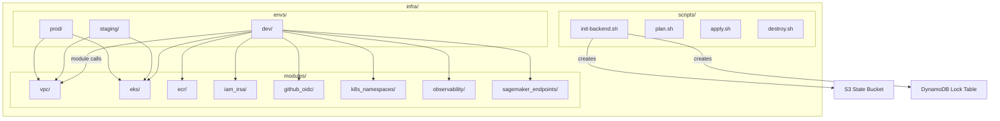

# infra/

Terraform Infrastructure-as-Code for provisioning all AWS resources. Uses a modular architecture with per-environment configurations and remote S3/DynamoDB state management.

## Architecture



## Directory Contents

| Path            | Purpose                                                   |
| --------------- | --------------------------------------------------------- |
| `envs/dev/`     | Dev environment config — VPC, EKS, ECR, IRSA, all modules |
| `envs/staging/` | Staging environment (placeholder)                         |
| `envs/prod/`    | Production environment (placeholder)                      |
| `modules/`      | Reusable Terraform modules                                |
| `scripts/`      | Shell helpers for init, plan, apply, destroy              |

## Module Summary

| Module                | Resources Created                                         |
| --------------------- | --------------------------------------------------------- |
| `vpc`                 | VPC, subnets (public/private), NAT Gateway, route tables  |
| `eks`                 | EKS cluster, managed node groups (general + GPU SPOT)     |
| `ecr`                 | ECR repositories per service with lifecycle policies      |
| `iam_irsa`            | IRSA roles per team for SageMaker + CloudWatch access     |
| `github_oidc`         | GitHub Actions OIDC provider + CI/CD IAM role             |
| `k8s_namespaces`      | Kubernetes namespaces with ResourceQuotas and LimitRanges |
| `observability`       | CloudWatch log groups, ALB Ingress Controller IRSA role   |
| `sagemaker_endpoints` | SageMaker models, endpoint configs, endpoints per team    |

## State Management

Remote state backend (S3 + DynamoDB):

```hcl
backend "s3" {
  bucket         = "troys-bigbucket-west2"
  key            = "terraform.tfstate"
  region         = "us-west-2"
  encrypt        = true
  dynamodb_table = "tf-locks-llmplatform-dev"
}
```

## Dev Environment Node Groups

```hcl
node_groups = {
  general = {
    instance_types = ["t3.medium"]
    desired_size   = 4, min_size = 2, max_size = 5
  }
  gpu = {
    instance_types = ["g4dn.xlarge", "g4dn.2xlarge", "g5.xlarge"]
    capacity_type  = "SPOT"
    desired_size   = 0, min_size = 0, max_size = 4
    taints = [{ key = "nvidia.com/gpu", effect = "NO_SCHEDULE" }]
  }
}
```

## Usage

```bash
# Initialize remote backend
bash infra/scripts/init-backend.sh llmplatform dev us-west-2

# Plan changes
bash infra/scripts/plan.sh dev

# Apply changes
bash infra/scripts/apply.sh dev
```
