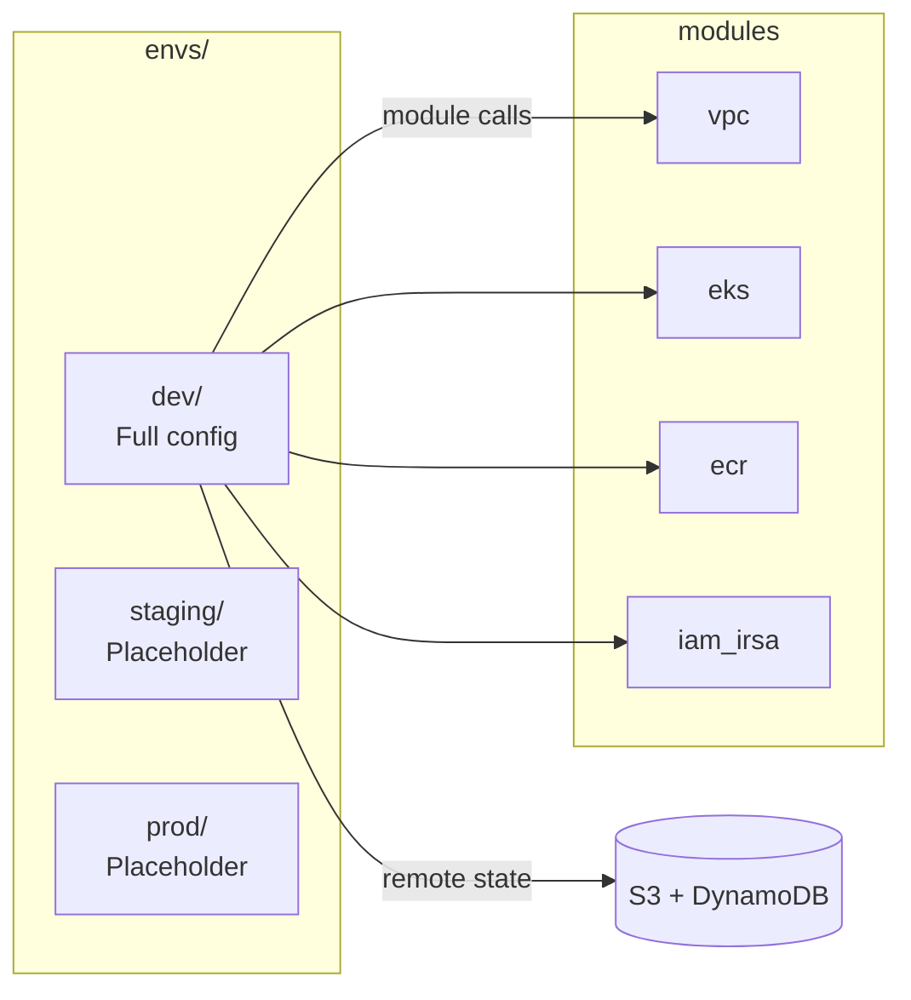

# infra/envs/

Per-environment Terraform root configurations. Each environment directory is a self-contained Terraform root that composes the shared modules from `infra/modules/`.

## Architecture



## Environments

| Directory  | Status      | Backend                                      |
| ---------- | ----------- | -------------------------------------------- |
| `dev/`     | **Active**  | `s3://troys-bigbucket-west2` + DynamoDB lock |
| `staging/` | Placeholder | `.gitkeep` only                              |
| `prod/`    | Placeholder | `.gitkeep` only                              |

## dev/ File Structure

| File               | Purpose                                                          |
| ------------------ | ---------------------------------------------------------------- |
| `main.tf`          | Module composition — VPC, EKS, ECR, IRSA per team, observability |
| `variables.tf`     | Input variables (region, project, VPC CIDR, node groups)         |
| `terraform.tfvars` | Concrete values for dev (t3.medium + g4dn.xlarge GPU SPOT)       |
| `backend.tf`       | S3 remote state backend configuration                            |
| `outputs.tf`       | Cluster name, ECR URLs, IRSA role ARNs                           |

## Key Outputs

```hcl
output "eks_cluster_name"       # → "llmplatform-dev"
output "ecr_repository_urls"    # → per-service ECR URLs
output "irsa_role_arns"         # → per-team IRSA role ARNs
output "sagemaker_endpoint_names"  # → per-team endpoint names
```
