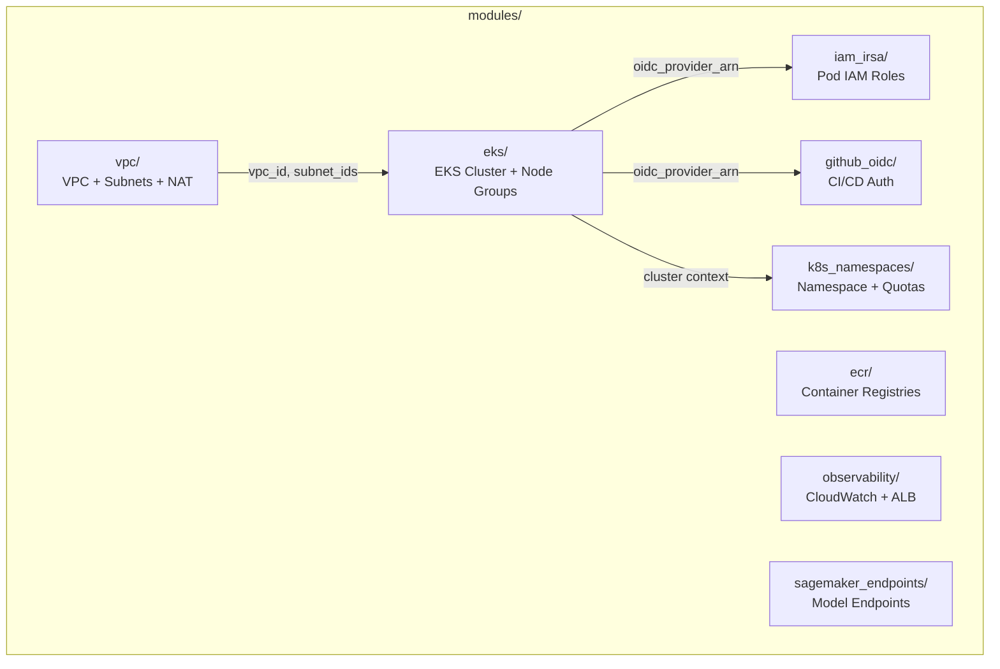

# infra/modules/

Reusable Terraform modules that encapsulate AWS resource creation patterns. Each module is called from the environment roots in `infra/envs/`.

## Architecture



## Module Details

### vpc/

Creates VPC with public/private subnets across AZs, NAT Gateway, and route tables. Subnets are tagged for EKS auto-discovery (`kubernetes.io/role/elb`).

```hcl
resource "aws_vpc" "main" { cidr_block = var.vpc_cidr }
resource "aws_subnet" "public" { map_public_ip_on_launch = true }
resource "aws_nat_gateway" "main" { ... }  # single_nat_gateway option for cost savings
```

### eks/

Provisions EKS cluster with managed node groups. Supports mixed instance types, GPU nodes with taints, and SPOT capacity:

```hcl
resource "aws_eks_cluster" "main" { version = var.cluster_version }
resource "aws_eks_node_group" "main" {
    for_each = var.node_groups  # general + gpu groups
}
```

### ecr/

Creates ECR repositories per service with KMS encryption, scan-on-push, and lifecycle policies (keep 15 tagged, expire untagged after 7 days).

### iam_irsa/

Creates IAM Roles for Service Accounts (IRSA) with scoped policies for SageMaker invoke and CloudWatch access. One role per team namespace.

### github_oidc/

Sets up GitHub Actions OIDC provider for keyless CI/CD authentication. Restricts to specific repo branches (main, develop, PRs).

### k8s_namespaces/

Creates Kubernetes namespaces with ResourceQuotas and LimitRanges per team. Enforces resource boundaries.

### observability/

Creates CloudWatch log groups for EKS and IRSA role for the ALB Ingress Controller.

### sagemaker_endpoints/

Provisions SageMaker models, endpoint configurations (with A/B variant support), and endpoints per team.
