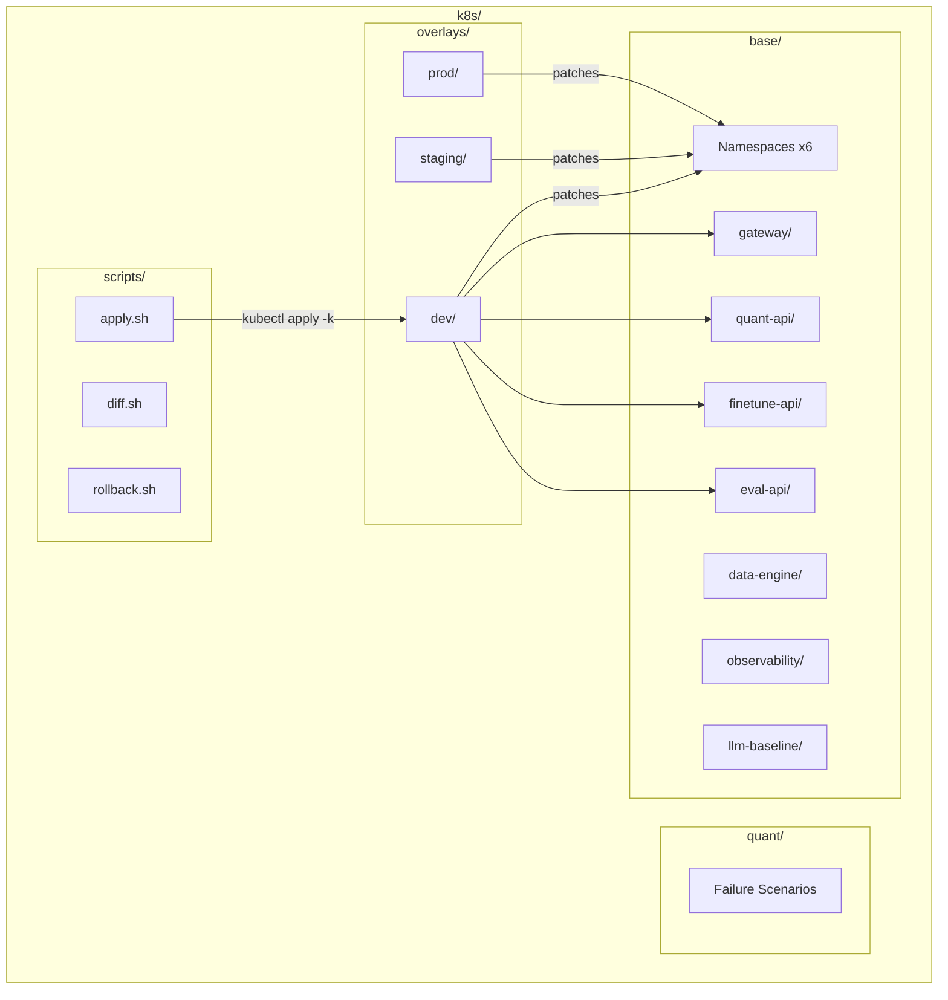

# k8s/

Kubernetes manifests using Kustomize for deploying platform services, observability stack, and vLLM model fleet. Organized as base manifests with per-environment overlays.

## Architecture



## Directory Contents

| Path        | Purpose                                                            |
| ----------- | ------------------------------------------------------------------ |
| `base/`     | Environment-agnostic manifests — deployments, services, configmaps |
| `overlays/` | Per-environment patches (dev, staging, prod)                       |
| `quant/`    | Controlled failure scenario manifests for observability validation |
| `scripts/`  | Shell helpers for apply, diff, and rollback operations             |

## Namespaces (6 total)

| Namespace       | Purpose                                          |
| --------------- | ------------------------------------------------ |
| `platform`      | Gateway API                                      |
| `quant`         | Quantization team service                        |
| `finetune`      | Fine-tuning team service                         |
| `eval`          | Evaluation team service                          |
| `observability` | OTEL Collector, Prometheus, Loki, Tempo, Grafana |
| `llm-baseline`  | vLLM model fleet (4 Mistral-7B variants)         |

## Usage

```bash
# Preview changes
k8s/scripts/diff.sh dev

# Apply dev overlay
k8s/scripts/apply.sh dev

# Deploy model fleet separately
kubectl apply -k k8s/base/llm-baseline/

# Rollback a service
k8s/scripts/rollback.sh gateway platform
```
