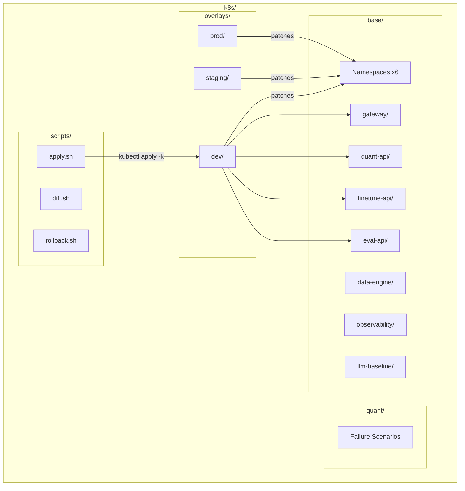

# k8s/

Kubernetes manifests using Kustomize for deploying platform services, observability stack, and vLLM model fleet. Organized as base manifests with per-environment overlays.

## Architecture



## Directory Contents

| Path        | Purpose                                                            |
| ----------- | ------------------------------------------------------------------ |
| `base/`     | Environment-agnostic manifests — deployments, services, configmaps |
| `overlays/` | Per-environment patches (dev, staging, prod)                       |
| `quant/`    | Controlled failure scenario manifests for observability validation |
| `scripts/`  | Shell helpers for apply, diff, and rollback operations             |

## Namespaces (6 total)

| Namespace       | Purpose                                          |
| --------------- | ------------------------------------------------ |
| `platform`      | Gateway API                                      |
| `quant`         | Quantization team service                        |
| `finetune`      | Fine-tuning team service                         |
| `eval`          | Evaluation team service                          |
| `observability` | OTEL Collector, Prometheus, Loki, Tempo, Grafana |
| `llm-baseline`  | vLLM model fleet (4 Mistral-7B variants)         |

## Resource Hierarchy Diagram (94 Resources)

```mermaid
graph TB
    %% ── Cluster ──────────────────────────────────────────
    CLUSTER["☸ EKS Cluster: llmplatform-dev\nKubernetes 1.29 · us-west-2"]

    %% ── Cluster-Scoped RBAC ──────────────────────────────
    subgraph RBAC["Cluster-Scoped RBAC (6)"]
        direction LR
        CR1["ClusterRole\nprometheus"]
        CRB1["ClusterRoleBinding\nprometheus"]
        CR2["ClusterRole\notel-collector"]
        CRB2["ClusterRoleBinding\notel-collector"]
        CR3["ClusterRole\nkube-state-metrics"]
        CRB3["ClusterRoleBinding\nkube-state-metrics"]
        CR1 --- CRB1
        CR2 --- CRB2
        CR3 --- CRB3
    end
    CLUSTER --> RBAC

    %% ── Nodes ────────────────────────────────────────────
    subgraph NODES["Nodes"]
        direction LR
        GEN["General Nodes\nt3.medium × 2-5\nON_DEMAND"]
        GPU["GPU Nodes\ng4dn / g5 × 0-4\nSPOT"]
    end
    CLUSTER --> NODES

    %% ── DaemonSets (kube-system) ─────────────────────────
    subgraph DS["DaemonSets · kube-system (4)"]
        direction LR
        NVIDIA["DaemonSet\nnvidia-device-plugin"]
        NODEEXP["DaemonSet\nnode-exporter"]
        NODEEXP_SA["SA\nnode-exporter"]
        NODEEXP_SVC["Service HL\nnode-exporter\n:9100"]
        NODEEXP --> NODEEXP_SA
        NODEEXP --> NODEEXP_SVC
    end
    GPU --> NVIDIA
    NODES --> DS

    %% ── Namespace: platform ──────────────────────────────
    subgraph NS_PLAT["Namespace: platform (9)"]
        direction TB
        PLAT_GOV["ResourceQuota · LimitRange"]

        subgraph PLAT_DEPLOY["Deployments (2)"]
            direction LR
            GW_DEP["Deployment\ngateway\n✦ 2 replicas (dev: 1)\n:8000"]
            DE_DEP["Deployment\ndata-engine\n✦ 1 replica\n:8000"]
        end

        subgraph PLAT_SVC["Services (2)"]
            direction LR
            GW_SVC["⬡ Service LB\ngateway\n:8000\na2d4...elb"]
            DE_SVC["Service ClusterIP\ndata-engine\n:8000"]
        end

        PLAT_SA["SA\ngateway-sa\n↔ IRSA"]
        PLAT_CM["ConfigMap\ngateway-config"]

        GW_DEP --> GW_SVC
        DE_DEP --> DE_SVC
        GW_DEP --> PLAT_SA
        GW_DEP --> PLAT_CM
    end
    CLUSTER --> NS_PLAT

    %% ── Namespace: quant ─────────────────────────────────
    subgraph NS_QUANT["Namespace: quant (7)"]
        direction TB
        QUANT_GOV["ResourceQuota · LimitRange"]

        QUANT_DEP["Deployment\nquant-api\n✦ 2 replicas\n:8000"]
        QUANT_SVC["Service ClusterIP\nquant-api\n:8000"]
        QUANT_SA["SA\nquant-sa\n↔ IRSA"]
        QUANT_CM["ConfigMap\nquant-config"]

        QUANT_DEP --> QUANT_SVC
        QUANT_DEP --> QUANT_SA
        QUANT_DEP --> QUANT_CM
    end
    CLUSTER --> NS_QUANT

    %% ── Namespace: finetune ──────────────────────────────
    subgraph NS_FT["Namespace: finetune (7)"]
        direction TB
        FT_GOV["ResourceQuota · LimitRange"]

        FT_DEP["Deployment\nfinetune-api\n✦ 2 replicas\n:8000"]
        FT_SVC["Service ClusterIP\nfinetune-api\n:8000"]
        FT_SA["SA\nfinetune-sa\n↔ IRSA"]
        FT_CM["ConfigMap\nfinetune-config"]

        FT_DEP --> FT_SVC
        FT_DEP --> FT_SA
        FT_DEP --> FT_CM
    end
    CLUSTER --> NS_FT

    %% ── Namespace: eval ──────────────────────────────────
    subgraph NS_EVAL["Namespace: eval (7)"]
        direction TB
        EVAL_GOV["ResourceQuota · LimitRange"]

        EVAL_DEP["Deployment\neval-api\n✦ 2 replicas\n:8000"]
        EVAL_SVC["Service ClusterIP\neval-api\n:8000"]
        EVAL_SA["SA\neval-sa\n↔ IRSA"]
        EVAL_CM["ConfigMap\neval-config"]

        EVAL_DEP --> EVAL_SVC
        EVAL_DEP --> EVAL_SA
        EVAL_DEP --> EVAL_CM
    end
    CLUSTER --> NS_EVAL

    %% ── Namespace: llm-baseline ──────────────────────────
    subgraph NS_LLM["Namespace: llm-baseline (16)"]
        direction TB

        subgraph LLM_MODELS["vLLM Deployments (5) — GPU Nodes"]
            direction LR
            AWQ["Deployment\nmistral-7b-awq\n✦ 1 · 1 GPU"]
            FP16["Deployment\nmistral-7b-fp16\n✦ 1 · 1 GPU"]
            LORA["Deployment\nmistral-7b-lora\n✦ 1 · 1 GPU"]
            JUDGE["Deployment\nmistral-7b-judge\n✦ 1 · 1 GPU"]
            LEGACY["Deployment\nmistral-7b-instruct\n✦ 0 (disabled)"]
        end

        subgraph LLM_SVC["Services (5)"]
            direction LR
            AWQ_S["ClusterIP\nmistral-7b-awq\n:8000"]
            FP16_S["ClusterIP\nmistral-7b-fp16\n:8000"]
            LORA_S["ClusterIP\nmistral-7b-lora\n:8000"]
            JUDGE_S["ClusterIP\nmistral-7b-judge\n:8000"]
            BASE_S["ClusterIP\nmistral-7b-baseline\n:8000"]
        end

        LLM_SECRET["Secret\nhf-token"]
        LLM_PVC["PVC\nhf-cache\n200Gi gp2"]

        subgraph LLM_SCALE["Autoscaling (3)"]
            direction LR
            LLM_HPA["HPA\nbaseline\n1-5 CPU 70%"]
            LLM_KEDA["KEDA ScaledObject\nbaseline\n1-10 queue>5"]
            LLM_SM["ServiceMonitor\nbaseline\n15s scrape"]
        end

        AWQ --> AWQ_S
        FP16 --> FP16_S
        LORA --> LORA_S
        JUDGE --> JUDGE_S
        LEGACY --> BASE_S
    end
    CLUSTER --> NS_LLM

    %% ── Namespace: observability ─────────────────────────
    subgraph NS_OBS["Namespace: observability (28)"]
        direction TB
        OBS_GOV["ResourceQuota · LimitRange"]

        subgraph OBS_DEPLOY["Deployments (6)"]
            direction LR
            PROM["Deployment\nprometheus\n:9090"]
            GRAF["Deployment\ngrafana\n✦ 2 containers\nnginx:3000 + grafana:3001"]
            OTEL["Deployment\notel-collector\n✦ 2 replicas\n:4317 :4318"]
            LOKI["Deployment\nloki\n:3100"]
            TEMPO["Deployment\ntempo\n:3200 :4317"]
            KSM["Deployment\nkube-state-metrics\n:8080"]
        end

        subgraph OBS_SVC["Services (6)"]
            direction LR
            GRAF_SVC["⬡ Service LB\ngrafana\n:3000\naa72...elb"]
            PROM_SVC["ClusterIP\nprometheus\n:9090"]
            OTEL_SVC["ClusterIP\notel-collector\n:4317 :4318"]
            LOKI_SVC["ClusterIP\nloki\n:3100"]
            TEMPO_SVC["ClusterIP\ntempo\n:3200"]
            KSM_SVC["ClusterIP\nkube-state-metrics\n:8080"]
        end

        subgraph OBS_SA["ServiceAccounts (3)"]
            direction LR
            PROM_SA["SA\nprometheus"]
            OTEL_SA["SA\notel-collector"]
            KSM_SA["SA\nkube-state-metrics"]
        end

        subgraph OBS_CM["ConfigMaps (9)"]
            direction LR
            PROM_CM["prometheus-config"]
            OTEL_CM["otel-collector-config"]
            GRAF_NGINX["grafana-nginx-conf"]
            GRAF_DS["grafana-datasources"]
            GRAF_PROV["grafana-dashboards-provider"]
            GRAF_DASH["grafana-dashboards"]
            GRAF_K8S["grafana-k8s-dashboards"]
            LOKI_CM["loki-config"]
            TEMPO_CM["tempo-config"]
        end

        OBS_SECRET["Secret\ngrafana-secrets"]

        subgraph OBS_PVC["PersistentVolumeClaims (3)"]
            direction LR
            PROM_PVC["PVC\nprometheus-data\n50Gi gp2"]
            LOKI_PVC["PVC\nloki-data\n50Gi gp2"]
            TEMPO_PVC["PVC\ntempo-data\n20Gi gp2"]
        end

        PROM --> PROM_SVC
        GRAF --> GRAF_SVC
        OTEL --> OTEL_SVC
        LOKI --> LOKI_SVC
        TEMPO --> TEMPO_SVC
        KSM --> KSM_SVC
    end
    CLUSTER --> NS_OBS

    %% ── Overlay: dev ─────────────────────────────────────
    subgraph OV_DEV["Overlay: dev (+3)"]
        direction LR
        DEV_ING1["Ingress\nplatform-ingress\napi.llmplatform.dev"]
        DEV_ING2["Ingress\ngrafana-ingress\ngrafana.llmplatform.dev"]
        DEV_SS["SealedSecret\nplatform-secrets"]
    end
    NS_PLAT -. "patches" .-> OV_DEV
    NS_OBS -. "patches" .-> OV_DEV

    %% ── Overlay: prod ────────────────────────────────────
    subgraph OV_PROD["Overlay: prod (+4)"]
        direction LR
        PROD_HPA["HPA\ngateway\n3-10 replicas"]
        PROD_PDB1["PDB\ngateway\nminAvail: 2"]
        PROD_PDB2["PDB\nquant-api\nminAvail: 1"]
        PROD_SS["SealedSecret\nplatform-secrets"]
    end
    NS_PLAT -. "patches" .-> OV_PROD
    NS_QUANT -. "patches" .-> OV_PROD

    %% ── Data flows across namespaces ─────────────────────
    GW_SVC ==> |"/quant/*"| QUANT_SVC
    GW_SVC ==> |"/finetune/*"| FT_SVC
    GW_SVC ==> |"/eval/*"| EVAL_SVC
    QUANT_SVC --> |"VLLM_BASE_URL"| AWQ_S
    FT_SVC --> |"VLLM_BASE_URL"| LORA_S
    EVAL_SVC --> |"VLLM_BASE_URL"| JUDGE_S
    PROM_SVC --> |"scrapes"| AWQ_S
    PROM_SVC --> |"scrapes"| GW_SVC
    OTEL_SVC -.-> |"traces → Tempo"| TEMPO_SVC
    OTEL_SVC -.-> |"metrics → Prom"| PROM_SVC
    GRAF_SVC -.-> |"queries"| PROM_SVC
    GRAF_SVC -.-> |"queries"| LOKI_SVC
    GRAF_SVC -.-> |"queries"| TEMPO_SVC

    %% ── Styles ───────────────────────────────────────────
    classDef cluster fill:#1a1a2e,stroke:#e94560,color:#fff,stroke-width:2px
    classDef ns fill:#16213e,stroke:#0f3460,color:#fff
    classDef deploy fill:#533483,stroke:#7c3aed,color:#fff
    classDef svc fill:#0f3460,stroke:#4cc9f0,color:#fff
    classDef lb fill:#e94560,stroke:#fff,color:#fff,stroke-width:2px
    classDef config fill:#1b4332,stroke:#40916c,color:#fff
    classDef storage fill:#7f5539,stroke:#ddb892,color:#fff
    classDef rbac fill:#3a0ca3,stroke:#7209b7,color:#fff
    classDef overlay fill:#2d3436,stroke:#636e72,color:#fff,stroke-dasharray:5 5
    classDef gpu fill:#ff6b00,stroke:#fff,color:#fff

    class CLUSTER cluster
    class NS_PLAT,NS_QUANT,NS_FT,NS_EVAL,NS_LLM,NS_OBS ns
    class GW_DEP,DE_DEP,QUANT_DEP,FT_DEP,EVAL_DEP,AWQ,FP16,LORA,JUDGE,LEGACY,PROM,GRAF,OTEL,LOKI,TEMPO,KSM deploy
    class GW_SVC,GRAF_SVC lb
    class DE_SVC,QUANT_SVC,FT_SVC,EVAL_SVC,AWQ_S,FP16_S,LORA_S,JUDGE_S,BASE_S,PROM_SVC,OTEL_SVC,LOKI_SVC,TEMPO_SVC,KSM_SVC,NODEEXP_SVC svc
    class PLAT_CM,QUANT_CM,FT_CM,EVAL_CM,PROM_CM,OTEL_CM,GRAF_NGINX,GRAF_DS,GRAF_PROV,GRAF_DASH,GRAF_K8S,LOKI_CM,TEMPO_CM config
    class LLM_PVC,PROM_PVC,LOKI_PVC,TEMPO_PVC storage
    class CR1,CRB1,CR2,CRB2,CR3,CRB3 rbac
    class OV_DEV,OV_PROD overlay
    class NVIDIA,GPU gpu
```



## Complete Kubernetes Resource Inventory

Every resource deployed by the K8s manifests, organized by the Kubernetes object hierarchy and how each connects to the LLM Optimization Platform.

### Cluster-Scoped Resources

Resources that operate across all namespaces.

| #   | Resource Kind      | Name                 | Description                                                                  | Platform Connection                                                                                                                    |
| --- | ------------------ | -------------------- | ---------------------------------------------------------------------------- | -------------------------------------------------------------------------------------------------------------------------------------- |
| 1   | ClusterRole        | `prometheus`         | Grants read access to pods, services, endpoints, nodes across all namespaces | Allows Prometheus to discover and scrape metrics from every platform service (gateway, quant-api, finetune-api, eval-api, vLLM models) |
| 2   | ClusterRoleBinding | `prometheus`         | Binds ClusterRole to SA `prometheus` in `observability`                      | Connects the Prometheus service account to cluster-wide scrape permissions                                                             |
| 3   | ClusterRole        | `otel-collector`     | Grants read access to pods and namespaces for OTEL metadata enrichment       | Allows the OTEL collector to tag traces/logs with pod and namespace labels from all platform services                                  |
| 4   | ClusterRoleBinding | `otel-collector`     | Binds ClusterRole to SA `otel-collector` in `observability`                  | Connects the OTEL collector service account to cluster-wide metadata discovery                                                         |
| 5   | ClusterRole        | `kube-state-metrics` | Grants read access to all Kubernetes object types                            | Exposes cluster health metrics (pod status, deployment replicas, node capacity) to Prometheus/Grafana dashboards                       |
| 6   | ClusterRoleBinding | `kube-state-metrics` | Binds ClusterRole to SA `kube-state-metrics` in `observability`              | Connects kube-state-metrics to cluster-wide object discovery                                                                           |

### Nodes & DaemonSets

Resources that run on every matching node in the cluster.

| #   | Resource Kind      | Name                             | Namespace     | Description                                                                         | Platform Connection                                                                                                        |
| --- | ------------------ | -------------------------------- | ------------- | ----------------------------------------------------------------------------------- | -------------------------------------------------------------------------------------------------------------------------- |
| 7   | DaemonSet          | `nvidia-device-plugin-daemonset` | `kube-system` | Runs the NVIDIA device plugin on GPU nodes (`nodeSelector: nvidia.com/gpu.present`) | Registers `nvidia.com/gpu` as a schedulable resource so the 4 vLLM model pods can request GPU allocation                   |
| 8   | DaemonSet          | `node-exporter`                  | `kube-system` | Runs Prometheus node-exporter on all nodes (tolerates all taints)                   | Exposes hardware metrics (CPU, memory, disk, network) from every node to Prometheus for the K8s cluster Grafana dashboards |
| 9   | ServiceAccount     | `node-exporter`                  | `kube-system` | Identity for the node-exporter pods                                                 | Standard SA for node-exporter DaemonSet                                                                                    |
| 10  | Service (Headless) | `node-exporter`                  | `kube-system` | Headless service (`clusterIP: None`) on port 9100                                   | Enables Prometheus to discover and scrape node-exporter pods via DNS                                                       |

---

### Namespace: `platform`

The platform ingress layer — runs the API gateway (single entry point for all users) and the data processing engine.

#### Namespace Governance

| #   | Resource Kind | Name              | Description                                                             | Platform Connection                                                                                   |
| --- | ------------- | ----------------- | ----------------------------------------------------------------------- | ----------------------------------------------------------------------------------------------------- |
| 11  | Namespace     | `platform`        | Isolated namespace with labels `tier: platform`                         | Houses the gateway and data-engine; all user traffic enters the platform here                         |
| 12  | ResourceQuota | `platform-quota`  | Caps at 4 CPU / 8Gi requests, 8 CPU / 16Gi limits, 20 pods, 10 services | Prevents gateway/data-engine from consuming cluster resources needed by team services and vLLM models |
| 13  | LimitRange    | `platform-limits` | Default 500m/512Mi per container, max 2 CPU/4Gi, min 50m/64Mi           | Right-sizes gateway pods automatically; prevents misconfigured containers from exceeding quota        |

#### Deployments → ReplicaSets → Pods → Containers

| #   | Resource Kind | Name          | Image                                    | Replicas   | Resources (req/lim)     | Ports | Platform Connection                                                                                                                   |
| --- | ------------- | ------------- | ---------------------------------------- | ---------- | ----------------------- | ----- | ------------------------------------------------------------------------------------------------------------------------------------- |
| 14  | Deployment    | `gateway`     | `llmplatform-dev/gateway:dev-latest`     | 2 (dev: 1) | 200m/256Mi → 1 CPU/1Gi  | 8000  | The API gateway — routes `/quant/*`, `/finetune/*`, `/eval/*` requests to team services; serves `/health` and `/ops/health` endpoints |
| 15  | Deployment    | `data-engine` | `llmplatform-dev/data-engine:dev-latest` | 1          | 100m/128Mi → 500m/512Mi | 8000  | Processes and prepares training/evaluation datasets used by the finetune and eval teams                                               |

#### Services

| #   | Resource Kind | Name          | Type             | Ports | Platform Connection                                                                                      |
| --- | ------------- | ------------- | ---------------- | ----- | -------------------------------------------------------------------------------------------------------- |
| 16  | Service       | `gateway`     | **LoadBalancer** | 8000  | Public entry point — exposes the gateway to external users via AWS ELB (`a2d4...elb.amazonaws.com:8000`) |
| 17  | Service       | `data-engine` | ClusterIP        | 8000  | Internal-only service — accessed by gateway and team APIs for dataset operations                         |

#### ServiceAccounts

| #   | Resource Kind  | Name         | IRSA Role                      | Platform Connection                                                                           |
| --- | -------------- | ------------ | ------------------------------ | --------------------------------------------------------------------------------------------- |
| 18  | ServiceAccount | `gateway-sa` | `llmplatform-dev-gateway-irsa` | Binds gateway pods to IAM role with CloudWatch access for request logging and latency metrics |

#### ConfigMaps

| #   | Resource Kind | Name             | Keys                                                                                                                                                          | Platform Connection                                                                                  |
| --- | ------------- | ---------------- | ------------------------------------------------------------------------------------------------------------------------------------------------------------- | ---------------------------------------------------------------------------------------------------- |
| 19  | ConfigMap     | `gateway-config` | `LOG_LEVEL`, `AWS_REGION`, `OTEL_EXPORTER_OTLP_ENDPOINT`, `OTEL_SERVICE_NAME`, `QUANT_SERVICE_URL`, `FINETUNE_SERVICE_URL`, `EVAL_SERVICE_URL`, `ROUTE_TABLE` | Configures service routing (which URLs map to which team APIs), OTEL trace export, and log verbosity |

---

### Namespace: `quant`

The quantization team's namespace — runs the API that applies GPTQ/AWQ model compression via SageMaker and vLLM.

#### Namespace Governance

| #   | Resource Kind | Name           | Description                                                       | Platform Connection                                                                                   |
| --- | ------------- | -------------- | ----------------------------------------------------------------- | ----------------------------------------------------------------------------------------------------- |
| 20  | Namespace     | `quant`        | Isolated namespace with labels `tier: team`, `team: quantization` | Dedicated environment for quantization workloads; isolated from other teams' resource usage           |
| 21  | ResourceQuota | `quant-quota`  | Caps at 8 CPU / 16Gi requests, 16 CPU / 32Gi limits, 15 pods      | Higher limits than platform — quantization API pods are CPU/memory-intensive during model compression |
| 22  | LimitRange    | `quant-limits` | Default 1 CPU/2Gi, max 4 CPU/8Gi, min 100m/128Mi                  | Tuned for quantization workloads that need more memory for model weight manipulation                  |

#### Deployments → ReplicaSets → Pods → Containers

| #   | Resource Kind | Name        | Image                                  | Replicas | Resources (req/lim)  | Ports | Platform Connection                                                                                                                          |
| --- | ------------- | ----------- | -------------------------------------- | -------- | -------------------- | ----- | -------------------------------------------------------------------------------------------------------------------------------------------- |
| 23  | Deployment    | `quant-api` | `llmplatform-dev/quant-api:dev-latest` | 2        | 500m/1Gi → 2 CPU/4Gi | 8000  | Accepts quantization requests from the gateway, invokes SageMaker quant endpoints, and queries the `mistral-7b-awq` vLLM model for inference |

#### Services

| #   | Resource Kind | Name        | Type      | Ports | Platform Connection                                                                                       |
| --- | ------------- | ----------- | --------- | ----- | --------------------------------------------------------------------------------------------------------- |
| 24  | Service       | `quant-api` | ClusterIP | 8000  | Internal service — gateway routes `/quant/*` traffic here; also called by Prometheus for metrics scraping |

#### ServiceAccounts

| #   | Resource Kind  | Name       | IRSA Role                        | Platform Connection                                                                                  |
| --- | -------------- | ---------- | -------------------------------- | ---------------------------------------------------------------------------------------------------- |
| 25  | ServiceAccount | `quant-sa` | `llmplatform-dev-quant-api-irsa` | Binds quant-api pods to IAM role with `sagemaker:InvokeEndpoint` on `quant-*` endpoints + CloudWatch |

#### ConfigMaps

| #   | Resource Kind | Name           | Keys                                                                                                                                                                 | Platform Connection                                                                                                          |
| --- | ------------- | -------------- | -------------------------------------------------------------------------------------------------------------------------------------------------------------------- | ---------------------------------------------------------------------------------------------------------------------------- |
| 26  | ConfigMap     | `quant-config` | `LOG_LEVEL`, `AWS_REGION`, `SAGEMAKER_ENDPOINT_NAME`, `VLLM_BASE_URL`, `OTEL_EXPORTER_OTLP_ENDPOINT`, `OTEL_SERVICE_NAME`, `SAGEMAKER_TIMEOUT_MS`, `ENABLE_FALLBACK` | Points quant-api to the `mistral-7b-awq` vLLM service and configures SageMaker endpoint name, timeout, and fallback behavior |

---

### Namespace: `finetune`

The fine-tuning team's namespace — runs the API that manages LoRA adapter training and inference via SageMaker and vLLM.

#### Namespace Governance

| #   | Resource Kind | Name              | Description                                                     | Platform Connection                                                           |
| --- | ------------- | ----------------- | --------------------------------------------------------------- | ----------------------------------------------------------------------------- |
| 27  | Namespace     | `finetune`        | Isolated namespace with labels `tier: team`, `team: finetuning` | Dedicated environment for fine-tuning workloads                               |
| 28  | ResourceQuota | `finetune-quota`  | Caps at 8 CPU / 16Gi requests, 16 CPU / 32Gi limits, 15 pods    | Matches quant quota — fine-tuning inference can be equally resource-intensive |
| 29  | LimitRange    | `finetune-limits` | Default 1 CPU/2Gi, max 4 CPU/8Gi, min 100m/128Mi                | Tuned for LoRA adapter workloads                                              |

#### Deployments → ReplicaSets → Pods → Containers

| #   | Resource Kind | Name           | Image                                     | Replicas | Resources (req/lim)  | Ports | Platform Connection                                                                                                                                          |
| --- | ------------- | -------------- | ----------------------------------------- | -------- | -------------------- | ----- | ------------------------------------------------------------------------------------------------------------------------------------------------------------ |
| 30  | Deployment    | `finetune-api` | `llmplatform-dev/finetune-api:dev-latest` | 2        | 500m/1Gi → 2 CPU/4Gi | 8000  | Accepts fine-tuning requests from the gateway, invokes SageMaker finetune endpoints, and queries the `mistral-7b-lora` vLLM model for LoRA-adapted inference |

#### Services

| #   | Resource Kind | Name           | Type      | Ports | Platform Connection                                          |
| --- | ------------- | -------------- | --------- | ----- | ------------------------------------------------------------ |
| 31  | Service       | `finetune-api` | ClusterIP | 8000  | Internal service — gateway routes `/finetune/*` traffic here |

#### ServiceAccounts

| #   | Resource Kind  | Name          | IRSA Role                           | Platform Connection                                                                                        |
| --- | -------------- | ------------- | ----------------------------------- | ---------------------------------------------------------------------------------------------------------- |
| 32  | ServiceAccount | `finetune-sa` | `llmplatform-dev-finetune-api-irsa` | Binds finetune-api pods to IAM role with `sagemaker:InvokeEndpoint` on `finetune-*` endpoints + CloudWatch |

#### ConfigMaps

| #   | Resource Kind | Name              | Keys                                                                                                                                                                 | Platform Connection                                                                                                           |
| --- | ------------- | ----------------- | -------------------------------------------------------------------------------------------------------------------------------------------------------------------- | ----------------------------------------------------------------------------------------------------------------------------- |
| 33  | ConfigMap     | `finetune-config` | `LOG_LEVEL`, `AWS_REGION`, `SAGEMAKER_ENDPOINT_NAME`, `VLLM_BASE_URL`, `OTEL_EXPORTER_OTLP_ENDPOINT`, `OTEL_SERVICE_NAME`, `SAGEMAKER_TIMEOUT_MS`, `ENABLE_FALLBACK` | Points finetune-api to the `mistral-7b-lora` vLLM service and configures SageMaker endpoint, timeout, and A/B routing support |

---

### Namespace: `eval`

The evaluation team's namespace — runs the API that benchmarks and scores optimized models.

#### Namespace Governance

| #   | Resource Kind | Name          | Description                                                     | Platform Connection                                  |
| --- | ------------- | ------------- | --------------------------------------------------------------- | ---------------------------------------------------- |
| 34  | Namespace     | `eval`        | Isolated namespace with labels `tier: team`, `team: evaluation` | Dedicated environment for model evaluation workloads |
| 35  | ResourceQuota | `eval-quota`  | Caps at 8 CPU / 16Gi requests, 16 CPU / 32Gi limits, 15 pods    | Matches team quotas                                  |
| 36  | LimitRange    | `eval-limits` | Default 1 CPU/2Gi, max 4 CPU/8Gi, min 100m/128Mi                | Standard team limits                                 |

#### Deployments → ReplicaSets → Pods → Containers

| #   | Resource Kind | Name       | Image                                 | Replicas | Resources (req/lim)  | Ports | Platform Connection                                                                                                                       |
| --- | ------------- | ---------- | ------------------------------------- | -------- | -------------------- | ----- | ----------------------------------------------------------------------------------------------------------------------------------------- |
| 37  | Deployment    | `eval-api` | `llmplatform-dev/eval-api:dev-latest` | 2        | 500m/1Gi → 2 CPU/4Gi | 8000  | Accepts evaluation requests from the gateway, invokes SageMaker eval endpoints, and queries the `mistral-7b-judge` vLLM model for scoring |

#### Services

| #   | Resource Kind | Name       | Type      | Ports | Platform Connection                                      |
| --- | ------------- | ---------- | --------- | ----- | -------------------------------------------------------- |
| 38  | Service       | `eval-api` | ClusterIP | 8000  | Internal service — gateway routes `/eval/*` traffic here |

#### ServiceAccounts

| #   | Resource Kind  | Name      | IRSA Role                       | Platform Connection                                                                                |
| --- | -------------- | --------- | ------------------------------- | -------------------------------------------------------------------------------------------------- |
| 39  | ServiceAccount | `eval-sa` | `llmplatform-dev-eval-api-irsa` | Binds eval-api pods to IAM role with `sagemaker:InvokeEndpoint` on `eval-*` endpoints + CloudWatch |

#### ConfigMaps

| #   | Resource Kind | Name          | Keys                                                                                                                                                                 | Platform Connection                                                                                        |
| --- | ------------- | ------------- | -------------------------------------------------------------------------------------------------------------------------------------------------------------------- | ---------------------------------------------------------------------------------------------------------- |
| 40  | ConfigMap     | `eval-config` | `LOG_LEVEL`, `AWS_REGION`, `SAGEMAKER_ENDPOINT_NAME`, `VLLM_BASE_URL`, `OTEL_EXPORTER_OTLP_ENDPOINT`, `OTEL_SERVICE_NAME`, `SAGEMAKER_TIMEOUT_MS`, `ENABLE_FALLBACK` | Points eval-api to the `mistral-7b-judge` vLLM service and configures SageMaker endpoint for model scoring |

---

### Namespace: `llm-baseline`

The vLLM model fleet — runs 4 Mistral-7B variants on GPU nodes, each owned by a different team.

#### Namespace Governance

| #   | Resource Kind | Name           | Description                                                                       | Platform Connection                                                                    |
| --- | ------------- | -------------- | --------------------------------------------------------------------------------- | -------------------------------------------------------------------------------------- |
| 41  | Namespace     | `llm-baseline` | Namespace for all vLLM model deployments, labeled `component: baseline-inference` | Isolates GPU-intensive model inference from platform services running on general nodes |

#### Deployments → ReplicaSets → Pods → Containers (all require 1× GPU)

All model deployments use `vllm/vllm-openai:v0.6.6`, require `nodeSelector: nvidia.com/gpu.present`, tolerate the `nvidia.com/gpu` taint, use `podAntiAffinity` to spread across nodes, and request 2 CPU/12Gi with limits of 3 CPU/14Gi.

| #   | Resource Kind | Name                       | Model                                   | Replicas         | GPU | Key Args                                                                     | Team      | Platform Connection                                                                                            |
| --- | ------------- | -------------------------- | --------------------------------------- | ---------------- | --- | ---------------------------------------------------------------------------- | --------- | -------------------------------------------------------------------------------------------------------------- |
| 42  | Deployment    | `mistral-7b-awq`           | `TheBloke/Mistral-7B-Instruct-v0.2-AWQ` | 1                | 1   | `--quantization awq`, `--max-model-len 4096`, `--max-num-seqs 32`            | Quant     | AWQ 4-bit quantized model (~4GB VRAM) — the primary model for the quantization team's compression comparisons  |
| 43  | Deployment    | `mistral-7b-fp16`          | `mistralai/Mistral-7B-Instruct-v0.2`    | 1                | 1   | `--max-model-len 1024`, `--max-num-seqs 4`, `--gpu-memory-utilization 0.95`  | Reference | Full-precision reference model (~14GB VRAM) — baseline for measuring compression quality loss across all teams |
| 44  | Deployment    | `mistral-7b-lora`          | `TheBloke/Mistral-7B-Instruct-v0.2-AWQ` | 1                | 1   | `--quantization awq`, `--enable-lora`, `--max-lora-rank 32`, `--max-loras 4` | Finetune  | AWQ model with LoRA adapter serving — the fine-tuning team loads and A/B tests LoRA adapters at runtime        |
| 45  | Deployment    | `mistral-7b-judge`         | `TheBloke/Mistral-7B-Instruct-v0.2-AWQ` | 1                | 1   | `--quantization awq`, `--max-model-len 4096`, `--max-num-seqs 32`            | Eval      | AWQ model dedicated to the eval team — scores and benchmarks outputs from quantized and fine-tuned variants    |
| 46  | Deployment    | `mistral-7b-instruct-vllm` | `vllm/vllm-openai:v0.6.6`               | **0** (disabled) | 1   | Same as AWQ                                                                  | Legacy    | Original baseline deployment — superseded by the 4 team-specific models above; kept at 0 replicas              |

#### Services

| #   | Resource Kind | Name                  | Type      | Ports | Platform Connection                                                            |
| --- | ------------- | --------------------- | --------- | ----- | ------------------------------------------------------------------------------ |
| 47  | Service       | `mistral-7b-awq`      | ClusterIP | 8000  | Exposes the AWQ model to `quant-api` via `VLLM_BASE_URL` ConfigMap setting     |
| 48  | Service       | `mistral-7b-fp16`     | ClusterIP | 8000  | Exposes the full-precision reference model for cross-team baseline comparisons |
| 49  | Service       | `mistral-7b-lora`     | ClusterIP | 8000  | Exposes the LoRA-enabled model to `finetune-api` for adapter inference         |
| 50  | Service       | `mistral-7b-judge`    | ClusterIP | 8000  | Exposes the judge model to `eval-api` for scoring and benchmarking             |
| 51  | Service       | `mistral-7b-baseline` | ClusterIP | 8000  | Legacy service (selects `mistral-7b-instruct-vllm` pods, currently 0 replicas) |

#### Secrets

| #   | Resource Kind | Name       | Keys                     | Platform Connection                                                                                                |
| --- | ------------- | ---------- | ------------------------ | ------------------------------------------------------------------------------------------------------------------ |
| 52  | Secret        | `hf-token` | `HUGGING_FACE_HUB_TOKEN` | Authentication token for Hugging Face Hub — all vLLM pods use this to download Mistral-7B model weights on startup |

#### PersistentVolumeClaims

| #   | Resource Kind | Name       | Storage | StorageClass | Platform Connection                                                                                                                           |
| --- | ------------- | ---------- | ------- | ------------ | --------------------------------------------------------------------------------------------------------------------------------------------- |
| 53  | PVC           | `hf-cache` | 200Gi   | gp2          | Persistent cache for downloaded model weights — avoids re-downloading ~4–14GB per model on pod restarts (currently unused; pods use emptyDir) |

#### Autoscaling

| #   | Resource Kind       | Name                         | Target                     | Min/Max | Metrics                                     | Platform Connection                                                                                    |
| --- | ------------------- | ---------------------------- | -------------------------- | ------- | ------------------------------------------- | ------------------------------------------------------------------------------------------------------ |
| 54  | HPA                 | `mistral-7b-baseline-hpa`    | `mistral-7b-instruct-vllm` | 1–5     | CPU 70%                                     | Scales the legacy baseline model (disabled) based on CPU pressure                                      |
| 55  | ScaledObject (KEDA) | `mistral-7b-baseline-scaler` | `mistral-7b-instruct-vllm` | 1–10    | Prometheus: `vllm_num_requests_waiting > 5` | Queue-depth-based scaling — triggers GPU node scale-up when inference requests back up beyond 5 queued |

#### Monitoring

| #   | Resource Kind  | Name                  | Target                          | Interval | Platform Connection                                                                                          |
| --- | -------------- | --------------------- | ------------------------------- | -------- | ------------------------------------------------------------------------------------------------------------ |
| 56  | ServiceMonitor | `mistral-7b-baseline` | `app: mistral-7b-instruct-vllm` | 15s      | Tells Prometheus to scrape vLLM `/metrics` (request count, latency histograms, queue depth, GPU utilization) |

---

### Namespace: `observability`

The monitoring and tracing stack — provides full platform visibility through metrics, logs, traces, and dashboards.

#### Namespace Governance

| #   | Resource Kind | Name                   | Description                                                                    | Platform Connection                                                                           |
| --- | ------------- | ---------------------- | ------------------------------------------------------------------------------ | --------------------------------------------------------------------------------------------- |
| 57  | Namespace     | `observability`        | Isolated namespace for all monitoring infrastructure, labeled `tier: platform` | Keeps observability workloads separate from application services to avoid resource contention |
| 58  | ResourceQuota | `observability-quota`  | Caps at 4 CPU / 8Gi requests, 8 CPU / 16Gi limits, 20 pods                     | Prevents the monitoring stack from starving application workloads                             |
| 59  | LimitRange    | `observability-limits` | Default 500m/512Mi, max 2 CPU/4Gi, min 50m/64Mi                                | Right-sizes monitoring containers                                                             |

#### Deployments → ReplicaSets → Pods → Containers

| #   | Resource Kind | Name                 | Image                                                                     | Replicas | Resources (req/lim)                                           | Ports                        | Platform Connection                                                                                                                                                                                   |
| --- | ------------- | -------------------- | ------------------------------------------------------------------------- | -------- | ------------------------------------------------------------- | ---------------------------- | ----------------------------------------------------------------------------------------------------------------------------------------------------------------------------------------------------- |
| 60  | Deployment    | `prometheus`         | `prom/prometheus:v2.49.0`                                                 | 1        | 100m/256Mi → 1 CPU/2Gi                                        | 9090                         | Scrapes metrics from all platform services (gateway, quant/finetune/eval APIs, vLLM models, kube-state-metrics, node-exporter) at 15s intervals                                                       |
| 61  | Deployment    | `grafana`            | `llmplatform-dev/grafana-plugin:dev-latest` + `nginx:1.25-alpine` sidecar | 1        | grafana: 200m/256Mi → 1 CPU/1Gi; nginx: 50m/64Mi → 200m/128Mi | 3000 (nginx), 3001 (grafana) | Custom Grafana with LLM platform dashboards — visualizes model latency, throughput, compression ratios, and cluster health. Nginx sidecar proxies `/gateway-proxy/` to the gateway's internal K8s DNS |
| 62  | Deployment    | `otel-collector`     | `otel/opentelemetry-collector-contrib:0.95.0`                             | 2        | 200m/256Mi → 1 CPU/1Gi                                        | 4317, 4318, 8888             | Receives OTLP traces/metrics from all platform services, enriches with K8s metadata, and exports to Tempo (traces) and Prometheus (metrics)                                                           |
| 63  | Deployment    | `loki`               | `grafana/loki:3.0.0`                                                      | 1        | 200m/256Mi → 1 CPU/1Gi                                        | 3100                         | Centralized log aggregation — stores structured logs from all platform services; queryable via Grafana LogQL                                                                                          |
| 64  | Deployment    | `tempo`              | `grafana/tempo:2.3.1`                                                     | 1        | 100m/128Mi → 500m/512Mi                                       | 3200, 4317, 9411             | Distributed tracing backend — stores traces from OTEL collector; enables end-to-end request tracing across gateway → team API → vLLM model                                                            |
| 65  | Deployment    | `kube-state-metrics` | `kube-state-metrics:v2.10.1`                                              | 1        | 50m/128Mi → 100m/256Mi                                        | 8080, 8081                   | Exports Kubernetes object state (pod status, deployment replicas, node capacity) as Prometheus metrics for cluster dashboards                                                                         |

#### Services

| #   | Resource Kind | Name                 | Type             | Ports                          | Platform Connection                                                                                      |
| --- | ------------- | -------------------- | ---------------- | ------------------------------ | -------------------------------------------------------------------------------------------------------- |
| 66  | Service       | `grafana`            | **LoadBalancer** | 3000                           | Public dashboard endpoint via AWS ELB (`aa72...elb.amazonaws.com:3000`) — accessible with admin/admin    |
| 67  | Service       | `prometheus`         | ClusterIP        | 9090                           | Internal metrics endpoint — Grafana queries it as a data source; KEDA reads it for autoscaling decisions |
| 68  | Service       | `otel-collector`     | ClusterIP        | 4317 (gRPC), 4318 (HTTP), 8888 | Receives traces from all platform services via `OTEL_EXPORTER_OTLP_ENDPOINT` in their ConfigMaps         |
| 69  | Service       | `loki`               | ClusterIP        | 3100                           | Internal log ingestion endpoint — Grafana queries it as a data source                                    |
| 70  | Service       | `tempo`              | ClusterIP        | 3200, 4317, 9411               | Internal trace storage — receives from OTEL collector; Grafana queries it for distributed tracing        |
| 71  | Service       | `kube-state-metrics` | ClusterIP        | 8080, 8081                     | Internal metrics endpoint — Prometheus scrapes it for Kubernetes object state                            |

#### ServiceAccounts

| #   | Resource Kind  | Name                 | Platform Connection                                                                    |
| --- | -------------- | -------------------- | -------------------------------------------------------------------------------------- |
| 72  | ServiceAccount | `prometheus`         | Identity for Prometheus pods; bound to ClusterRole for cross-namespace metric scraping |
| 73  | ServiceAccount | `otel-collector`     | Identity for OTEL pods; bound to ClusterRole for K8s metadata enrichment               |
| 74  | ServiceAccount | `kube-state-metrics` | Identity for kube-state-metrics pods; bound to ClusterRole for Kubernetes API access   |

#### ConfigMaps

| #   | Resource Kind | Name                          | Keys                                 | Platform Connection                                                                                             |
| --- | ------------- | ----------------------------- | ------------------------------------ | --------------------------------------------------------------------------------------------------------------- |
| 75  | ConfigMap     | `prometheus-config`           | `prometheus.yml`                     | Defines all scrape targets: gateway, team APIs, vLLM models, kube-state-metrics, node-exporter, OTEL            |
| 76  | ConfigMap     | `otel-collector-config`       | `config.yaml`                        | Configures OTLP receivers, K8s attribute processors, and exporters to Tempo + Prometheus                        |
| 77  | ConfigMap     | `grafana-nginx-conf`          | `default.conf`                       | Nginx reverse proxy config — routes `/gateway-proxy/` to `gateway.platform.svc:8000` for dashboard API calls    |
| 78  | ConfigMap     | `grafana-datasources`         | `datasources.yaml`                   | Pre-configures Prometheus, Loki, and Tempo as Grafana data sources with internal service URLs                   |
| 79  | ConfigMap     | `grafana-dashboards-provider` | `dashboards.yaml`                    | Tells Grafana where to find dashboard JSON files on disk                                                        |
| 80  | ConfigMap     | `grafana-dashboards`          | `llm-platform.json`                  | The main LLM platform dashboard — panels for model latency, throughput, compression ratio, error rates per team |
| 81  | ConfigMap     | `grafana-k8s-dashboards`      | `k8s-cluster.json`, `k8s-nodes.json` | Kubernetes cluster and node health dashboards — pod counts, resource utilization, node status                   |
| 82  | ConfigMap     | `loki-config`                 | `config.yaml`                        | Loki storage and retention configuration                                                                        |
| 83  | ConfigMap     | `tempo-config`                | `config.yaml`                        | Tempo trace storage, retention, and receiver configuration                                                      |

#### Secrets

| #   | Resource Kind | Name              | Keys             | Platform Connection                               |
| --- | ------------- | ----------------- | ---------------- | ------------------------------------------------- |
| 84  | Secret        | `grafana-secrets` | `admin-password` | Admin login credentials for the Grafana dashboard |

#### PersistentVolumeClaims

| #   | Resource Kind | Name              | Storage | StorageClass | Platform Connection                                                                              |
| --- | ------------- | ----------------- | ------- | ------------ | ------------------------------------------------------------------------------------------------ |
| 85  | PVC           | `prometheus-data` | 50Gi    | gp2          | Persistent storage for Prometheus TSDB — retains 30 days of platform metrics across pod restarts |
| 86  | PVC           | `loki-data`       | 50Gi    | gp2          | Persistent storage for Loki — retains platform log history                                       |
| 87  | PVC           | `tempo-data`      | 20Gi    | gp2          | Persistent storage for Tempo — retains distributed trace spans                                   |

---

### Overlay: `dev` (environment patches)

Resources added or modified for the dev environment only.

| #   | Resource Kind | Name               | Namespace       | Description                                                | Platform Connection                                                                            |
| --- | ------------- | ------------------ | --------------- | ---------------------------------------------------------- | ---------------------------------------------------------------------------------------------- |
| 88  | Ingress       | `platform-ingress` | `platform`      | ALB Ingress for `api.llmplatform.dev` → `gateway:80`       | DNS-based access to the gateway API in dev (via AWS ALB Ingress Controller)                    |
| 89  | Ingress       | `grafana-ingress`  | `observability` | ALB Ingress for `grafana.llmplatform.dev` → `grafana:3000` | DNS-based access to Grafana dashboards in dev                                                  |
| 90  | SealedSecret  | `platform-secrets` | `platform`      | Encrypted `DATABASE_URL`, `API_KEY`                        | Securely stores platform secrets in Git; decrypted at deploy time by Sealed Secrets controller |
| —   | Patch         | `gateway-replicas` | `platform`      | Gateway replicas → **1**                                   | Cost optimization — single replica sufficient for dev                                          |
| —   | Patch         | `resource-limits`  | `platform`      | Gateway resources → 100m/128Mi req, 500m/512Mi lim         | Reduced resource footprint for dev                                                             |
| —   | Patch         | `gateway-config`   | `platform`      | `LOG_LEVEL` → `DEBUG`                                      | Verbose logging in dev for debugging                                                           |
| —   | Patch         | Image tags         | all             | All images → `dev-latest`                                  | Latest dev builds from ECR                                                                     |

### Overlay: `prod` (environment patches)

Resources added or modified for the production environment.

| #   | Resource Kind       | Name               | Namespace  | Description                                                       | Platform Connection                                                                                   |
| --- | ------------------- | ------------------ | ---------- | ----------------------------------------------------------------- | ----------------------------------------------------------------------------------------------------- |
| 91  | HPA                 | `gateway-hpa`      | `platform` | 3–10 replicas, CPU 70% + memory 80%, scaleDown stabilization 300s | Auto-scales the gateway in production to handle variable traffic; 5-minute cooldown prevents flapping |
| 92  | PodDisruptionBudget | `gateway-pdb`      | `platform` | `minAvailable: 2`                                                 | Ensures at least 2 gateway pods remain running during node drains and cluster upgrades                |
| 93  | PodDisruptionBudget | `quant-api-pdb`    | `quant`    | `minAvailable: 1`                                                 | Ensures quant-api availability during node maintenance                                                |
| 94  | SealedSecret        | `platform-secrets` | `platform` | Encrypted `DATABASE_URL`, `API_KEY`                               | Production secrets (different values from dev)                                                        |
| —   | Patch               | Replicas           | all        | gateway→4, quant-api→3, finetune-api→3, eval-api→3                | Production scale for high availability                                                                |
| —   | Patch               | `resource-limits`  | `platform` | Gateway resources → 500m/512Mi req, 2 CPU/2Gi lim                 | Production-grade resource allocation                                                                  |
| —   | Patch               | `gateway-config`   | `platform` | `LOG_LEVEL` → `INFO`                                              | Reduced log verbosity in production                                                                   |
| —   | Patch               | Image tags         | all        | All images → `v1.0.0` from `llmplatform-prod` registry            | Pinned release versions                                                                               |

---

### Resource Summary

| Category                  | Count  | Details                                                                                                                                       |
| ------------------------- | ------ | --------------------------------------------------------------------------------------------------------------------------------------------- |
| **Namespaces**            | 6      | platform, quant, finetune, eval, observability, llm-baseline                                                                                  |
| **Deployments**           | 12     | gateway, data-engine, quant-api, finetune-api, eval-api, 5× vLLM models, prometheus, grafana, otel-collector, loki, tempo, kube-state-metrics |
| **DaemonSets**            | 2      | nvidia-device-plugin, node-exporter                                                                                                           |
| **Services**              | 17     | 2× LoadBalancer (gateway, grafana), 15× ClusterIP                                                                                             |
| **ServiceAccounts**       | 8      | 4× IRSA-bound (gateway, quant, finetune, eval), 4× standard (prometheus, otel, kube-state-metrics, node-exporter)                             |
| **ConfigMaps**            | 13     | 4× service config, 9× observability config                                                                                                    |
| **Secrets**               | 2      | hf-token, grafana-secrets                                                                                                                     |
| **PVCs**                  | 4      | 320Gi total (hf-cache 200Gi, prometheus 50Gi, loki 50Gi, tempo 20Gi)                                                                          |
| **ResourceQuotas**        | 5      | One per namespace (except llm-baseline)                                                                                                       |
| **LimitRanges**           | 5      | One per namespace (except llm-baseline)                                                                                                       |
| **ClusterRoles/Bindings** | 6      | 3 roles + 3 bindings (prometheus, otel, kube-state-metrics)                                                                                   |
| **HPA / KEDA**            | 3      | 1 HPA (base), 1 KEDA ScaledObject (base), 1 HPA (prod)                                                                                        |
| **ServiceMonitor**        | 1      | vLLM metrics scraping                                                                                                                         |
| **Ingresses**             | 2      | Dev only (gateway, grafana ALB)                                                                                                               |
| **PDBs**                  | 2      | Prod only (gateway, quant-api)                                                                                                                |
| **SealedSecrets**         | 2      | Dev + prod platform secrets                                                                                                                   |
| **Total**                 | **94** | Base: 87 resources, Dev overlay: +3, Prod overlay: +4                                                                                         |

## Usage

```bash
# Preview changes
k8s/scripts/diff.sh dev

# Apply dev overlay
k8s/scripts/apply.sh dev

# Deploy model fleet separately
kubectl apply -k k8s/base/llm-baseline/

# Rollback a service
k8s/scripts/rollback.sh gateway platform
```
