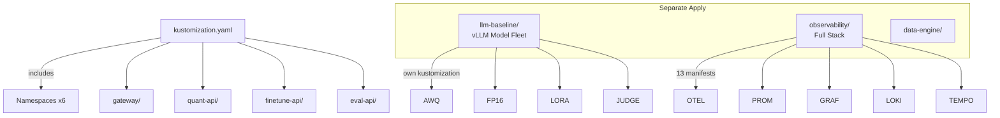

# k8s/base/

Environment-agnostic Kubernetes base manifests. Defines deployments, services, configmaps, and service accounts for all platform components. Composed via `kustomization.yaml`.

## Architecture



## Directory Contents

| Path                 | Resources                                                   |
| -------------------- | ----------------------------------------------------------- |
| `kustomization.yaml` | Master kustomization — includes namespaces + 4 services     |
| `namespace-*.yaml`   | 6 namespace definitions                                     |
| `gateway/`           | Deployment (2 replicas), Service, ServiceAccount, ConfigMap |
| `quant-api/`         | Deployment, Service, ServiceAccount, ConfigMap              |
| `finetune-api/`      | Deployment, Service, ServiceAccount, ConfigMap              |
| `eval-api/`          | Deployment, Service, ServiceAccount, ConfigMap              |
| `data-engine/`       | Deployment, Service                                         |
| `llm-baseline/`      | vLLM fleet — 5 deployments, HPA, KEDA, ServiceMonitor       |
| `observability/`     | 13 manifests for the full observability stack               |

## Service Deployment Pattern

Each team service follows the same deployment pattern:

```yaml
# deployment.yaml
spec:
  replicas: 2
  strategy:
    type: RollingUpdate
    rollingUpdate: { maxSurge: 1, maxUnavailable: 0 }
  template:
    metadata:
      annotations:
        prometheus.io/scrape: "true"
        prometheus.io/port: "8000"
    spec:
      serviceAccountName: {team}-sa
      containers:
        - name: {service}
          image: ECR_URL:{tag}
          env:
            - name: POD_NAME      # → OTEL resource attributes
            - name: POD_UID
            - name: K8S_NAMESPACE
            - name: LAB_TEAM
```

## Labels

All resources are labeled with:

```yaml
app.kubernetes.io/managed-by: kustomize
app.kubernetes.io/part-of: llm-optimization-platform
```
