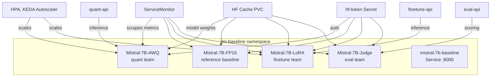

# k8s/base/llm-baseline/

vLLM model fleet deployment — runs 4 Mistral-7B-Instruct-v0.2 variants on GPU SPOT nodes. Each model variant serves a specific team's optimization approach.

## Architecture



## Files

| File                         | Purpose                                                |
| ---------------------------- | ------------------------------------------------------ |
| `kustomization.yaml`         | Composes all baseline resources                        |
| `vllm-deployment.yaml`       | Original baseline deployment (replicas: 0, superseded) |
| `vllm-awq-deployment.yaml`   | AWQ 4-bit quantized model for quant team               |
| `vllm-fp16-deployment.yaml`  | FP16 full-precision reference baseline                 |
| `vllm-lora-deployment.yaml`  | LoRA-enabled model for finetune team                   |
| `vllm-judge-deployment.yaml` | Judge model for eval team scoring                      |
| `vllm-service.yaml`          | ClusterIP service exposing port 8000                   |
| `hf-token-secret.yaml`       | HuggingFace Hub token for model downloads              |
| `hf-cache-pvc.yaml`          | PersistentVolumeClaim for model weight cache           |
| `hpa.yaml`                   | HorizontalPodAutoscaler for GPU scaling                |
| `keda-scaledobject.yaml`     | KEDA ScaledObject for Prometheus-driven scaling        |
| `servicemonitor.yaml`        | Prometheus ServiceMonitor for vLLM metrics             |

## GPU Node Scheduling

All vLLM pods target GPU nodes with SPOT tolerance:

```yaml
spec:
  nodeSelector:
    nvidia.com/gpu.present: "true"
  tolerations:
    - key: "nvidia.com/gpu"
      operator: "Exists"
      effect: "NoSchedule"
  containers:
    - name: vllm
      image: vllm/vllm-openai:v0.6.6
      resources:
        limits:
          nvidia.com/gpu: 1
```

## Model Variants

| Deployment                 | Model                              | Team     |
| -------------------------- | ---------------------------------- | -------- |
| `mistral-7b-instruct-vllm` | Mistral-7B-Instruct-v0.2 (legacy)  | —        |
| `mistral-7b-awq`           | TheBloke/Mistral-7B-AWQ            | Quant    |
| `mistral-7b-fp16`          | Mistral-7B-Instruct-v0.2           | Baseline |
| `mistral-7b-lora`          | Mistral-7B + LoRA adapter          | FineTune |
| `mistral-7b-judge`         | Mistral-7B-Instruct (judge prompt) | Eval     |
