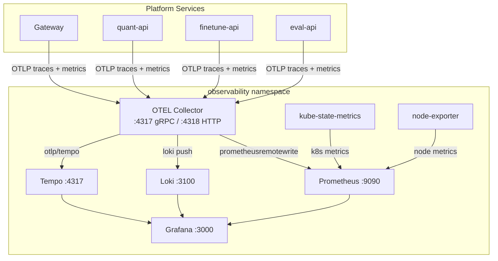

# k8s/base/observability/

Full observability stack deployed in the `observability` namespace. Provides end-to-end telemetry collection, storage, and visualization via OpenTelemetry, Prometheus, Loki, Tempo, and Grafana.

## Architecture



## Files (13 manifests)

| File                             | Purpose                                               |
| -------------------------------- | ----------------------------------------------------- |
| `otel-collector-config.yaml`     | ConfigMap — receivers, processors, exporters          |
| `otel-collector-deployment.yaml` | OTEL Collector deployment                             |
| `prometheus-config.yaml`         | Prometheus configuration                              |
| `prometheus-deployment.yaml`     | Prometheus server deployment                          |
| `loki-deployment.yaml`           | Loki log aggregation                                  |
| `tempo-deployment.yaml`          | Tempo distributed tracing                             |
| `grafana-deployment.yaml`        | Grafana with custom plugin                            |
| `grafana-datasources.yaml`       | Pre-configured data sources (Prometheus, Loki, Tempo) |
| `grafana-dashboards.yaml`        | Dashboard provisioning ConfigMap                      |
| `grafana-k8s-dashboards.yaml`    | Kubernetes-specific dashboards                        |
| `grafana-secrets.yaml`           | Grafana admin credentials                             |
| `kube-state-metrics.yaml`        | K8s cluster state metrics                             |
| `node-exporter.yaml`             | Node-level system metrics                             |

## OTEL Collector Pipeline

The collector receives traces, metrics, and logs from all services and routes them:

```yaml
receivers:
  otlp: # gRPC :4317, HTTP :4318
  k8s_cluster: # Kubernetes cluster metrics
  prometheus: # Scrapes pods with prometheus.io/scrape annotation

processors:
  batch: # Batches 10k spans, 10s timeout
  memory_limiter: # 800 MiB limit, 200 MiB spike
  k8sattributes: # Enriches with pod/namespace/node metadata

exporters:
  prometheusremotewrite: → Prometheus :9090
  loki: → Loki :3100
  otlp/tempo: → Tempo :4317
```

## Relationship to Other Components

- **services/shared/telemetry.py** sends OTLP data to collector at `:4317`
- **services/shared/logging_config.py** formats logs with trace_id for Loki ↔ Tempo correlation
- **prometheus/recording-rules.yaml** pre-computes dashboard metrics
- **grafana-plugins/** custom panel is installed in the Grafana deployment
- **scripts/generate_dashboard.py** generates Grafana dashboard JSON
