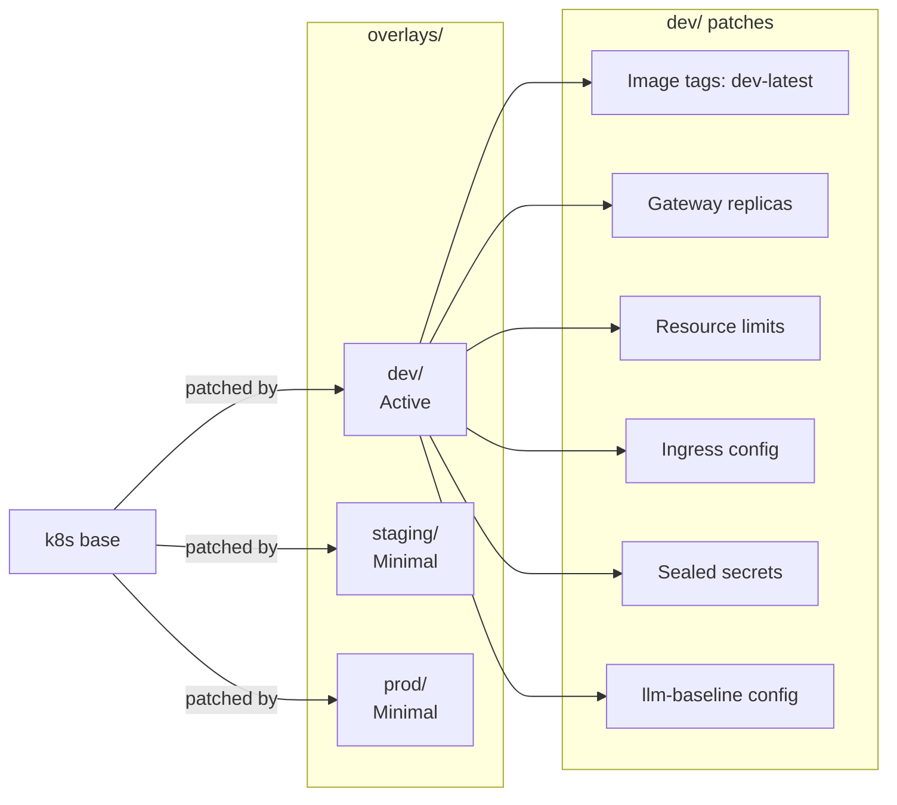

# k8s/overlays/

Per-environment Kustomize overlays that patch the base manifests with environment-specific configurations (image tags, replica counts, resource limits, secrets).

## Architecture



## Environments

| Directory  | Status  | Contents                                               |
| ---------- | ------- | ------------------------------------------------------ |
| `dev/`     | Active  | Full kustomization with patches, secrets, llm-baseline |
| `staging/` | Minimal | Kustomization + llm-baseline + patches + secrets       |
| `prod/`    | Minimal | Kustomization only                                     |

## dev/ Overlay

The dev overlay applies:

```yaml
# Image tags → dev-latest for all services
images:
  - name: .../llmplatform-dev/gateway
    newTag: dev-latest

# Patches
patches:
  - patches/gateway-replicas.yaml    # Replica count override
  - patches/resource-limits.yaml     # Memory/CPU limits
  - patches/ingress-dev.yaml         # Dev ingress rules

# Inline ConfigMap patch
- patch: |
    apiVersion: v1
    kind: ConfigMap
    metadata:
      name: gateway-config
    data:
      LOG_LEVEL: "DEBUG"
```

## Usage

```bash
# Preview rendered manifests
kubectl kustomize k8s/overlays/dev/

# Apply overlay
kubectl apply -k k8s/overlays/dev/

# Or use the helper script
k8s/scripts/apply.sh dev
```
