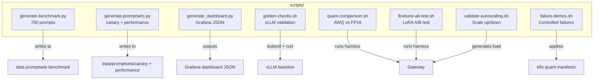

# scripts/

Operational scripts for benchmarking, validation, and demonstration. These scripts exercise the platform end-to-end and are used for both CI/CD validation and hands-on demo scenarios.

## Architecture



## Files

| Script                    | Purpose                                                           |
| ------------------------- | ----------------------------------------------------------------- |
| `generate-benchmark.py`   | Generates 700 benchmark prompts across 3 team-specific promptsets |
| `generate-promptsets.py`  | Generates canary (50) and performance (100) promptsets            |
| `generate_dashboard.py`   | Generates Grafana dashboard JSON with PromQL queries              |
| `golden-checks.sh`        | vLLM baseline validation: rollout, models, chat, metrics          |
| `quant-comparison.sh`     | Runs promptset against FP16, GPTQ-4bit, AWQ-4bit variants         |
| `finetune-ab-test.sh`     | A/B comparison between LoRA fine-tune versions                    |
| `failure-demos.sh`        | Controlled failure scenarios (slow startup, quota, timeout)       |
| `validate-autoscaling.sh` | Verifies HPA scale-up and scale-down under load                   |

## Key Scripts

### generate-benchmark.py

Generates 700 prompts across three benchmark suites:

```python
# benchmark-quant: 250 prompts
#   - 50 math precision (programmatic)
#   - 50 reasoning/trick questions
#   - 100 code generation (Python, SQL, Bash)
#   - 50 factual recall

# benchmark-finetune: 250 prompts (domain adaptation)
# benchmark-eval: 200 prompts (judge calibration)
```

### golden-checks.sh

Validates the vLLM baseline is functional:

1. Check rollout status
2. Verify `/v1/models` returns a model
3. Test `/v1/chat/completions` returns content
4. Verify Prometheus metrics are available

### validate-autoscaling.sh

Stress-tests HPA behavior:

1. Record baseline replicas
2. Generate load (50 concurrent requests)
3. Verify scale-up after 2 minutes
4. Stop load, verify scale-down after 6 minutes

## Relationship to Other Components

- **services/data-engine/generator.py** — imported by `generate-benchmark.py` and `generate-promptsets.py`
- **services/test-harness/harness.py** — invoked by benchmark and comparison scripts
- **k8s/quant/** — failure scenario manifests applied by `failure-demos.sh`
- **data/promptsets/** — output directory for generated promptsets
