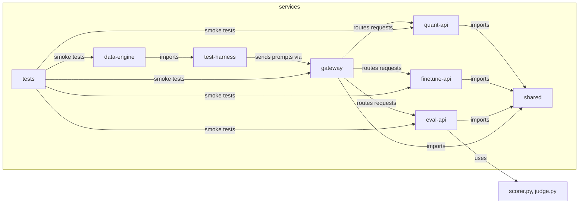

# services/

Core Python microservices powering the LLM Optimization Platform. Each service is a FastAPI application with OpenTelemetry instrumentation, health probes, and SageMaker/vLLM inference backends.

## Architecture



## Directory Contents

| Directory / File                             | Purpose                                                                           |
| -------------------------------------------- | --------------------------------------------------------------------------------- |
| [gateway/](gateway/)                         | API gateway — routes `/api/{team}/predict` to team services, A/B testing, ops API |
| [quant-api/](quant-api/)                     | Quantization team wrapper — invokes AWQ/GPTQ SageMaker or vLLM endpoints          |
| [finetune-api/](finetune-api/)               | Fine-tune team wrapper — invokes LoRA-adapted model endpoints                     |
| [eval-api/](eval-api/)                       | Evaluation team wrapper — LLM-as-a-Judge scoring with rubric thresholds           |
| [data-engine/](data-engine/)                 | Promptset serving and test harness orchestration API                              |
| [test-harness/](test-harness/)               | Concurrent prompt execution engine with validation and metrics                    |
| [shared/](shared/)                           | Shared library — telemetry, health checks, SageMaker/vLLM clients, models         |
| [tests/](tests/)                             | Smoke tests validating service structure and entrypoints                          |
| [requirements-dev.txt](requirements-dev.txt) | Union of all service dependencies for CI lint/test                                |

## Common Service Pattern

All team services (quant-api, finetune-api, eval-api) follow the same structure:

```python
# Lifespan initializes SageMaker or vLLM client based on environment
@asynccontextmanager
async def lifespan(app: FastAPI):
    endpoint_name = os.getenv("SAGEMAKER_ENDPOINT_NAME", "")
    if endpoint_name:
        app.state.sagemaker = SageMakerClient(endpoint_name=endpoint_name)
    else:
        app.state.sagemaker = VLLMClient()  # Dev fallback
    app.state.health = HealthChecker(app.state.sagemaker)
    yield

# Telemetry setup with OTEL (design-08 schema)
tracer, meter = setup_telemetry(app, "service-name", "namespace")

# Standard endpoints: /startup, /health, /ready, /predict
```

## Key Metrics Emitted

All services emit metrics following the `lab_*` naming convention (design-08 §4):

- `lab_service_requests_total` — Request counter per service
- `lab_llm_e2e_duration_ms` — End-to-end inference latency histogram
- `lab_llm_ttft_ms` — Time to first token histogram
- `lab_gateway_requests_total` — Gateway routing counter
- `lab_harness_requests_total` — Test harness execution counter

## Docker Build

Each service has a Dockerfile that copies the `shared/` library and the service code:

```dockerfile
FROM python:3.11-slim
COPY shared/ /app/shared/
COPY gateway/ /app/gateway/
WORKDIR /app/gateway
ENV PYTHONPATH=/app
CMD ["uvicorn", "main:app", "--host", "0.0.0.0", "--port", "8000"]
```
