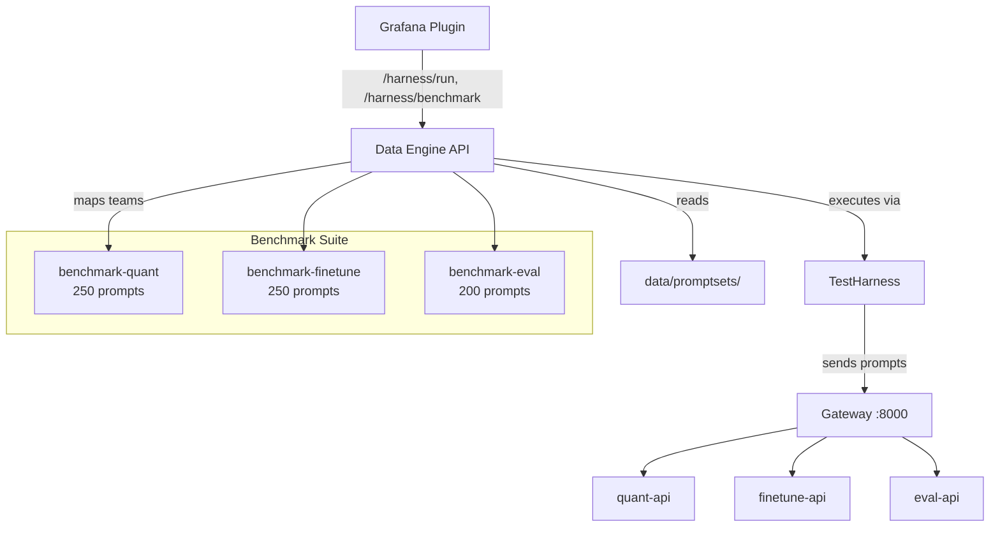

# services/data-engine/

Data Engine API — serves versioned promptsets and orchestrates test harness runs and benchmark suites. Acts as the data backbone for testing and benchmarking all model variants.

## Architecture



## Files

| File               | Purpose                                                                          |
| ------------------ | -------------------------------------------------------------------------------- |
| `api.py`           | FastAPI app — promptset listing, harness run management, benchmark endpoints     |
| `generator.py`     | `PromptsetGenerator` — creates versioned promptsets with manifests and checksums |
| `Dockerfile`       | Container build                                                                  |
| `requirements.txt` | Dependencies (includes tiktoken for token counting)                              |

## Key Components

### PromptsetGenerator (generator.py)

Generates versioned promptset files with SHA-256 checksums and JSONL format:

```python
class PromptsetGenerator:
    def generate_promptset(self, scenario_id, dataset_id, prompts, output_dir) -> Manifest:
        # Assigns output length buckets (short/medium/long)
        # Writes promptset.jsonl + manifest.json
        # Computes sha256 checksum for integrity verification
```

### API Endpoints (api.py)

```python
GET  /health                      # Service health
GET  /promptsets                   # List available promptsets with metadata
POST /harness/run                  # Start a test harness run against a team
GET  /harness/run/{run_id}         # Get run status and results
POST /harness/benchmark            # Start full 700-prompt benchmark suite
GET  /harness/benchmark/{id}       # Get benchmark results per team
```

### Benchmark Mapping

Teams are automatically mapped to their benchmark promptsets:

- `quant` → `benchmark-quant` (250 prompts: math, reasoning, code, factual)
- `finetune` → `benchmark-finetune` (250 prompts: domain adaptation)
- `eval` → `benchmark-eval` (200 prompts: scoring calibration)

## Relationship to Other Components

- **test-harness/** provides the `TestHarness` class imported by the API
- **data/promptsets/** contains the promptset files this service reads
- **scripts/generate-benchmark.py** generates the benchmark promptsets
- **Gateway** is the target for all harness-driven inference requests
- **Grafana plugin** HarnessConsole component calls these endpoints
