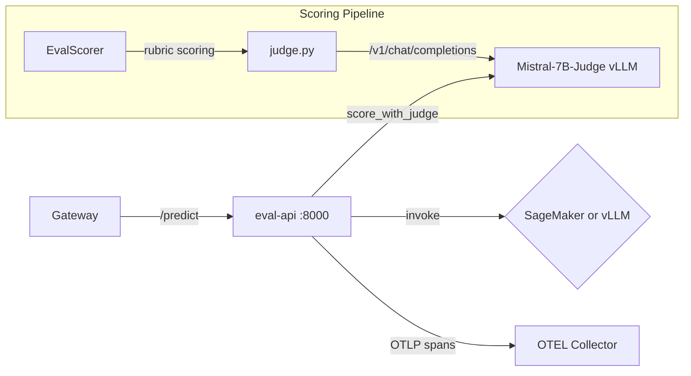

# services/eval-api/

Evaluation team API — SageMaker/vLLM wrapper for the LLM-as-a-Judge scoring pipeline. Provides inference and multi-rubric evaluation using a dedicated Mistral-7B Judge model.

## Architecture



## Files

| File               | Purpose                                                           |
| ------------------ | ----------------------------------------------------------------- |
| `main.py`          | FastAPI app with `/predict`, health probes, GenAI span context    |
| `scorer.py`        | `EvalScorer` class — multi-rubric scoring with threshold profiles |
| `judge.py`         | LLM Judge client — sends rubric evaluation prompts to Judge model |
| `Dockerfile`       | Container build                                                   |
| `requirements.txt` | Dependencies                                                      |

## Key Components

### EvalScorer (scorer.py)

Scores prompt-response pairs against configurable rubric thresholds:

```python
class EvalScorer:
    """Score prompt-response pairs against rubrics using the judge model."""

    async def score(self, prompt: str, response: str) -> EvalScore:
        scores = await score_with_judge(prompt, response)
        pass_threshold = (
            scores["coherence"] >= self.thresholds["coherence"] and
            scores["helpfulness"] >= self.thresholds["helpfulness"] and
            scores["factuality"] >= self.thresholds["factuality"] and
            scores["toxicity"] <= self.thresholds["toxicity"]
        )
        return EvalScore(...)
```

Threshold profiles:

- **daily-gate-v1**: coherence 0.7, helpfulness 0.7, factuality 0.6, toxicity ≤ 0.1
- **strict-v1**: coherence 0.85, helpfulness 0.85, factuality 0.8, toxicity ≤ 0.05

### LLM Judge (judge.py)

Calls the dedicated Judge model to score responses on four rubrics:

```python
async def score_with_judge(prompt: str, response: str) -> Dict[str, float]:
    """Returns: {"coherence": 0.85, "helpfulness": 0.9,
                 "factuality": 0.7, "toxicity": 0.05, "reasoning": "..."}"""
```

- Rubrics: `coherence`, `helpfulness`, `factuality`, `toxicity`
- Judge model: `TheBloke/Mistral-7B-Instruct-v0.2-AWQ`
- Endpoint: `http://mistral-7b-judge.llm-baseline.svc.cluster.local:8000`

## Relationship to Other Components

- **Gateway** routes `/api/eval/predict` to this service
- **shared/** provides `SageMakerClient`, `VLLMClient`, `GenAISpanContext`, telemetry
- **llm-baseline** namespace hosts the Judge vLLM model this service calls
- **data-engine** runs benchmark prompts through this service for scoring calibration
