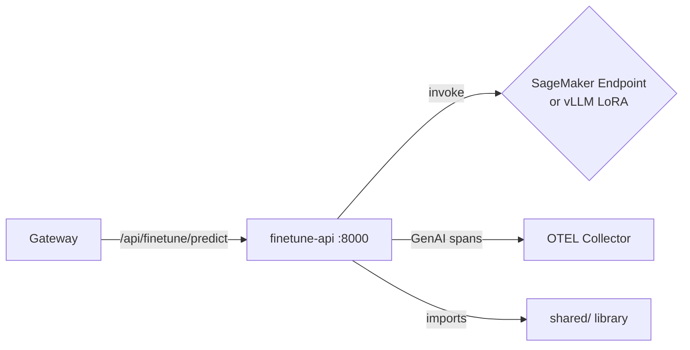

# services/finetune-api/

Fine-tuning team API — SageMaker/vLLM wrapper for LoRA-adapted model variants. Provides inference through domain-specific LoRA fine-tuned models with full OpenTelemetry tracing.

## Architecture



## Files

| File               | Purpose                                                           |
| ------------------ | ----------------------------------------------------------------- |
| `main.py`          | FastAPI app — `/predict` endpoint, health probes, telemetry setup |
| `Dockerfile`       | Container build (Python 3.11-slim + shared library)               |
| `requirements.txt` | Service dependencies                                              |

## Key Behavior

Follows the [common service pattern](../README.md) with LoRA-specific configuration:

```python
# Longer timeout for LoRA inference
app.state.sagemaker = SageMakerClient(
    endpoint_name=endpoint_name,
    timeout_ms=int(os.getenv("SAGEMAKER_TIMEOUT_MS", "60000")),  # 60s default
)
```

- **Model variant**: LoRA-adapted Mistral-7B (domain-specific fine-tunes)
- **GenAI span context**: Records `lab.model.variant.type`, `lab.model.variant.id`
- **Debug events**: 1% sample rate for prompt/completion hash recording

## Relationship to Other Components

- **Gateway** routes `/api/finetune/predict` here
- **shared/** provides inference clients, telemetry, health checks
- **llm-baseline** namespace hosts the vLLM LoRA model (`vllm-lora-deployment.yaml`)
- **domains/** defines data splits for fine-tuning (e.g., `legal.yaml`)
- **scripts/finetune-ab-test.sh** runs A/B comparisons between LoRA versions
