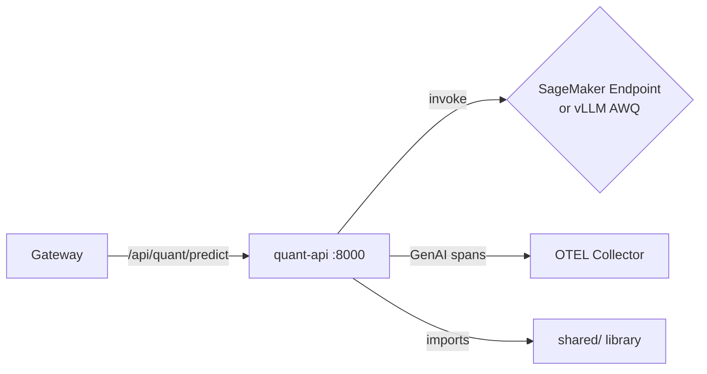

# services/quant-api/

Quantization team API — SageMaker/vLLM wrapper for GPTQ/AWQ compressed model inference. Serves quantized Mistral-7B variants with full OpenTelemetry instrumentation.

## Architecture



## Files

| File               | Purpose                                                           |
| ------------------ | ----------------------------------------------------------------- |
| `main.py`          | FastAPI app — `/predict` endpoint, health probes, telemetry setup |
| `Dockerfile`       | Container build (Python 3.11-slim + shared library)               |
| `requirements.txt` | Service dependencies                                              |

## Key Behavior

Follows the [common service pattern](../README.md) optimized for quantized model access:

```python
# Shorter timeout for quantized inference (faster than full-precision)
app.state.sagemaker = SageMakerClient(
    endpoint_name=endpoint_name,
    timeout_ms=int(os.getenv("SAGEMAKER_TIMEOUT_MS", "30000")),  # 30s default
)
```

- **Model variant**: AWQ 4-bit quantized Mistral-7B
- **GenAI span context**: Records quantization-specific variant attributes
- **Metrics**: `lab_service_requests_total`, `lab_llm_e2e_duration_ms`, `lab_llm_ttft_ms`

## Relationship to Other Components

- **Gateway** routes `/api/quant/predict` here
- **shared/** provides inference clients, telemetry, health checks
- **llm-baseline** namespace hosts the AWQ model (`vllm-awq-deployment.yaml`)
- **scripts/quant-comparison.sh** benchmarks AWQ vs FP16 quality
- **data/promptsets/benchmark-quant/** contains 250 prompts for quality comparison
