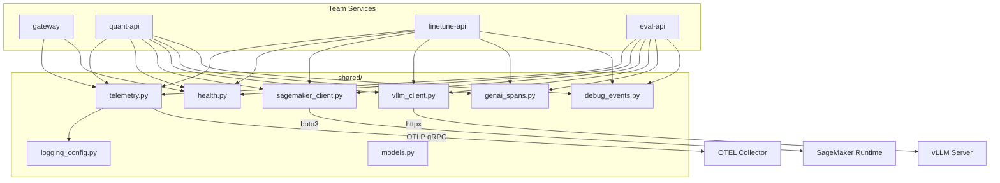

# services/shared/

Shared library imported by all platform microservices. Provides standardized telemetry, health checks, inference clients, data models, and logging with OpenTelemetry trace correlation.

## Architecture



## Files

| File                  | Purpose                                                      |
| --------------------- | ------------------------------------------------------------ |
| `telemetry.py`        | OpenTelemetry setup — tracing, metrics, auto-instrumentation |
| `health.py`           | `HealthChecker` — startup, liveness, and readiness probes    |
| `sagemaker_client.py` | Async SageMaker endpoint client with tracing and fallback    |
| `vllm_client.py`      | vLLM inference client — drop-in replacement for dev mode     |
| `genai_spans.py`      | GenAI span context manager with timing and token metrics     |
| `debug_events.py`     | Sampled debug events for prompt/completion hash inspection   |
| `logging_config.py`   | JSON structured logging with trace_id/span_id correlation    |
| `models.py`           | Shared Pydantic models (`PredictRequest`, `PredictResponse`) |

## Key Components

### Telemetry Setup (telemetry.py)

Initializes full OTEL stack with resource attributes per design-08 schema:

```python
def setup_telemetry(app, service_name: str, namespace: str):
    resource = _create_resource(service_name, namespace)
    # TracerProvider → BatchSpanProcessor → OTLPSpanExporter
    # MeterProvider → PeriodicExportingMetricReader → OTLPMetricExporter
    # Auto-instrument: FastAPI, httpx, botocore
    configure_logging(service_name, team)
    return trace.get_tracer(service_name), metrics.get_meter(service_name)
```

Resource attributes include: `service.name`, `service.namespace`, `k8s.cluster.name`, `k8s.pod.name`, `cloud.provider`, `lab.team`, `lab.owner`.

### SageMaker Client (sagemaker_client.py)

Async wrapper around `sagemaker-runtime` with OTEL spans and optional fallback:

```python
class SageMakerClient:
    async def invoke(self, payload, correlation_id, variant=None) -> Dict:
        with self.tracer.start_as_current_span("sagemaker.invoke_endpoint") as span:
            span.set_attribute("sagemaker.endpoint", self.endpoint_name)
            # Supports A/B via TargetVariant, timeout control, fallback
```

### vLLM Client (vllm_client.py)

Drop-in replacement for `SageMakerClient` used in dev/local mode:

```python
class VLLMClient:
    async def invoke(self, payload, correlation_id, variant=None) -> Dict:
        # Translates SageMaker payload format to vLLM /v1/completions
        # Auto-discovers model name via /v1/models endpoint
```

### GenAI Spans (genai_spans.py)

Context manager for LLM-specific span attributes and timing:

```python
class GenAISpanContext:
    def record_first_token(self):   # TTFT measurement
    def record_completion(self, input_tokens, output_tokens):
        # Records: genai.usage.*, lab.llm.tpot.ms, lab.llm.tokens_per_sec
```

### Structured Logging (logging_config.py)

JSON formatter that injects OTEL trace context for Loki ↔ Tempo correlation:

```python
class OTelJSONFormatter(logging.Formatter):
    def format(self, record):
        log_dict["trace_id"] = format(ctx.trace_id, "032x")
        log_dict["span_id"] = format(ctx.span_id, "016x")
        return json.dumps(log_dict)
```

### Health Checker (health.py)

Three-phase health check with SageMaker endpoint verification:

```python
class HealthChecker:
    async def startup_check(self) -> bool:   # Verifies endpoint InService
    async def readiness_check(self) -> bool:  # Periodic SageMaker health (30s)
    async def liveness_check(self) -> bool:   # Event loop responsiveness
```
