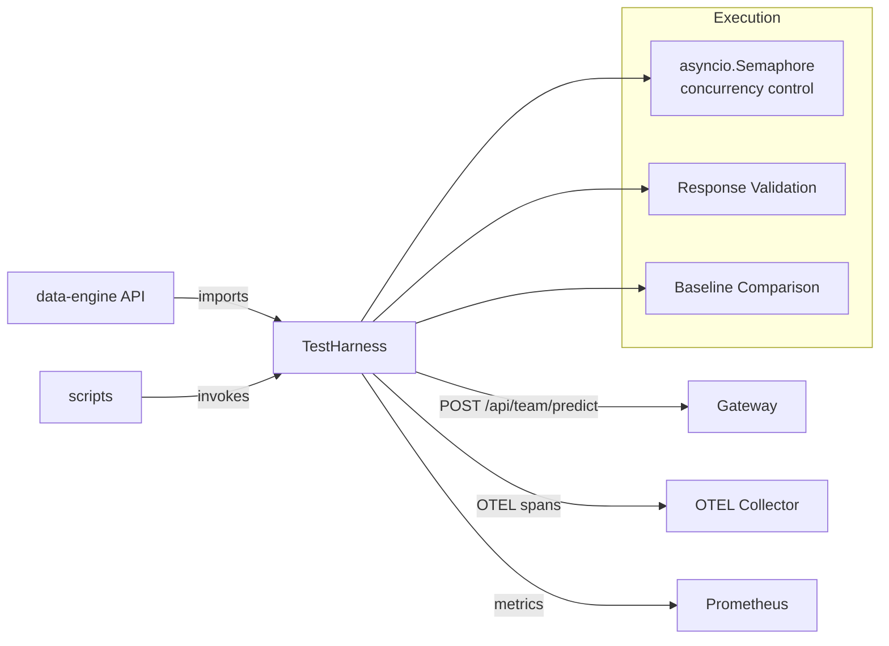

# services/test-harness/

Concurrent prompt execution engine that drives promptsets through the Gateway and validates responses. Used by the data-engine API and operational scripts.

## Architecture



## Files

| File               | Purpose                                           |
| ------------------ | ------------------------------------------------- |
| `harness.py`       | `TestHarness` class — concurrent prompt execution |
| `requirements.txt` | Dependencies (httpx, opentelemetry)               |

## Key Components

### TestHarness (harness.py)

Executes promptsets concurrently with configurable concurrency, OTEL propagation, and response validation:

```python
class TestHarness:
    def __init__(self, gateway_url, run_id, concurrency=10, compare_baseline=False):
        self.semaphore = asyncio.Semaphore(concurrency)

    async def execute_prompt(self, prompt, team, variant=None) -> HarnessResult:
        async with self.semaphore:
            # Sets OTEL span attributes (lab.promptset.id, lab.run.id, etc.)
            # Injects W3C trace context into outbound headers
            # Validates response against expected_contains
            # Records: latency, tokens/sec, model version, pass/fail
```

### HarnessResult

Rich result object with Phase 7/8 extended metrics:

```python
@dataclass
class HarnessResult:
    prompt_id: str
    passed: bool
    latency_ms: float
    tokens_generated: int
    tokens_per_second: float
    category: Optional[str]
    # Phase 8: baseline comparison fields
    baseline_response: Optional[str]
    baseline_latency_ms: float
```

### Metrics Emitted

- `lab_harness_requests_total` — Total prompts executed (by scenario, team, bucket)
- `lab_harness_pass_total` — Passed validations
- `lab_harness_fail_total` — Failed validations
- `lab_harness_latency_ms` — Per-prompt latency histogram

## Relationship to Other Components

- **data-engine/api.py** imports `TestHarness` and `HarnessResult`
- **scripts/** invoke the harness for benchmarks, A/B tests, and failure demos
- **Gateway** receives all harness-driven requests via `/api/{team}/predict`
